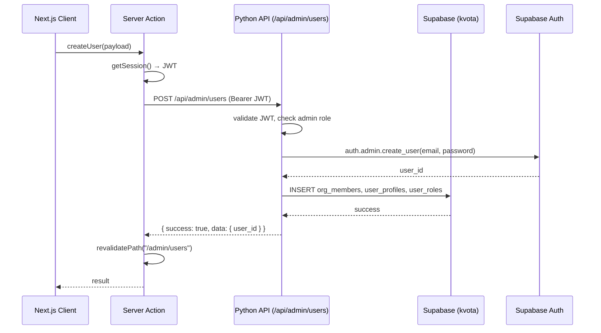

# Design: Управление пользователями в админке

## Overview

**Purpose:** Администраторы получают UI для создания, редактирования и деактивации пользователей — без SSH и SQL.
**Users:** Администраторы системы (роль `admin`).
**Impact:** Заменяет ручной 6-шаговый SQL-процесс на форму. Закрывает security-дыры в существующем коде ролей.

### Goals
- Создание пользователя через UI за 30 секунд
- Атомарное управление ролями с last-admin guard
- Все multi-table writes через Python API (API-first)
- Безопасность: IDOR-защита, server-only service_role

### Non-Goals
- Password reset (follow-up PR)
- Email-приглашения / magic link
- Аудит-лог (follow-up PR)
- Bulk operations
- "Must change password" flow

## Architecture

### Existing Architecture
- **Page:** `app/(app)/admin/users/page.tsx` — Server Component, gate `admin` role, fetches via `fetchOrgMembers` + `fetchAllRoles`
- **Client:** `features/admin-users/ui/users-page.tsx` — table + search + `RoleEditModal`
- **Entity:** `entities/admin/` — `types.ts`, `queries.ts` (admin client), `mutations.ts` (browser client — security issue)
- **Python API:** `api/` module with `ApiAuthMiddleware` (JWT validation via GoTrue)
- **Server helper:** `shared/lib/api-server.ts` — `apiServerClient(path, options)` forwards JWT
- **DB helpers (migration 254):** `has_role(user_id, role_slug)`, `current_user_has_role(role_slug)`, `is_org_admin(user_id)` — Postgres functions for RLS
- **Schema note:** `organization_members` no longer has `role_id` (dropped in migration 255). Roles are solely in `user_roles` table.

### Architecture Pattern



### Technology Stack

| Layer | Choice | Role |
|-------|--------|------|
| Frontend | Next.js 15 App Router + shadcn/ui | Page, dialogs, forms |
| Server Actions | Thin wrappers (api-first pattern) | Auth → call API → revalidate |
| Python API | FastHTML/Starlette endpoints in `api/` | Business logic, multi-table writes |
| Database | Supabase PostgreSQL (kvota schema) | Storage, Postgres function |
| Auth | Supabase Auth Admin API | User CRUD, ban/unban |

## Components and Interfaces

| Component | Layer | Intent | Req | Dependencies |
|-----------|-------|--------|-----|-------------|
| `api/admin_users.py` | Python API | Create/deactivate users, update roles | 1,3,4,6 | auth.py, supabase-py |
| Migration `update_user_roles` | DB | Atomic role swap + last-admin guard | 3,7 | — |
| `createUser` Server Action | Next.js | Thin wrapper for POST /api/admin/users | 1,6 | api-server.ts |
| `updateUserStatus` Server Action | Next.js | Thin wrapper for PATCH /api/admin/users/{id} | 4,6 | api-server.ts |
| `updateUserRolesAction` Server Action | Next.js | Thin wrapper for PATCH /api/admin/users/{id}/roles | 3,6 | api-server.ts |
| `CreateUserDialog` | Feature UI | Form: email, password, name, roles, position, group | 1 | entities/admin |
| `UserEditSheet` | Feature UI | Edit profile, roles, status | 2,3,4 | entities/admin |
| Extended `UsersPageClient` | Feature UI | Add status column, create button | 5 | entities/admin |

### Python API — `api/admin_users.py`

#### `POST /api/admin/users`

```python
async def create_user(request):
    """Create a new user with roles and profile.

    Path: POST /api/admin/users
    Params:
        email: str (required) — User email
        password: str (required) — Initial password
        full_name: str (required) — Display name
        role_slugs: list[str] (required) — At least one role slug
        position: str (optional) — Job title
        sales_group_id: str (optional) — Sales group UUID
    Returns:
        user_id: str — Created user UUID
        email: str — User email
    Side Effects:
        - Creates auth.users record via Supabase Admin API
        - Inserts into organization_members (status: active)
        - Inserts into user_profiles (full_name, position)
        - Inserts into user_roles (one per slug)
        - On failure after auth creation: deletes auth user (cleanup)
    Roles: admin
    """
```

**Error handling:**
- Email exists → 409 `{ "success": false, "error": { "code": "USER_EXISTS", "message": "..." } }`
- Invalid role slugs → 400
- Auth creation fails → 500 with Supabase error
- Post-auth INSERT fails → cleanup auth user, 500

#### `PATCH /api/admin/users/{user_id}`

```python
async def update_user_status(request, user_id: str):
    """Activate or deactivate a user.

    Path: PATCH /api/admin/users/{user_id}
    Params:
        status: str (required) — "active" or "suspended"
    Returns:
        user_id: str
        status: str — New status
    Side Effects:
        - Deactivate: bans auth user, signs out all sessions, updates org_members.status
        - Activate: unbans auth user, updates org_members.status
    Roles: admin
    """
```

#### `PATCH /api/admin/users/{user_id}/roles`

```python
async def update_user_roles(request, user_id: str):
    """Atomically update user roles via Postgres function.

    Path: PATCH /api/admin/users/{user_id}/roles
    Params:
        role_slugs: list[str] (required) — New role set (replaces all)
    Returns:
        user_id: str
        roles: list[str] — Applied role slugs
    Side Effects:
        - Calls kvota.update_user_roles() Postgres function
        - Atomic DELETE + INSERT in single transaction
    Roles: admin
    """
```

**Auth pattern (all endpoints):**
```python
api_user = request.state.api_user
if not api_user:
    return JSONResponse({"success": False, "error": {"code": "UNAUTHORIZED"}}, 401)
# Check admin role
roles = get_user_role_codes(str(api_user.id), org_id)
if "admin" not in roles:
    return JSONResponse({"success": False, "error": {"code": "FORBIDDEN"}}, 403)
# org_id from api_user's org membership, NOT from request body
```

### Server Actions — `features/admin-users/actions.ts`

```typescript
"use server";
import { apiServerClient } from "@/shared/lib/api-server";
import { revalidatePath } from "next/cache";

export async function createUserAction(payload: CreateUserPayload) {
  const res = await apiServerClient<{ user_id: string }>("/admin/users", {
    method: "POST",
    body: JSON.stringify(payload),
  });
  revalidatePath("/admin/users");
  return res;
}

export async function updateUserStatusAction(userId: string, status: "active" | "suspended") {
  const res = await apiServerClient(`/admin/users/${userId}`, {
    method: "PATCH",
    body: JSON.stringify({ status }),
  });
  revalidatePath("/admin/users");
  return res;
}

export async function updateUserRolesAction(userId: string, roleSlugs: string[]) {
  const res = await apiServerClient(`/admin/users/${userId}/roles`, {
    method: "PATCH",
    body: JSON.stringify({ role_slugs: roleSlugs }),
  });
  revalidatePath("/admin/users");
  return res;
}
```

### UI Components

#### CreateUserDialog
- Trigger: "Добавить пользователя" button (top-right of page)
- Fields: email (input), password (input + auto-generate button + copy), full_name (input), roles (checkbox group from `allRoles`), position (input, optional), sales_group (select, shown only when sales/head_of_sales role selected)
- Validation: Zod schema — email required, password min 8 chars, full_name required, roles min 1
- On submit: call `createUserAction` → on success close + toast
- On error: display error message inline

#### UserEditSheet
- Trigger: row click in users table
- Sections: Profile (name, position, group) + Roles (checkboxes) + Status (badge + toggle button)
- Profile save: Supabase direct `updateUserProfile` (single table CRUD)
- Roles save: `updateUserRolesAction` (Python API)
- Status toggle: `updateUserStatusAction` (Python API)
- Last admin: disable deactivate + role removal for last admin

## Data Models

### Postgres Function

```sql
CREATE OR REPLACE FUNCTION kvota.update_user_roles(
  p_user_id UUID,
  p_org_id UUID,
  p_role_slugs TEXT[]
)
RETURNS void
LANGUAGE plpgsql
SECURITY DEFINER
AS $$
DECLARE
  v_admin_count INTEGER;
  v_has_admin BOOLEAN;
  v_will_have_admin BOOLEAN;
BEGIN
  -- Check if user currently has admin role
  SELECT EXISTS(
    SELECT 1 FROM kvota.user_roles ur
    JOIN kvota.roles r ON r.id = ur.role_id
    WHERE ur.user_id = p_user_id AND ur.organization_id = p_org_id AND r.slug = 'admin'
  ) INTO v_has_admin;

  -- Check if new roles include admin
  v_will_have_admin := 'admin' = ANY(p_role_slugs);

  -- If removing admin, check last admin guard
  IF v_has_admin AND NOT v_will_have_admin THEN
    SELECT COUNT(*) INTO v_admin_count
    FROM kvota.user_roles ur
    JOIN kvota.roles r ON r.id = ur.role_id
    WHERE ur.organization_id = p_org_id AND r.slug = 'admin' AND ur.user_id != p_user_id;

    IF v_admin_count = 0 THEN
      RAISE EXCEPTION 'Cannot remove admin role from the last administrator';
    END IF;
  END IF;

  -- Atomic swap
  DELETE FROM kvota.user_roles WHERE user_id = p_user_id AND organization_id = p_org_id;

  INSERT INTO kvota.user_roles (user_id, organization_id, role_id)
  SELECT p_user_id, p_org_id, r.id
  FROM kvota.roles r
  WHERE r.slug = ANY(p_role_slugs);
END;
$$;
```

### Extended Types

```typescript
// entities/admin/types.ts — additions
interface CreateUserPayload {
  email: string;
  password: string;
  full_name: string;
  role_slugs: string[];
  position?: string;
  sales_group_id?: string | null;
}

interface UpdateUserPayload {
  full_name?: string;
  position?: string;
  sales_group_id?: string | null;
}
```

## Error Handling

| Error | Code | HTTP | User Message |
|-------|------|------|-------------|
| Email exists | USER_EXISTS | 409 | Пользователь с таким email уже существует |
| Empty roles | VALIDATION_ERROR | 400 | Пользователь должен иметь хотя бы одну роль |
| Last admin | LAST_ADMIN | 422 | Невозможно удалить роль admin у последнего администратора |
| Last admin deactivate | LAST_ADMIN | 422 | Невозможно деактивировать последнего администратора |
| Not admin | FORBIDDEN | 403 | Доступ запрещён |
| Invalid JWT | UNAUTHORIZED | 401 | Необходима авторизация |

## Testing Strategy

### Unit Tests (Python)
- `test_create_user_success` — creates user with all fields
- `test_create_user_duplicate_email` — returns 409
- `test_create_user_cleanup_on_failure` — deletes auth user if INSERT fails
- `test_update_roles_last_admin_guard` — rejects removing last admin
- `test_deactivate_user` — bans + updates status

### Integration Tests
- Create user → verify appears in list
- Deactivate user → verify banned in auth
- Update roles atomically → verify old roles gone, new applied

### E2E (Browser)
- Open admin page → click "Add user" → fill form → submit → see in table
- Click user → edit profile → save → verify updated
- Deactivate → verify status badge changes

## Security Considerations

- **org_id from JWT:** Python API resolves org_id from `api_user.id` → `organization_members` lookup. Never from request body.
- **service_role isolation:** `createAdminClient()` only in Python backend. Never in Server Actions or client code.
- **Admin gate:** Every endpoint checks `admin` role from JWT before any operation.
- **No hard delete:** Only ban/unban. CASCADE on `auth.users` would destroy business data.
