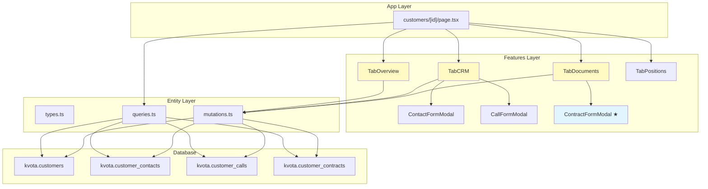
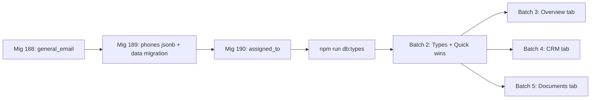

# Technical Design: Customer Detail Improvements

## Overview

**Purpose**: Enhance the Next.js customer detail page with schema extensions, improved tab layouts, multi-phone contacts, call assignment, editable addresses, and contracts CRUD — driven by real user feedback.

**Users**: Sales managers and procurement specialists use the customer detail page daily for CRM activities, contact management, and document tracking.

**Impact**: Modifies 3 database tables (new columns), updates 4 existing UI tabs, adds 1 new section (contracts), and creates 2 new components (phone list, contract form).

### Goals
- Extend DB schema with general_email, phones jsonb, assigned_to columns
- Move notes to Overview tab for immediate visibility
- Enable multi-phone contacts with labels and extensions
- Add call assignment and contact info display in calls
- Make addresses editable in CRM tab
- Show contracts CRUD in Documents tab
- Ensure responsive tables across all customer tabs

### Non-Goals
- CRM activity types beyond calls (notes, email, meetings — backlog)
- Call date filters and reminders (backlog)
- Procurement page restructuring (separate spec)
- Migrating customer list page (already done)

## Architecture

### Existing Architecture Analysis
- **Pattern**: FSD layers (shared → entities → features → widgets → app)
- **Boundaries**: Entity layer owns types + queries + mutations. Features layer owns UI components.
- **Integration**: Server components fetch data, pass to client components for interactivity.
- **Preserved**: All existing patterns (inline edit, modal form, mutation, query) remain unchanged.

### Architecture Pattern & Boundary Map



★ = new component, yellow = modified components

**Architecture Integration**:
- **Selected pattern**: Extend existing FSD layers — no new boundaries
- **New components**: ContractFormModal (features/customers/ui/) — follows ContactFormModal pattern exactly
- **Steering compliance**: FSD import rules, Supabase direct access, shadcn components

### Technology Stack

| Layer | Choice / Version | Role in Feature | Notes |
|-------|------------------|-----------------|-------|
| Frontend | Next.js 15 (App Router) | Server components + client interactivity | Existing |
| UI | shadcn/ui + Tailwind CSS v4 | Form inputs, Dialog, Table, Select, Badge | Existing |
| Data | Supabase JS client | Direct CRUD on kvota schema | Existing |
| Database | PostgreSQL (Supabase) | 3 ALTER TABLE + customer_contracts reads | Schema `kvota` |

## Requirements Traceability

| Req | Summary | Components | Data Model |
|-----|---------|------------|------------|
| 1.1–1.4 | General email | TabOverview, mutations | customers.general_email |
| 2.1–2.4 | Notes on Overview | TabOverview, TabCRM | customers.notes (existing) |
| 3.1–3.5 | Multi-phone contacts | ContactFormModal, TabCRM | customer_contacts.phones |
| 4.1–4.4 | Call assignment | CallFormModal, TabCRM, queries | customer_calls.assigned_to |
| 5.1–5.3 | Contact info in calls | TabCRM, queries | JOIN contacts on calls |
| 6.1–6.4 | Editable addresses | TabCRM | customers.legal/actual/postal_address |
| 7.1–7.2 | SKU split | TabPositions | quote_items.sku, idn_sku |
| 8.1–8.3 | Responsive tables | All tabs | CSS wrapper |
| 9.1–9.6 | Contracts CRUD | TabDocuments, ContractFormModal, queries, mutations | customer_contracts |
| 10.1–10.5 | DB schema | Migrations 188–190 | 3 ALTER TABLE statements |

## Components and Interfaces

| Component | Layer | Intent | Req | Dependencies | Contracts |
|-----------|-------|--------|-----|-------------|-----------|
| TabOverview | Features | Display notes + general_email + stats | 1, 2 | mutations | State |
| TabCRM | Features | Contacts, calls, addresses (no notes) | 3, 4, 5, 6 | ContactFormModal, CallFormModal | State |
| TabDocuments | Features | КП + Спецификации + Contracts | 9 | ContractFormModal | State |
| TabPositions | Features | Positions with split SKU columns | 7 | — | — |
| ContactFormModal | Features | Contact CRUD with phones array | 3 | mutations | State |
| CallFormModal | Features | Call/meeting with assigned_to | 4, 5 | mutations, queries | State |
| ContractFormModal ★ | Features | Contract CRUD modal | 9 | mutations | State |
| ScrollableTable ★ | Shared/UI | Responsive table wrapper | 8 | — | — |

### Features Layer

#### TabOverview (modified)

| Field | Detail |
|-------|--------|
| Intent | Display customer overview with notes and general_email |
| Requirements | 1.1–1.4, 2.1–2.4 |

**Changes**:
- Add NotesSection (moved from TabCRM) — reuse existing component, same props
- Add GeneralEmailField to Реквизиты card — inline edit pattern (same as notes)
- New mutation: `updateCustomerGeneralEmail(customerId, email)`

**State Management**:
```typescript
// GeneralEmailField — follows NotesSection pattern
const [editing, setEditing] = useState(false);
const [email, setEmail] = useState(initialEmail);
const [saving, setSaving] = useState(false);
```

#### TabCRM (modified)

| Field | Detail |
|-------|--------|
| Intent | CRM hub: contacts, calls, addresses (notes removed) |
| Requirements | 3.5, 4.3–4.4, 5.1–5.3, 6.1–6.4 |

**Changes**:
- Remove NotesSection (moved to Overview)
- ContactsSection: display primary phone from phones array + tooltip for additional
- CallsSection: display assigned_to name, show contact phone/email column
- AddressesSection: add edit toggle per address card, save via updateCustomerAddresses

**Address Edit Pattern**:
```typescript
// Per-address-type edit state
const [editingAddress, setEditingAddress] = useState<string | null>(null);
// "legal" | "actual" | "postal" | null
```

#### ContactFormModal (modified)

| Field | Detail |
|-------|--------|
| Intent | Contact CRUD with dynamic phone list |
| Requirements | 3.1–3.4 |

**Changes**:
- Replace single `phone` input with dynamic phones array
- Add/remove phone entries
- Each entry: number (Input), ext (Input, optional), label (Select)

**Phone Entry Type**:
```typescript
interface PhoneEntry {
  number: string;  // required
  ext: string;     // optional extension
  label: string;   // "основной" | "рабочий" | "мобильный" | "добавочный"
}
```

**Form State Extension**:
```typescript
interface ContactFormData {
  // ... existing fields
  phones: PhoneEntry[];  // replaces phone: string
}
```

#### CallFormModal (modified)

| Field | Detail |
|-------|--------|
| Intent | Call/meeting creation with assignment |
| Requirements | 4.1–4.2 |

**Changes**:
- Add `assigned_to` Select field populated by `fetchOrgUsers()` query
- Default to current user ID

**New Query**:
```typescript
async function fetchOrgUsers(orgId: string): Promise<{id: string, full_name: string}[]>
// SELECT user_id, full_name FROM kvota.user_profiles WHERE organization_id = orgId
```

#### ContractFormModal ★ (new)

| Field | Detail |
|-------|--------|
| Intent | Contract CRUD modal for Documents tab |
| Requirements | 9.3–9.5 |

**Pattern**: Identical to ContactFormModal — Dialog + useState(form, saving, error) + updateField

**Form Type**:
```typescript
interface ContractFormData {
  contract_number: string;  // required
  contract_date: string;    // date input
  status: "active" | "suspended" | "terminated";
  notes: string;
}
```

**Mutations**:
```typescript
async function createContract(customerId: string, data: ContractFormData): Promise<CustomerContract>;
async function updateContract(contractId: string, data: ContractFormData): Promise<void>;
async function deleteContract(contractId: string): Promise<void>;
```

#### TabDocuments (modified)

| Field | Detail |
|-------|--------|
| Intent | Documents tab with contracts section |
| Requirements | 9.1–9.2, 9.6 |

**Changes**:
- Add ContractsSection above existing sub-tabs
- Display table: contract_number, date, status badge, notes, actions (edit/delete)
- Status badges: active=green, suspended=yellow, terminated=red (shadcn Badge with variant)

#### TabPositions (modified)

| Field | Detail |
|-------|--------|
| Intent | Positions table with split SKU columns |
| Requirements | 7.1–7.2 |

**Changes**:
- Replace single SKU column with two: "Артикул" (sku) and "IDN-SKU" (idn_sku)
- No logic changes, display only

### Shared Layer

#### ScrollableTable ★ (new)

| Field | Detail |
|-------|--------|
| Intent | Responsive table wrapper with horizontal scroll |
| Requirements | 8.1–8.3 |

**Implementation**: CSS-only wrapper div around shadcn Table.

```typescript
// Wrapper component
function ScrollableTable({ children }: { children: React.ReactNode }) {
  return <div className="overflow-x-auto">{children}</div>;
}
```

Applied to all tables in: TabCRM (contacts, calls), TabDocuments (contracts, quotes, specs), TabPositions.

## Data Models

### Physical Data Model

#### Migration 188: customers.general_email
```sql
ALTER TABLE kvota.customers ADD COLUMN general_email VARCHAR(255);
```

#### Migration 189: customer_contacts.phones
```sql
ALTER TABLE kvota.customer_contacts ADD COLUMN phones JSONB DEFAULT '[]';

-- Migrate existing phone data
UPDATE kvota.customer_contacts
SET phones = jsonb_build_array(
  jsonb_build_object('number', phone, 'ext', null, 'label', 'основной')
)
WHERE phone IS NOT NULL AND phone != '';
```

#### Migration 190: customer_calls.assigned_to
```sql
ALTER TABLE kvota.customer_calls
ADD COLUMN assigned_to UUID REFERENCES auth.users(id);
```

### TypeScript Types (after db:types regeneration)

```typescript
// Extend Customer entity
interface Customer {
  // ... existing fields
  general_email: string | null;  // NEW
}

// Extend CustomerContact entity
interface CustomerContact {
  // ... existing fields
  phones: PhoneEntry[];  // NEW (JSONB)
  phone: string | null;  // KEEP during transition
}

// Extend CustomerCall entity
interface CustomerCall {
  // ... existing fields
  assigned_to: string | null;     // NEW (UUID)
  assigned_user_name?: string;    // resolved via query
}

// New entity
interface CustomerContract {
  id: string;
  customer_id: string;
  organization_id: string;
  contract_number: string;
  contract_date: string | null;
  status: "active" | "suspended" | "terminated";
  notes: string | null;
  next_specification_number: number;
  created_at: string;
  updated_at: string;
}
```

### New Queries

```typescript
// Contracts for customer
async function fetchCustomerContracts(customerId: string): Promise<CustomerContract[]>;
// SELECT * FROM kvota.customer_contracts WHERE customer_id = customerId ORDER BY contract_date DESC

// Org users for assignment dropdown
async function fetchOrgUsers(orgId: string): Promise<{id: string, full_name: string}[]>;
// SELECT user_id, full_name FROM kvota.user_profiles WHERE organization_id = orgId ORDER BY full_name
```

### New Mutations

```typescript
async function updateCustomerGeneralEmail(customerId: string, email: string): Promise<void>;
async function createContract(customerId: string, data: ContractFormData): Promise<CustomerContract>;
async function updateContract(contractId: string, data: ContractFormData): Promise<void>;
async function deleteContract(contractId: string): Promise<void>;
```

## Error Handling

### Error Strategy
All mutations follow existing pattern: throw on Supabase error, catch in component, display error message.

### Error Categories
- **User Errors**: Missing required fields (contract_number, phone number) → field-level validation before submit
- **System Errors**: Supabase connection failure → error state in component, retry button
- **Business Logic**: Duplicate contract_number → database unique constraint → catch and display "Договор с таким номером уже существует"

## Testing Strategy

### Unit Tests
- Phone entry add/remove logic (form state manipulation)
- Contract status badge color mapping
- ScrollableTable renders children correctly

### Integration Tests
- Contact CRUD with phones array: create, read, update, delete
- Contract CRUD: create, edit, delete with confirmation
- Call creation with assigned_to field

### E2E Tests (Playwright)
- Overview tab: edit notes inline, edit general_email inline
- CRM tab: create contact with 2 phones, verify display
- CRM tab: create call with assignment, verify assigned name shows
- Documents tab: add contract, verify in table, edit, delete
- Positions tab: verify sku and idn_sku are separate columns
- Responsive: verify horizontal scroll at 1024px viewport

## Migration Strategy



Batches 3, 4, 5 are parallelizable (different files). Batch 1 (migrations) and Batch 2 (types) are sequential prerequisites.
