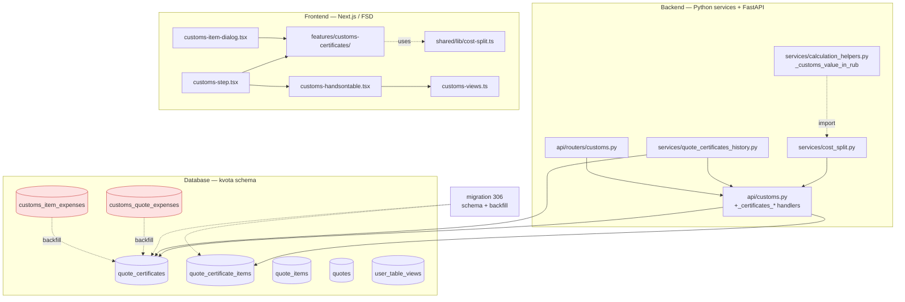

# Technical Design — customs-shared-certificates (Phase B)

**Date:** 2026-05-04
**Architecture:** Extension of Phase A (customs-tariff-completeness) — UI/API only, calc-engine untouched
**Requirements:** see `requirements.md` (11 REQ, 16 LD, 17 Acceptance Gates)
**Gap analysis:** see `gap-analysis.md`
**Code validation:** see `code-validation.md`
**UI mockup:** `docs/mockups/customs-after-phases.html` (v3 утверждён 2026-05-03; Phase B секции 111, 881-1000)

---

## 1. Overview

Phase B вводит общие сертификаты как первоклассную сущность (`kvota.quote_certificates`) с many-to-many привязкой к позициям КП через `kvota.quote_certificate_items`. Отдельный тип «Свой расход» (`is_custom_expense=TRUE` + `display_name`) живёт в той же таблице — избегаем семантического клонирования. Стоимость сертификата пропорционально распределяется на привязанные позиции через **shared cost-split helper**, реализованный синхронно в Python (`services/cost_split.py`) и TypeScript (`frontend/src/shared/lib/cost-split.ts`) и проверяемый общими JSON-фикстурами с парити-тестами.

UI-слой объединяет ранее разделённые Phase A секции «Сертификаты на КП» (`<QuoteCustomsExpenses />`) и «Общие расходы по таможне» (`<ItemCustomsExpenses />`) в одну секцию «Расходы по таможне» с двумя кнопками «+ Добавить сертификат» / «+ Добавить расход». Per-item dialog получает read-only список «Сертификация» с долями + popover «Привязать к существующему». Cost-aware history даёт автодополнение по 2-of-3 loose-match с явной развилкой «Применить» / «Создать новый» в зависимости от `is_actual` флага. TableViewsDropdown переиспользуется (уже интегрирован в `customs-step.tsx:383-397`) и расширяется четырьмя виртуальными системными видами с синтетическими ID `system:*`.

**Phase A → B lineage:** Phase B наследует FSD-структуру `frontend/src/features/customs-history/` (audit-log + history banner pattern), `formatDateRussian` helper, dual-auth pattern, role-gate constant `_CUSTOMS_ROLES`, dataclass-based history-service blueprint (`services/customs_user_choices.py`). Calc-engine модули (`calculation_engine.py`, `calculation_models.py`, `calculation_mapper.py`) — locked. RUB cost basis вычисляется через существующий helper `services/calculation_helpers.py:_customs_value_in_rub()` (он не входит в locked engine).

**Key design principles:**
- **Locked-files isolation:** ни одной строки в трёх locked модулях — Phase B оперирует helper-ом calc-helpers и собственным cost_split-сервисом.
- **FSD architecture:** новая фича `frontend/src/features/customs-certificates/` зеркалит `customs-history/` (api/lib/model/ui/__tests__/index.ts).
- **Atomic migrations:** одна миграция 306 с CREATE + RLS + INDEX + INSERT-from-old в одной транзакции. Drop старых таблиц отложен (REQ-1 AC#8).
- **Shared helpers parity-tested:** Python и TS cost_split консумируют один и тот же JSON-фикстурный массив; любое расхождение копейка-в-копейку падает в CI.
- **No silent autofill:** baseline UX — explicit user prompt при истёкшем сертификате, никакого auto-apply.

---

## 2. Architecture Pattern & Boundary Map



**Boundary map (one concern per file):**

| File | Concern | Public surface |
|---|---|---|
| `migrations/306_quote_certificates.sql` | Schema + RLS + INDEX + atomic backfill | DDL only |
| `services/cost_split.py` | Pure proportional-split + Decimal precision + residual handling | `split_cost`, `customs_value_rub_for_item` (re-export) |
| `services/quote_certificates_history.py` | Loose 2-of-3 match + 12-month + org isolation | `find_match`, `HistoryCertMatch` |
| `api/customs.py` (extension) | HTTP handlers + dual auth + role gate + envelope | 7 new handler fns |
| `api/routers/customs.py` | Route registration | router decorations |
| `frontend/src/shared/lib/cost-split.ts` | TS port — half-up shim + same residual rule | `splitCost`, `splitCostBatch` |
| `frontend/src/features/customs-certificates/api/*.ts` | apiClient typed wrappers | `createCertificate`, `attachItem`, `fetchHistory` … |
| `frontend/src/features/customs-certificates/model/types.ts` | TS типы (mirror Python dataclasses) | exported interfaces |
| `frontend/src/features/customs-certificates/lib/*.ts` | Локальные derive-helpers (RUB basis, formatRub) | pure fns |
| `frontend/src/features/customs-certificates/ui/*` | UI компоненты | re-exported via `index.ts` |
| `customs-step.tsx` | Wiring `<CertificatesSection />` + system views | rendering |
| `customs-item-dialog.tsx` | Mounting «Сертификация» section + popover | rendering |
| `customs-handsontable.tsx` | Synthetic-ID resolver + hint banner | rendering |
| `customs-views.ts` | `CUSTOMS_SYSTEM_VIEWS` constant | exported const |

No leaks: cost-split helpers не знают про HTTP; API handlers не знают про Decimal-internals; UI компоненты не знают про SQL.

---

## 3. Technology Stack & Alignment

| Layer | Existing | Phase B addition |
|---|---|---|
| Backend lang | Python 3.12 | — |
| Web framework | FastAPI sub-app at `/api` | 7 new handlers |
| ORM/DB | Supabase Python client (`schema='kvota'`) | 2 new tables (306) |
| Decimal | `decimal.Decimal` (см. `services/customs_calc.py`) | new module `services/cost_split.py` |
| Auth | dual: `request.state.api_user` (JWT via `ApiAuthMiddleware`) + legacy session | reuse |
| Role gate | `_CUSTOMS_ROLES = {"customs","admin","head_of_customs"}` (`api/customs.py:36`) | reuse + new `_CERT_READ_ROLES` |
| RLS | 293-паттерн multi-table JOIN (`organization_members`, `user_roles`, `roles`) с `r.slug` | new policies, mirror 293 |
| Frontend | Next.js 15 App Router + React 19 + Tailwind v4 + shadcn/ui | new FSD-feature |
| FSD blueprint | `frontend/src/features/customs-history/` | mirror in `customs-certificates/` |
| API client | `frontend/src/shared/lib/api.ts:apiClient<T>` | reuse |
| Combobox blueprint | `frontend/src/shared/ui/geo/country-combobox.tsx` (Popover + Input + filtered list) | reuse pattern; cmdk не нужен |
| Date format | `formatDateRussian` (Phase A) | reuse — реимплементация запрещена (LD-11) |
| Tests | pytest 9 + pytest-asyncio (backend); vitest 4 + @testing-library/react (frontend) | new test files + shared JSON fixture |

Alignment with steering: уважает `api-first.md` (новые `/api/customs/certificates/*` доступны AI-агентам без UI), `database.md` (kvota schema, RLS), `access-control.md` (role gate via existing constant), `code-quality.md` (no dead code — старые expenses CRUD удаляются в том же PR, REQ-2 AC#16 + REQ-6 AC#9).

**No new packages.** Все примитивы уже в codebase: shadcn `button/dialog/popover/checkbox/input/textarea/dropdown-menu`, Tailwind tokens из `design-system.md`, `Decimal` (stdlib), existing `apiClient<T>` envelope.

---

## 4. Components & Interface Contracts

### 4.1 Migration 306 — `quote_certificates` + `quote_certificate_items` (REQ-1)

**File:** `migrations/306_quote_certificates.sql`

**Responsibility:** атомарно создать обе таблицы, RLS-политики (293-паттерн), индексы, CHECK constraint и backfill из `customs_quote_expenses` + `customs_item_expenses`.

**SQL contract (полная DDL, idempotent):**

```sql
-- Migration 306: quote_certificates + quote_certificate_items
--
-- RLS rationale: This file uses the migration-293 multi-table JOIN pattern
-- (organization_members + user_roles + roles WHERE r.slug IN (...)) — NOT the
-- migration-304 single-line JWT-claim pattern. Reason: Phase B certificates
-- are a primary entity with role-based mutation rights (REQ-1 AC#6), not a
-- write-only audit log. Future migrations should NOT copy 304's JWT-claim
-- shortcut for similar entities.

-- Schema -----------------------------------------------------------

CREATE TABLE IF NOT EXISTS kvota.quote_certificates (
    id              UUID         PRIMARY KEY DEFAULT gen_random_uuid(),
    quote_id        UUID         NOT NULL REFERENCES kvota.quotes(id) ON DELETE CASCADE,
    type            TEXT         NOT NULL,
    number          TEXT,
    issuer          TEXT,
    legal_doc       TEXT,
    issued_at       DATE,
    valid_until     DATE,
    cost_rub        NUMERIC(14,2) NOT NULL DEFAULT 0,
    notes           TEXT,
    display_name    TEXT,                    -- only for is_custom_expense=TRUE
    is_custom_expense BOOLEAN    NOT NULL DEFAULT FALSE,
    created_at      TIMESTAMPTZ  NOT NULL DEFAULT NOW(),
    updated_at      TIMESTAMPTZ  NOT NULL DEFAULT NOW(),
    created_by      UUID         REFERENCES auth.users(id)
);

DO $$ BEGIN
    IF NOT EXISTS (SELECT 1 FROM pg_constraint WHERE conname = 'quote_certificates_cost_rub_nonneg') THEN
        ALTER TABLE kvota.quote_certificates
            ADD CONSTRAINT quote_certificates_cost_rub_nonneg CHECK (cost_rub >= 0);
    END IF;
END $$;

CREATE TABLE IF NOT EXISTS kvota.quote_certificate_items (
    id              UUID         PRIMARY KEY DEFAULT gen_random_uuid(),
    certificate_id  UUID         NOT NULL REFERENCES kvota.quote_certificates(id) ON DELETE CASCADE,
    item_id         UUID         NOT NULL REFERENCES kvota.quote_items(id)        ON DELETE CASCADE,
    created_at      TIMESTAMPTZ  NOT NULL DEFAULT NOW(),
    UNIQUE (certificate_id, item_id)
);

CREATE INDEX IF NOT EXISTS idx_quote_certificates_quote_id
    ON kvota.quote_certificates(quote_id);
CREATE INDEX IF NOT EXISTS idx_quote_certificate_items_cert
    ON kvota.quote_certificate_items(certificate_id);
CREATE INDEX IF NOT EXISTS idx_quote_certificate_items_item
    ON kvota.quote_certificate_items(item_id);

-- RLS (293-pattern) ------------------------------------------------

ALTER TABLE kvota.quote_certificates       ENABLE ROW LEVEL SECURITY;
ALTER TABLE kvota.quote_certificate_items  ENABLE ROW LEVEL SECURITY;

-- SELECT: extended role list + active org membership
CREATE POLICY quote_certificates_org_select ON kvota.quote_certificates FOR SELECT TO authenticated
USING (
    EXISTS (
        SELECT 1
        FROM kvota.quotes q
        JOIN kvota.organization_members om ON om.organization_id = q.organization_id
        JOIN kvota.user_roles ur            ON ur.user_id = om.user_id
        JOIN kvota.roles r                  ON r.id = ur.role_id
        WHERE q.id = quote_certificates.quote_id
          AND om.user_id = auth.uid()
          AND om.status = 'active'
          AND r.slug IN ('customs','admin','head_of_customs','sales',
                         'quote_controller','spec_controller','finance','top_manager')
    )
);

-- INSERT/UPDATE/DELETE: write-roles only
CREATE POLICY quote_certificates_org_mutate ON kvota.quote_certificates FOR ALL TO authenticated
USING (
    EXISTS (
        SELECT 1
        FROM kvota.quotes q
        JOIN kvota.organization_members om ON om.organization_id = q.organization_id
        JOIN kvota.user_roles ur            ON ur.user_id = om.user_id
        JOIN kvota.roles r                  ON r.id = ur.role_id
        WHERE q.id = quote_certificates.quote_id
          AND om.user_id = auth.uid()
          AND om.status = 'active'
          AND r.slug IN ('customs','admin','head_of_customs')
    )
)
WITH CHECK (/* same predicate */);

-- Mirror policies on quote_certificate_items (predicate joins via certificate_id → quote_id).

-- Backfill (atomic, in same transaction) ---------------------------

-- Step 1: customs_quote_expenses → 1 cert + N attachments (one per quote_item).
WITH ins AS (
    INSERT INTO kvota.quote_certificates
        (quote_id, type, display_name, cost_rub, notes,
         is_custom_expense, created_by, created_at)
    SELECT cqe.quote_id, 'custom_expense', cqe.label, cqe.amount_rub, cqe.notes,
           TRUE, cqe.created_by, cqe.created_at
    FROM kvota.customs_quote_expenses cqe
    RETURNING id, quote_id
)
INSERT INTO kvota.quote_certificate_items (certificate_id, item_id)
SELECT ins.id, qi.id
FROM ins
JOIN kvota.quote_items qi ON qi.quote_id = ins.quote_id;

-- Step 2: customs_item_expenses → multi-attach grouping by (quote_id, label).
-- Same label across multiple items in same quote = ONE cert + N attachments.
WITH grouped AS (
    SELECT qi.quote_id, cie.label,
           AVG(cie.amount_rub)::NUMERIC(14,2) AS amount_rub,  -- assumed equal; flag mismatch in test
           MIN(cie.notes) AS notes,
           MIN(cie.created_by) AS created_by,
           MIN(cie.created_at) AS created_at,
           ARRAY_AGG(cie.quote_item_id) AS item_ids
    FROM kvota.customs_item_expenses cie
    JOIN kvota.quote_items qi ON qi.id = cie.quote_item_id
    GROUP BY qi.quote_id, cie.label
), ins AS (
    INSERT INTO kvota.quote_certificates
        (quote_id, type, display_name, cost_rub, notes,
         is_custom_expense, created_by, created_at)
    SELECT g.quote_id, 'custom_expense', g.label, g.amount_rub, g.notes,
           TRUE, g.created_by, g.created_at
    FROM grouped g
    RETURNING id, quote_id, display_name
)
INSERT INTO kvota.quote_certificate_items (certificate_id, item_id)
SELECT ins.id, UNNEST(g.item_ids)
FROM ins
JOIN grouped g ON g.quote_id = ins.quote_id AND g.label = ins.display_name;

-- NOTE: customs_item_expenses + customs_quote_expenses tables NOT dropped here
-- (REQ-1 AC#8). Drop migration deferred to a separate release after production
-- verification. Source rows remain intact = rollback-safe.
```

**Field mapping comments inside SQL (non-trivial):**
- `customs_quote_expenses.label` → `quote_certificates.display_name` (custom-expense-only поле; `type` пока не имеет смысла).
- `customs_item_expenses.amount_rub` (DECIMAL(15,2)) → `quote_certificates.cost_rub` (NUMERIC(14,2)) — типы совместимы.
- Multi-attach: GROUP BY `(quote_id, label)` обеспечивает 1-cert-N-attachments. AVG(amount_rub) — safety: при production-data одинаковая label почти всегда несёт одинаковую сумму; миграция-test проверяет mismatch.

**Verification post-apply:** `cd frontend && npm run db:types` → `database.types.ts` обновлён, `tsc --noEmit` зелёный (REQ-1 AC#11).

---

### 4.2 `services/cost_split.py` — pure proportional split (REQ-3)

**File:** `services/cost_split.py` (новый)

**Responsibility:** одна чистая функция распределения с Decimal precision и правилом «последняя позиция поглощает residual». Re-экспортирует `customs_value_rub_for_item` для удобства frontend-symmetric API (LD-15).

**Type definitions:**

```python
from decimal import Decimal
from typing import Sequence

# Re-export from calculation_helpers (LD-15)
from services.calculation_helpers import _customs_value_in_rub as customs_value_rub_for_item


def split_cost(
    item_value: Decimal,
    total_items_value: Decimal,
    cert_cost: Decimal,
) -> Decimal:
    """Proportional share for a single item.

    Args:
        item_value:        RUB cost basis of THIS item (already in RUB).
        total_items_value: sum of RUB cost basis of ALL attached items.
        cert_cost:         total cost of the certificate (RUB).

    Returns:
        Decimal share for this item, quantized to 0.01 with ROUND_HALF_UP.

    Edge cases:
        - total_items_value == 0  → equal-split fallback (caller passes
          n_items via second overload below).
        - cert_cost == 0          → returns Decimal('0.00').
    """


def split_cost_batch(
    item_values: Sequence[Decimal],
    cert_cost: Decimal,
) -> list[Decimal]:
    """Compute shares for all items, residual absorbed by LAST item.

    Args:
        item_values: ordered (created_at ASC) RUB cost basis per item.
        cert_cost:   total cert cost (RUB).

    Returns:
        list[Decimal] of length len(item_values), each quantized to 0.01;
        sum(result) == cert_cost EXACTLY (residual rule REQ-3 AC#7).

    Edge cases:
        - len(item_values) == 1     → [cert_cost] (REQ-3 AC#6, no rounding).
        - sum(item_values) == 0     → equal split cert_cost / N (REQ-3 AC#5).
        - len(item_values) == 0     → ValueError("no items to split across").
    """
```

**Decimal precision contract:** `quantize(Decimal('0.01'), rounding=ROUND_HALF_UP)`. Совместимо с TS-копией через explicit half-up shim.

**Residual handling (REQ-3 AC#7):** для каждой позиции кроме последней — рассчитать долю через формулу `(item_value / total) * cert_cost`, квантизация. Последняя — `cert_cost - sum(others)` без квантизации (sum уже квантизован, разница не больше 0.01 копейки).

**Tests:** `tests/services/test_cost_split.py` — 6 сценариев из REQ-3 AC#10 (см. §7).

---

### 4.3 `frontend/src/shared/lib/cost-split.ts` — TS-port парити (REQ-3)

**File:** `frontend/src/shared/lib/cost-split.ts` (новый)

**Responsibility:** идентичная Python-стороне функция округления, использующая explicit half-up shim вместо `Math.round` (LD-6 — `Math.round` использует banker's rounding на половинных, несовместимо).

**Type definitions:**

```typescript
/**
 * Half-up shim — equivalent of Decimal.quantize('0.01', ROUND_HALF_UP).
 * NOT Math.round (banker's rounding on .5 → drift vs Python).
 */
export function roundHalfUp2(value: number): number;

/**
 * Proportional share for a single item.
 * Inputs are already-RUB numbers (no currency conversion in TS).
 */
export function splitCost(
  itemValue: number,
  totalItemsValue: number,
  certCost: number,
): number;

/**
 * Compute shares for all items, residual absorbed by LAST item.
 *
 * Mirrors services.cost_split.split_cost_batch contract:
 *  - itemValues[] ordered by created_at ASC
 *  - len === 1 → [certCost]
 *  - sum(itemValues) === 0 → equal split certCost / N
 *  - len === 0 → throws Error('no items to split across')
 *  - sum(result) === certCost exactly (residual rule)
 */
export function splitCostBatch(
  itemValues: readonly number[],
  certCost: number,
): number[];
```

**Number rounding:** `Math.floor(value * 100 + 0.5) / 100`. Negative values не ожидаются (CHECK `cost_rub >= 0` на DB-уровне, validation на API), но shim корректен и для них.

**Residual handling:** идентично Python — последний share = `certCost - sum(others)`.

**Tests:** `frontend/src/shared/lib/__tests__/cost-split.test.ts` — те же 6 сценариев, та же JSON-фикстура (REQ-3 AC#11/AC#12).

---

### 4.4 `tests/fixtures/cost_split_fixtures.json` — общий JSON-фикстурный массив (REQ-3 AC#12)

**File:** `tests/fixtures/cost_split_fixtures.json` (новый)

**Schema (TypeScript-style):**

```typescript
type Fixture = {
  name: string;                       // human-readable scenario name
  items: Array<{
    purchase_price_original: number;  // upstream invoice_items field
    purchase_currency: string;        // ISO code; "RUB" = no conversion
    quantity: number;
    currency_rate_to_rub: number;     // 1 if purchase_currency === "RUB"
  }>;
  cert_cost: number;
  expected_shares: number[];          // length === items.length, sum === cert_cost
};
```

**6 example rows (REQ-3 AC#10):**

```json
[
  { "name": "single item — 100%",
    "items": [{ "purchase_price_original": 1000, "purchase_currency": "RUB", "quantity": 1, "currency_rate_to_rub": 1 }],
    "cert_cost": 12500,
    "expected_shares": [12500] },

  { "name": "two equal items — 50/50",
    "items": [
      { "purchase_price_original": 100, "purchase_currency": "RUB", "quantity": 1, "currency_rate_to_rub": 1 },
      { "purchase_price_original": 100, "purchase_currency": "RUB", "quantity": 1, "currency_rate_to_rub": 1 }
    ],
    "cert_cost": 12500,
    "expected_shares": [6250, 6250] },

  { "name": "three items — 150k/350k/90k of 590k, cert 12500",
    "items": [
      { "purchase_price_original": 150000, "purchase_currency": "RUB", "quantity": 1, "currency_rate_to_rub": 1 },
      { "purchase_price_original": 350000, "purchase_currency": "RUB", "quantity": 1, "currency_rate_to_rub": 1 },
      { "purchase_price_original":  90000, "purchase_currency": "RUB", "quantity": 1, "currency_rate_to_rub": 1 }
    ],
    "cert_cost": 12500,
    "expected_shares": [3177.97, 7415.25, 1906.78] },

  { "name": "all items zero value — equal split fallback",
    "items": [
      { "purchase_price_original": 0, "purchase_currency": "RUB", "quantity": 1, "currency_rate_to_rub": 1 },
      { "purchase_price_original": 0, "purchase_currency": "RUB", "quantity": 1, "currency_rate_to_rub": 1 },
      { "purchase_price_original": 0, "purchase_currency": "RUB", "quantity": 1, "currency_rate_to_rub": 1 }
    ],
    "cert_cost": 100,
    "expected_shares": [33.33, 33.33, 33.34] },

  { "name": "rounding residual absorbed by last (10₽ split across 3)",
    "items": [
      { "purchase_price_original": 1, "purchase_currency": "RUB", "quantity": 1, "currency_rate_to_rub": 1 },
      { "purchase_price_original": 1, "purchase_currency": "RUB", "quantity": 1, "currency_rate_to_rub": 1 },
      { "purchase_price_original": 1, "purchase_currency": "RUB", "quantity": 1, "currency_rate_to_rub": 1 }
    ],
    "cert_cost": 10,
    "expected_shares": [3.33, 3.33, 3.34] },

  { "name": "large numbers — no drift",
    "items": [
      { "purchase_price_original": 5000, "purchase_currency": "USD", "quantity": 100, "currency_rate_to_rub": 95.5 },
      { "purchase_price_original": 1200, "purchase_currency": "EUR", "quantity": 50,  "currency_rate_to_rub": 102.3 }
    ],
    "cert_cost": 999999.99,
    "expected_shares": [879166.67, 120833.32] }
]
```

Оба теста (Python + TS) загружают этот JSON, по `items[]` вычисляют RUB-basis формулой `purchase_price_original × quantity × currency_rate_to_rub`, передают список в `split_cost_batch` / `splitCostBatch`, и сверяют результат с `expected_shares`. Расхождение копейка-в-копейку → fail.

---

### 4.5 `services/quote_certificates_history.py` — loose 2-of-3 history (REQ-5)

**File:** `services/quote_certificates_history.py` (новый)

**Responsibility:** SQL-запрос с JOIN на `quote_certificates` + `quote_certificate_items` + `quote_items` + `quotes`, фильтрами 12-month + org isolation + 2-of-3 loose match. Возвращает один `HistoryCertMatch` или `None`.

**Pattern source:** mirror `services/customs_user_choices.py` (Phase A blueprint, 351 строк): typed dataclass + одна публичная функция + try/except swallow на edge cases.

**Type definitions:**

```python
from dataclasses import dataclass
from datetime import datetime, date
from decimal import Decimal


@dataclass(frozen=True)
class HistoryCertMatch:
    """Loose 2-of-3 match from previous quotes (12-month, same org).

    Returned by find_match() — None if no match.
    """
    cert_id: str
    type: str
    number: str | None
    issuer: str | None
    legal_doc: str | None
    issued_at: date | None
    valid_until: date | None
    cost_rub: Decimal
    created_at: datetime
    source_quote_id: str
    source_item_id: str
    is_actual: bool          # valid_until IS NULL OR valid_until > CURRENT_DATE


def find_match(
    *,
    organization_id: str,
    current_quote_id: str,
    hs_code: str | None,
    brand: str | None,
    supplier_id: str | None,
) -> HistoryCertMatch | None:
    """Find the most recent (DESC) cert matching ≥2-of-3 loose criteria.

    Filters:
        - quote_certificates.created_at >= NOW() - INTERVAL '12 months'
        - quotes.organization_id = :organization_id
        - quotes.id != :current_quote_id
        - is_custom_expense = FALSE  (custom expenses don't propagate)
        - 2-of-3 match across (hs_code, brand, supplier_id)

    Order: ORDER BY quote_certificates.created_at DESC LIMIT 1.

    Returns None if no match (e.g. all three criteria are null/empty).
    """
```

**Core SQL query (parameterized via Supabase RPC or direct postgrest):**

```sql
SELECT
    qc.id, qc.type, qc.number, qc.issuer, qc.legal_doc, qc.issued_at,
    qc.valid_until, qc.cost_rub, qc.created_at, qc.quote_id, qci.item_id,
    (qc.valid_until IS NULL OR qc.valid_until > CURRENT_DATE) AS is_actual
FROM kvota.quote_certificates qc
JOIN kvota.quote_certificate_items qci ON qci.certificate_id = qc.id
JOIN kvota.quote_items qi              ON qi.id = qci.item_id
JOIN kvota.quotes q                    ON q.id = qc.quote_id
WHERE qc.is_custom_expense = FALSE
  AND qc.created_at >= NOW() - INTERVAL '12 months'
  AND q.organization_id = :organization_id
  AND q.id != :current_quote_id
  AND (
        (CASE WHEN qi.hs_code     = :hs_code     AND :hs_code     IS NOT NULL THEN 1 ELSE 0 END)
      + (CASE WHEN qi.brand       = :brand       AND :brand       IS NOT NULL THEN 1 ELSE 0 END)
      + (CASE WHEN qi.supplier_id = :supplier_id AND :supplier_id IS NOT NULL THEN 1 ELSE 0 END)
    ) >= 2
ORDER BY qc.created_at DESC
LIMIT 1;
```

**Error handling:** при DB-ошибке — `logger.warning(...)`, return `None` (history лучше чем 500). Никакого fallback на partial-match через 1-of-3.

**Tests:** `tests/services/test_quote_certificates_history.py` — 2-of-3 поведение, 12-month cutoff, org isolation (cert из чужой org не возвращается), exclude current quote, `is_actual=true/false` paths.

---

### 4.6 `api/customs.py` — новые handlers (REQ-2)

**File:** `api/customs.py` (extension; добавляются 7 handlers внизу файла)

**Responsibility:** HTTP layer над `services/cost_split.py` + `services/quote_certificates_history.py` + Supabase queries. Dual auth (`request.state.api_user` ИЛИ session, `api/customs.py:1699-1703`-pattern), role gate через `_CUSTOMS_ROLES`, error envelope `_err()` (`api/customs.py:806`).

**New role-list constant** (для REQ-1 AC#6 read-side):

```python
_CERT_READ_ROLES: frozenset[str] = frozenset({
    "customs", "admin", "head_of_customs",
    "sales", "quote_controller", "spec_controller", "finance", "top_manager",
})
```

**Handler signatures:**

```python
# 1. POST /api/customs/certificates  — create cert + N attachments atomically.
async def create_certificate_handler(request: Request) -> JSONResponse: ...
# Body: {quote_id, type, number?, issuer?, legal_doc?, issued_at?, valid_until?,
#        cost_rub, notes?, display_name?, is_custom_expense?: bool, item_ids: UUID[]}
# Auth:    dual; role gate _CUSTOMS_ROLES (write).
# Returns: {success, data: {id, ..., attached_items: [{item_id, share_rub, share_percent}]}}
# Errors:  400 VALIDATION_ERROR, 401, 403, 404, 422 NOT_IN_QUOTE, 500.
# Tx:      single transaction — if any item_id wrong-quote, rollback all.

# 2. GET /api/customs/certificates?quote_id={uuid}
async def list_certificates_handler(request: Request) -> JSONResponse: ...
# Auth:    dual; role gate _CERT_READ_ROLES.
# Returns: {success, data: {certificates: [{...cert, attached_items}]}}

# 3. POST /api/customs/certificates/{cert_id}/items
async def attach_item_handler(request: Request, cert_id: str) -> JSONResponse: ...
# Body: {item_id: UUID}
# Auth:    dual; role gate _CUSTOMS_ROLES.
# Returns: {success, data: {...cert, attached_items}}  -- recomputed shares
# Errors:  404 (cert/item), 422 NOT_IN_QUOTE, 409 (already attached — UNIQUE).

# 4. DELETE /api/customs/certificates/{cert_id}/items/{item_id}
async def detach_item_handler(request: Request, cert_id: str, item_id: str) -> JSONResponse: ...
# Auth:    dual; role gate _CUSTOMS_ROLES.
# Returns: {success, data: {...cert, attached_items}}  -- may be []

# 5. DELETE /api/customs/certificates/{cert_id}
async def delete_certificate_handler(request: Request, cert_id: str) -> JSONResponse: ...
# Auth:    dual; role gate _CUSTOMS_ROLES.
# Returns: {success, data: {deleted_id: cert_id}}

# 6. GET /api/customs/certificates/history?hs_code&brand&supplier_id&current_quote_id
async def history_certificate_handler(request: Request) -> JSONResponse: ...
# Auth:    dual; role gate _CERT_READ_ROLES.
# Returns: {success, data: {match: HistoryCertMatch | null}}
# Errors:  401, 500 (logger warns; returns null on internal error).
```

**Data flow inside `create_certificate_handler`:**
1. Resolve auth (`_resolve_dual_auth(request)` — `api/customs.py:86`).
2. Validate body (Pydantic-style or manual: required fields, `cost_rub >= 0`).
3. Begin Supabase RPC transaction (or use a single-shot SQL function defined in 306) — verify all `item_ids[]` belong to `quote_id`. If mismatch → 422 NOT_IN_QUOTE rollback.
4. INSERT into `quote_certificates` → `cert_id`.
5. INSERT N rows into `quote_certificate_items`.
6. Resolve `attached_items[]`: для каждого `item_id` вычислить `item_value = customs_value_rub_for_item(invoice_items_payload, quote_currency)`, передать в `split_cost_batch`.
7. Возврат envelope `{success: true, data: cert + attached_items}`.

**Removed handlers (REQ-2 AC#16):** `POST/PATCH/DELETE /api/customs/expenses/*` (`api/customs.py:605-797`) удаляются в том же PR. Никаких deprecation-флагов, no-dead-code (project rule).

---

### 4.7 `api/routers/customs.py` — регистрация маршрутов

**File:** `api/routers/customs.py` (extension)

**New registrations:**

```python
@router.post("/certificates")
async def post_certificates(request: Request): return await create_certificate_handler(request)

@router.get("/certificates")
async def get_certificates(request: Request): return await list_certificates_handler(request)

@router.post("/certificates/{cert_id}/items")
async def post_certificate_items(request: Request, cert_id: str):
    return await attach_item_handler(request, cert_id)

@router.delete("/certificates/{cert_id}/items/{item_id}")
async def delete_certificate_items(request: Request, cert_id: str, item_id: str):
    return await detach_item_handler(request, cert_id, item_id)

@router.delete("/certificates/{cert_id}")
async def delete_certificates(request: Request, cert_id: str):
    return await delete_certificate_handler(request, cert_id)

@router.get("/certificates/history")
async def get_certificates_history(request: Request):
    return await history_certificate_handler(request)
```

Route ordering — наиболее специфичные пути (`/items/{item_id}`) идут раньше generic (`/{cert_id}`) per FastAPI rules. Удаление старых `/expenses/*` маршрутов происходит в этом же файле.

---

### 4.8 FSD-feature `frontend/src/features/customs-certificates/` (REQ-6/7/8/9/10)

**Folder layout (mirror `frontend/src/features/customs-history/`):**

```
frontend/src/features/customs-certificates/
├── api/
│   ├── certificates.ts       # apiClient<T> wrappers for /api/customs/certificates/*
│   └── history.ts            # apiClient wrapper for GET /history
├── lib/
│   ├── derive-rub-basis.ts   # purchase_price_original × quantity × currency_rate_to_rub
│   ├── format-rub.ts         # «12 500 ₽» / «999 999,99 ₽» — Intl.NumberFormat ru-RU
│   └── cost-split.ts         # local re-export from @/shared/lib/cost-split (single import point)
├── model/
│   └── types.ts              # mirror Python dataclasses (Certificate, AttachedItem, HistoryCertMatch)
├── ui/
│   ├── CertificatesSection.tsx     # REQ-6 — section header + cards + empty state
│   ├── CertificateCard.tsx         # REQ-6 AC#4 — emerald cert tile
│   ├── CustomExpenseCard.tsx       # REQ-6 AC#5 — gray расход tile
│   ├── CertificateModal.tsx        # REQ-7 — full modal (full cert form + multi-select + live preview)
│   ├── ExpenseModal.tsx            # REQ-10 — simplified modal (display_name + cost + multi-select)
│   ├── PositionsMultiSelect.tsx    # shared by REQ-7 + REQ-10 (search + select-all + per-row RUB)
│   ├── LivePreviewPanel.tsx        # shared by REQ-7 + REQ-10 (right column live shares)
│   ├── CertificateBindPopover.tsx  # REQ-8 — popover with radio-list + after-attach preview
│   ├── CertificateCoverageList.tsx # REQ-9 — list inside per-item dialog
│   ├── CertificateDetailsModal.tsx # REQ-9 AC#7 — read-only details
│   └── HistoryBanner.tsx           # REQ-5 — info-blue (apply) / amber (create-new) variants
├── __tests__/
│   ├── certificate-modal.test.tsx
│   ├── expense-modal.test.tsx
│   ├── certificate-bind-popover.test.tsx
│   ├── certificate-coverage-list.test.tsx
│   ├── history-banner.test.tsx
│   └── certificates-section.test.tsx
└── index.ts                  # public API: exports all UI components + types
```

**Decision: ExpenseModal vs CertificateModal — separate files.** Although REQ-7 и REQ-10 структурно похожи (multi-select + live preview), форма в REQ-10 значительно проще (3 поля vs 8). Composition-over-condition: shared sub-components (`PositionsMultiSelect`, `LivePreviewPanel`) used by both. Это даёт: каждый файл < 250 LOC (вместо 600+ god-component с условными ветками), и снижает риск что баг в одной форме сломает другую.

**Decision: `lib/cost-split.ts` re-export.** Просто `export * from '@/shared/lib/cost-split'` — единая точка импорта внутри feature, упрощает рефакторинг. Это не дубликат, а namespace.

**Decision: `lib/format-rub.ts` локальный.** Project не имеет общего `formatRub` хелпера (gap-analysis: existing helper только `formatDateRussian`); если позже понадобится переиспользовать — поднимем в `shared/lib/`.

#### 4.8.1 `model/types.ts` (TS-зеркало Python dataclasses)

```typescript
export interface Certificate {
  id: string;
  quote_id: string;
  type: string;
  number: string | null;
  issuer: string | null;
  legal_doc: string | null;
  issued_at: string | null;     // ISO date
  valid_until: string | null;   // ISO date
  cost_rub: number;
  notes: string | null;
  display_name: string | null;
  is_custom_expense: boolean;
  created_at: string;
  updated_at: string;
  created_by: string | null;
  attached_items: AttachedItem[];
}

export interface AttachedItem {
  item_id: string;
  share_rub: number;
  share_percent: number;
}

export interface HistoryCertMatch {
  cert_id: string;
  type: string;
  number: string | null;
  issuer: string | null;
  legal_doc: string | null;
  issued_at: string | null;
  valid_until: string | null;
  cost_rub: number;
  created_at: string;
  source_quote_id: string;
  source_item_id: string;
  is_actual: boolean;
}

export interface QuoteItemForSelect {
  id: string;
  position: number;
  name: string;
  product_code: string | null;
  rub_basis: number;            // derived (lib/derive-rub-basis.ts)
}
```

#### 4.8.2 `api/certificates.ts` — typed wrappers (signatures only)

```typescript
import type { ApiResponse } from '@/shared/lib/api';
import type { Certificate } from '../model/types';

export function createCertificate(input: CreateCertificateInput): Promise<ApiResponse<Certificate>>;
export function listCertificates(quoteId: string): Promise<ApiResponse<{ certificates: Certificate[] }>>;
export function attachItem(certId: string, itemId: string): Promise<ApiResponse<Certificate>>;
export function detachItem(certId: string, itemId: string): Promise<ApiResponse<Certificate>>;
export function deleteCertificate(certId: string): Promise<ApiResponse<{ deleted_id: string }>>;

export interface CreateCertificateInput {
  quote_id: string;
  type: string;
  number?: string;
  issuer?: string;
  legal_doc?: string;
  issued_at?: string;
  valid_until?: string;
  cost_rub: number;
  notes?: string;
  display_name?: string;
  is_custom_expense?: boolean;
  item_ids: string[];
}
```

#### 4.8.3 `api/history.ts`

```typescript
export function fetchCertificateHistory(input: {
  hs_code?: string;
  brand?: string;
  supplier_id?: string;
  current_quote_id: string;
}): Promise<ApiResponse<{ match: HistoryCertMatch | null }>>;
```

#### 4.8.4 UI component contracts (props only)

```typescript
// REQ-6
export function CertificatesSection(props: {
  quoteId: string;
  items: QuoteItemForSelect[];
  certificates: Certificate[];
  canEdit: boolean;
  onRefresh: () => void;
}): JSX.Element;

// REQ-6 AC#4
export function CertificateCard(props: {
  cert: Certificate;
  totalItemsInQuote: number;
  isExpired: boolean;
  onClick: (cert: Certificate) => void;
}): JSX.Element;

// REQ-6 AC#5
export function CustomExpenseCard(props: {
  cert: Certificate;            // is_custom_expense === true
  totalItemsInQuote: number;
  onClick: (cert: Certificate) => void;
}): JSX.Element;

// REQ-7
export function CertificateModal(props: {
  open: boolean;
  mode: 'create' | 'edit';
  initial?: Partial<Certificate>;     // pre-filled in 'edit' or from history
  quoteId: string;
  items: QuoteItemForSelect[];
  onClose: () => void;
  onSaved: (cert: Certificate) => void;
}): JSX.Element;

// REQ-10
export function ExpenseModal(props: {
  open: boolean;
  mode: 'create' | 'edit';
  initial?: Partial<Certificate>;
  quoteId: string;
  items: QuoteItemForSelect[];
  onClose: () => void;
  onSaved: (cert: Certificate) => void;
}): JSX.Element;

// REQ-7 + REQ-10 shared
export function PositionsMultiSelect(props: {
  items: QuoteItemForSelect[];
  selectedIds: string[];
  onChange: (ids: string[]) => void;
}): JSX.Element;

export function LivePreviewPanel(props: {
  selectedItems: QuoteItemForSelect[];
  certCost: number;
  totalRubBasisInQuote: number;
}): JSX.Element;

// REQ-8
export function CertificateBindPopover(props: {
  open: boolean;
  anchorRef: React.RefObject<HTMLElement>;
  item: QuoteItemForSelect;
  candidates: Certificate[];        // same-quote certs
  onAttach: (certId: string) => Promise<void>;
  onCancel: () => void;
}): JSX.Element;

// REQ-9
export function CertificateCoverageList(props: {
  item: QuoteItemForSelect;
  attachedCertificates: Certificate[];
  canEdit: boolean;
  onDetach: (certId: string) => Promise<void>;
  onOpenDetails: (certId: string) => void;
}): JSX.Element;

// REQ-9 AC#7
export function CertificateDetailsModal(props: {
  open: boolean;
  certificate: Certificate;
  items: QuoteItemForSelect[];
  onClose: () => void;
}): JSX.Element;

// REQ-5
export function HistoryBanner(props: {
  match: HistoryCertMatch;
  variant: 'apply' | 'create-new';   // derived from match.is_actual
  onApply: () => void;               // POST /certificates/{id}/items
  onCreateNew: () => void;           // open CertificateModal pre-filled
  onDismiss: () => void;
}): JSX.Element;
```

**Compliance contract (shared by all UI components, REQ-7/10 AC#10, LD-13):**
- shadcn `<Button variant="default|secondary|ghost|outline">` (no raw `<button>`).
- Inter font (inherited from layout — no override per component).
- All dropdowns/selects = searchable Combobox (LD-5) — pattern `country-combobox.tsx`. Никакого плейн `<select>`.
- Tailwind v4 tokens (`bg-card`, `text-text-muted`, `border-border-light`, `bg-success-bg` etc.). Нет inline `style=` для colors/fonts/spacing. Нет hex.
- Нет `transition: all` (animate specific properties only). Нет `transform: translateY()` on hover (no card lift).
- `formatDateRussian` для всех дат (LD-11).

#### 4.8.5 `index.ts` — public API

```typescript
export { CertificatesSection } from './ui/CertificatesSection';
export { CertificateModal } from './ui/CertificateModal';
export { ExpenseModal } from './ui/ExpenseModal';
export { CertificateBindPopover } from './ui/CertificateBindPopover';
export { CertificateCoverageList } from './ui/CertificateCoverageList';
export { CertificateDetailsModal } from './ui/CertificateDetailsModal';
export { HistoryBanner } from './ui/HistoryBanner';
export type { Certificate, AttachedItem, HistoryCertMatch, QuoteItemForSelect } from './model/types';
```

Внутренние компоненты (`CertificateCard`, `CustomExpenseCard`, `PositionsMultiSelect`, `LivePreviewPanel`) НЕ ре-экспортятся — internal-only.

---

### 4.9 `customs-step.tsx` — wiring CertificatesSection (REQ-6 AC#9)

**File:** `frontend/src/features/quotes/ui/customs-step/customs-step.tsx`

**Modifications:**

| Line range (current) | Action |
|---|---|
| 31, 32 (imports `QuoteCustomsExpenses`, `ItemCustomsExpenses`) | DELETE imports |
| 411-417 (render `<ItemCustomsExpenses />`) | DELETE |
| 419 (render `<QuoteCustomsExpenses />`) | DELETE |
| 421 (render `<CustomsExpenses />`) | KEEP unchanged — это calc-engine variables form (REQ-6 AC#1 explicit) |
| Между линиями 419 (now removed) и 421 | INSERT `<CertificatesSection quoteId={quoteId} items={...} certificates={...} canEdit={canEditCustoms} onRefresh={refetchCertificates} />` |

Также добавить:
- New import: `import { CertificatesSection } from '@/features/customs-certificates';`
- New state hook `useCertificates(quoteId)` или server fetch через RSC — fetches `listCertificates(quoteId)`.

**No changes** to:
- Toolbar block (`383-397`) — TableViewsDropdown остаётся как есть.
- URL parsing block (`170-194`) — `?customs_view=` уже работает с синтетическими `system:*` ID без модификаций.

---

### 4.10 `customs-item-dialog.tsx` — секция «Сертификация» (REQ-8 + REQ-9)

**File:** `frontend/src/features/quotes/ui/customs-step/customs-item-dialog.tsx`

**Modifications:**

| Action | Where | Detail |
|---|---|---|
| Add new import | top | `import { CertificateCoverageList, CertificateBindPopover, CertificateModal, HistoryBanner } from '@/features/customs-certificates';` |
| Add state | inside component | `attachedCertificates: Certificate[]`, `bindOpen: boolean`, `historyMatch: HistoryCertMatch \| null`, `historyApplied: boolean` |
| Add useEffect | inside component | при `item.hs_code/brand/supplier_id` изменении (debounce 300ms) — `fetchCertificateHistory(...)` (REQ-5 AC#5/AC#11) |
| Render history banner | above «Сертификация» section | `{historyMatch && !historyApplied && <HistoryBanner ... />}` |
| Add new section | after существующих тарифных секций (Phase A), before «Нетарифные требования» placeholder (мокап lines 884-910) | UPPERCASE label «Сертификация» + body |
| Render section body | внутри секции | `{attachedCertificates.length === 0 ? <EmptyAmberCard ... /> : <CertificateCoverageList ... />}` |
| EmptyAmberCard buttons (REQ-8 AC#3) | inside empty state | «Привязать к существующему» (opens popover) + «Создать новый» (opens modal pre-selected current item) |

`<CertificateBindPopover />` mounted рядом с кнопкой «Привязать к существующему» (anchorRef через useRef).

Section visibility rule (REQ-8 AC#2): `{form?.hs_code ? <Section /> : null}`.

---

### 4.11 `customs-views.ts` — 4 виртуальных system view (REQ-11)

**File:** `frontend/src/features/quotes/ui/customs-step/customs-views.ts` (новый)

```typescript
export interface SystemView {
  readonly id: `system:${string}`;
  readonly label: string;
  readonly visibleColumnIds: readonly string[];
  readonly is_system: true;
}

/**
 * Phase B — 4 virtual client-side views (LD-16).
 * Synthetic IDs prefixed `system:` cannot collide with UUID rows in user_table_views.
 *
 * Column ids verified against frontend/src/features/quotes/ui/customs-step/customs-columns.ts
 * (CUSTOMS_AVAILABLE_COLUMNS — 24 entries, see code-validation.md §"24-column reality").
 */
export const CUSTOMS_SYSTEM_VIEWS: readonly SystemView[] = [
  {
    id: 'system:all',
    label: 'Все колонки',
    is_system: true,
    visibleColumnIds: [
      'position', 'brand', 'product_code', 'product_name', 'quantity', 'supplier_country',
      'hs_code',
      'customs_duty_composite', 'customs_util_fee', 'customs_excise', 'customs_antidumping',
      'customs_psm_pts', 'customs_notification', 'customs_licenses', 'customs_eco_fee',
      'customs_honest_mark',
      'import_banned', 'import_ban_reason',
      'license_ds_required', 'license_ds_cost',
      'license_ss_required', 'license_ss_cost',
      'license_sgr_required', 'license_sgr_cost',
    ],
  },
  {
    id: 'system:tariffs-nds',
    label: 'Тарифы и НДС',
    is_system: true,
    visibleColumnIds: [
      'position', 'product_code', 'product_name', 'hs_code', 'supplier_country',
      'customs_duty_composite', 'customs_antidumping', 'customs_excise',
      'customs_util_fee', 'customs_psm_pts',
    ],
  },
  {
    id: 'system:documents',
    label: 'Документы и сертификаты',
    is_system: true,
    visibleColumnIds: [
      'position', 'product_code', 'product_name', 'hs_code', 'supplier_country',
      'license_ds_required', 'license_ss_required', 'license_sgr_required',
      'customs_notification', 'customs_licenses', 'customs_eco_fee', 'customs_honest_mark',
    ],
  },
  {
    id: 'system:identification',
    label: 'Только идентификация',
    is_system: true,
    visibleColumnIds: [
      'position', 'brand', 'product_code', 'product_name', 'quantity', 'hs_code',
    ],
  },
] as const;

export function findSystemView(id: string | null | undefined): SystemView | null;
export function isSystemViewId(id: string | null | undefined): id is `system:${string}`;
export function defaultSystemViewId(): 'system:all';
```

**Integration in `customs-step.tsx`:** существующий fetch `fetchAllAvailable(orgId, tableKey, userId)` возвращает рealiные user_table_views строки. Перед передачей в `<TableViewsDropdown views={...} />` — concat: `[...CUSTOMS_SYSTEM_VIEWS, ...userViews]`. Системные группа отображается выше (см. §4.12).

---

### 4.12 `customs-handsontable.tsx` — synthetic-ID resolver + hint banner (REQ-11)

**File:** `frontend/src/features/quotes/ui/customs-step/customs-handsontable.tsx`

**Modifications:**

```typescript
// 1. Resolve activeView from URL/parent prop (URL persistence already wired in customs-step.tsx:170-194 — unchanged).
//    Key change: synthetic 'system:*' ID bypasses DB lookup.
const activeView = isSystemViewId(activeViewId)
  ? findSystemView(activeViewId)            // virtual row from CUSTOMS_SYSTEM_VIEWS
  : userViews.find(v => v.id === activeViewId) ?? null;

// 2. Compute visibleColumnIds — falls back to default 'system:all' if no active view (REQ-11 AC#7).
const visibleColumnIds = (activeView?.visibleColumnIds ?? CUSTOMS_SYSTEM_VIEWS[0].visibleColumnIds);

// 3. Existing filterColumns(...) at line 725 receives visibleColumnIds — no changes needed.

// 4. NEW: hint banner above <HotTable /> (REQ-11 AC#9).
//    Shown ONLY when active system view !== 'system:all'.
const hiddenLabels = computeHiddenLabels(visibleColumnIds, CUSTOMS_AVAILABLE_COLUMNS);
const showHintBanner = activeView?.is_system === true && activeView.id !== 'system:all';

return (
  <>
    {showHintBanner && (
      <HintBanner
        viewLabel={activeView!.label}
        hiddenLabels={hiddenLabels}
        // REQ-11 AC#10: link to "save as custom view" disabled in Phase B
        ctaDisabled
        ctaTooltip="Доступно в следующей фазе"
      />
    )}
    <HotTable {...existingProps} />
  </>
);
```

**TableViewsDropdown grouping update (REQ-11 AC#4):** в `frontend/src/features/table-views/ui/table-views-dropdown.tsx:124-167` добавить третью группу «Системные», рендерящуюся выше «Личные» / «Общие». Группировка детектируется по предикату `view.is_system === true`. Это локальная правка dropdown без новых props (data распознаётся по содержимому массива).

**HintBanner component:** новый локальный (`frontend/src/features/quotes/ui/customs-step/hint-banner.tsx`) — не feature-level, потому что это UI-помощник конкретного customs-step. Tailwind: `bg-info-bg text-info border-info`. Иконка 💡 inline-emoji (no SVG).

---

## 5. Data Flows

### 5.1 Create cert flow (REQ-7)

```
User clicks «+ Добавить сертификат»
    │
    ▼
<CertificatesSection /> opens <CertificateModal mode="create" />
    │
    ▼ User fills form + selects N positions in <PositionsMultiSelect />
    │
    ├─ <LivePreviewPanel /> recomputes shares on every toggle/cost change
    │     └─ uses splitCostBatch(itemRubBasisArray, certCost) — purely client-side
    │
    ▼ User clicks «Сохранить»
    │
    ▼
api/certificates.ts:createCertificate(input)
    │
    ▼ POST /api/customs/certificates
    │
    ▼
api/customs.py:create_certificate_handler
    ├─ dual auth → user.org_id
    ├─ role gate _CUSTOMS_ROLES (write)
    ├─ validate item_ids belong to quote_id    → 422 NOT_IN_QUOTE если нет
    ├─ TX BEGIN
    │  ├─ INSERT quote_certificates RETURNING id
    │  ├─ INSERT N rows quote_certificate_items
    │  ├─ resolve invoice_items payload per item_id
    │  ├─ compute item_value via customs_value_rub_for_item(...) per item
    │  ├─ split_cost_batch(item_values, cost_rub) → shares
    │  └─ TX COMMIT
    └─ return envelope { success: true, data: { ...cert, attached_items } }
    │
    ▼
Modal closes → onSaved callback → onRefresh() in <CertificatesSection />
    │
    ▼
listCertificates(quoteId) re-fetches; new card renders
```

### 5.2 Bind to existing flow (REQ-8)

```
User opens <CustomsItemDialog /> for item with hs_code set
    │
    ▼
«Сертификация» section renders <CertificateCoverageList />
    │
    ├─ if attached.length === 0 → empty amber card with «Привязать к существующему» + «Создать новый»
    │
    ▼ User clicks «Привязать к существующему»
    │
    ▼
<CertificateBindPopover open={true} candidates={sameQuoteCerts} />
    │
    ├─ Search filters list case-insensitive
    ├─ Expired certs (valid_until <= today) disabled with tooltip (REQ-4 AC#3)
    │
    ▼ User selects radio
    │
    ▼ After-attach preview block renders (frontend pure compute):
    │     splitCostBatch([...selected.attached_items_rub_basis, currentItem.rub_basis], cert.cost_rub)
    │
    ▼ User clicks «Привязать»
    │
    ▼ Optimistic: locally append currentItem to selected.attached_items
    │
    ▼ POST /api/customs/certificates/{cert_id}/items {item_id}
    │
    ▼
attach_item_handler — recomputes attached_items, returns full cert
    │
    ▼ On success → close popover, re-render coverage list
    │ On error   → rollback optimistic, toast error.message
```

### 5.3 History autofill flow (REQ-5)

```
User opens dialog for NEW item that already has hs_code (or types in hs_code)
    │
    ▼ debounce 300ms
    │
    ▼
fetchCertificateHistory({ hs_code, brand, supplier_id, current_quote_id })
    │
    ▼ GET /api/customs/certificates/history?...
    │
    ▼
history_certificate_handler → quote_certificates_history.find_match(...)
    ├─ SQL: 12-month + org isolation + 2-of-3 + ORDER BY DESC LIMIT 1
    └─ returns HistoryCertMatch | null
    │
    ▼ If match === null → no banner
    │ If match.is_actual === true:
    │     ▼
    │     <HistoryBanner variant="apply" ... />  (info-blue border)
    │     User clicks «Применить»
    │         ▼ POST /certificates/{match.cert_id}/items {item_id: currentItemId}
    │         ▼ attach_item_handler — same as flow 5.2
    │
    ▼ If match.is_actual === false:
          ▼
          <HistoryBanner variant="create-new" ... />  (amber border)
          User clicks «Создать новый»
              ▼ open <CertificateModal mode="create" initial={{ type: match.type, cost_rub: match.cost_rub }} />
              ▼ — flow 5.1
```

### 5.4 System view switch flow (REQ-11)

```
User clicks <TableViewsDropdown />
    │
    ▼ Dropdown groups: «Системные» (4 virtual rows from CUSTOMS_SYSTEM_VIEWS),
    │                  «Личные», «Общие» (real user_table_views rows)
    │
    ▼ User selects «Тарифы и НДС» (id=`system:tariffs-nds`)
    │
    ▼ TableViewsDropdown calls onViewChange('system:tariffs-nds')
    │
    ▼ customs-step.tsx existing handler updates URL:
    │     router.push(`?customs_view=system:tariffs-nds`)  (existing logic, no change)
    │
    ▼ customs-handsontable.tsx reads URL param → activeViewId='system:tariffs-nds'
    │
    ▼ isSystemViewId(...) → true → findSystemView(...) returns virtual row
    │
    ▼ visibleColumnIds = view.visibleColumnIds → filterColumns(...) returns subset
    │
    ▼ Hint banner renders: «Сейчас активен вид «Тарифы и НДС» — скрыты колонки: ...»
    │
    ▼ Page reload → URL param persists → same view restored
```

### 5.5 Backfill data migration flow (REQ-1 AC#7)

```
scripts/apply-migrations.sh
    │
    ▼ migration 306 BEGIN TRANSACTION
    │     │
    │     ├─ CREATE TABLE quote_certificates / quote_certificate_items / RLS / INDEX / CHECK
    │     │
    │     ├─ Step 1 backfill: customs_quote_expenses → 1 cert + N attachments per item
    │     │
    │     ├─ Step 2 backfill: customs_item_expenses (grouped by quote+label) →
    │     │                   1 cert + multi-attach
    │     │
    │     └─ COMMIT
    │
    ▼ NOT DROP — old tables remain (REQ-1 AC#8); rollback safety
    │
    ▼ cd frontend && npm run db:types → database.types.ts updated
    │
    ▼ Same PR: api/customs.py removes `/expenses/*` handlers (REQ-2 AC#16)
              customs-step.tsx removes <QuoteCustomsExpenses /> + <ItemCustomsExpenses /> (REQ-6 AC#9)
```

---

## 6. Migration Plan

| Step | What | Reversible? |
|---|---|---|
| 1 | `migrations/306_quote_certificates.sql` (атомарная: schema + RLS + INDEX + CHECK + backfill) применяется через `scripts/apply-migrations.sh` | YES — `DROP TABLE quote_certificates CASCADE` rollback (старые `customs_*_expenses` остаются нетронутыми, исходные данные в безопасности) |
| 2 | `cd frontend && npm run db:types` regenerates `database.types.ts`; `tsc --noEmit` проходит зелёным (REQ-1 AC#11) | YES — git revert |
| 3 | Deploy backend (`api/customs.py` extension + `services/cost_split.py` + `services/quote_certificates_history.py` + router updates) | YES — git revert |
| 4 | Deploy frontend (`features/customs-certificates/` + customs-step.tsx + customs-item-dialog.tsx + customs-handsontable.tsx + customs-views.ts) | YES — git revert |
| 5 | Browser test on localhost:3000 + prod Supabase (`reference_localhost_browser_test.md`-pattern); verify all 17 acceptance gates | N/A |
| 6 | Push to main → GitHub Actions auto-deploy → verify on app.kvotaflow.ru | N/A |

**Idempotency strategy:**
- `CREATE TABLE IF NOT EXISTS` — safe re-apply.
- `CREATE INDEX IF NOT EXISTS` — safe re-apply.
- CHECK constraint — guarded via `pg_constraint` lookup (DO block).
- Backfill INSERT — gated by `WHERE NOT EXISTS` predicate or выполняется один раз (миграция применяется однократно через apply-migrations.sh, повтор не предполагается; если потребуется — дополнительный guard `WHERE NOT EXISTS (SELECT 1 FROM quote_certificates WHERE display_name = cqe.label AND quote_id = cqe.quote_id)`).

**Multi-attach backfill correctness:** `GROUP BY (quote_id, label)` гарантирует, что одинаковый `label` в `customs_item_expenses` для нескольких items в одном КП сольётся в один сертификат с N attachments. Edge case: `amount_rub` различается для одной label — `AVG()` даёт усреднённое значение, миграция-test (`tests/migrations/test_306_backfill.py`) проверяет mismatch и падает если сумма расхождения > 1 копейки на квоту.

**Drop migration deferred (REQ-1 AC#8):** старые таблицы остаются coexisting — non-destructive backfill = rollback-safe. Production-верификация (≥2 недели наблюдения) → отдельный релиз с миграцией ≥307 (DROP TABLE).

**Rollback safety:**
- Если что-то ломается на step 4 (frontend) — `git revert`, старая UI снова работает поверх старых таблиц `customs_*_expenses`.
- Если что-то ломается на step 1 (migration) — `DROP TABLE quote_certificates CASCADE; DROP TABLE quote_certificate_items;` — данные не теряются.
- Source rows в `customs_*_expenses` не удаляются до отдельной drop-миграции.

---

## 7. Tests Strategy

### 7.1 Unit tests

| File | Coverage | Notes |
|---|---|---|
| `tests/services/test_cost_split.py` | 6 сценариев REQ-3 AC#10 (single, equal, three-different, zero-fallback, residual, large) + Decimal precision edge cases | Загружает `tests/fixtures/cost_split_fixtures.json` — те же входные данные, что TS-тест |
| `frontend/src/shared/lib/__tests__/cost-split.test.ts` | те же 6 сценариев из той же JSON-фикстуры | Загружает через `await import('../../../../../tests/fixtures/cost_split_fixtures.json')` (vitest resolver) |
| `tests/services/test_quote_certificates_history.py` | 2-of-3 матч, 12-month cutoff, org isolation, exclude current quote, is_actual computation, custom expense exclusion (`is_custom_expense=FALSE` filter) | Mock supabase client; используются in-memory fixtures |
| `frontend/src/features/customs-certificates/__tests__/*.test.tsx` | каждый UI компонент, шесть файлов (см. §4.8) | RTL + vitest; mock api wrappers |
| `frontend/src/features/quotes/ui/customs-step/__tests__/customs-views.test.ts` | findSystemView, isSystemViewId, defaultSystemViewId edge cases | Pure unit |

### 7.2 Integration tests

| File | Coverage |
|---|---|
| `tests/api/test_customs_certificates.py` | POST/GET/DELETE flow happy path; 401, 403, 404, 422 NOT_IN_QUOTE, 409 (UNIQUE), 400 VALIDATION_ERROR; transaction rollback on cross-quote item |
| `tests/api/test_customs_certificates_history.py` | endpoint auth + envelope + match shape + null match path |
| `tests/migrations/test_306_backfill.py` | migration 306 backfill — 3 fixtures: empty source tables (no-op), one-cert-one-item, multi-attach grouping |
| `tests/api/test_rls_quote_certificates.py` | RLS enforcement: customs role can write, sales role can read, sales role cannot write (403), other-org user gets empty SELECT |

### 7.3 Browser test (REQ-12 acceptance gate)

`reference_localhost_browser_test.md`-pattern: localhost:3000 Next.js + prod Supabase via `frontend/.env.local`.

**Scenarios:**
1. REQ-7 modal flow: создать новый сертификат → multi-select 3 позиций → live-preview обновляется → save → card появляется в секции «Расходы по таможне».
2. REQ-8 popover flow: per-item dialog → «Привязать к существующему» → popover открывается → radio-list показывает only-same-quote сертификаты → after-attach preview корректный → click «Привязать» → coverage list обновляется.
3. REQ-9 detach flow: «Отвязать» в coverage list → optimistic UI → API call → coverage list update.
4. REQ-5 history banner: открыть dialog для new item с тем же hs_code/brand/supplier_id → banner появляется → click «Применить» → cert привязан.
5. REQ-4 expired cert: cert с `valid_until` в прошлом → красная рамка → popover radio disabled с tooltip.
6. REQ-10 expense flow: «+ Добавить расход» → simple form → save → grey card с «Расход» бейджиком.
7. REQ-11 system view switch: dropdown → «Тарифы и НДС» → URL updates → hint-баннер появляется → reload → view preserved.

### 7.4 Phase A regression suite

241 backend tests (`tests/services/test_*.py`, `tests/api/test_customs_*.py`) и 677 frontend tests (`frontend/src/**/__tests__/*.test.{ts,tsx}`) **должны оставаться зелёными** после Phase B merge. Любое падение — blocker.

---

## 8. Risks & Mitigations

| # | Risk | Severity | Mitigation |
|---|---|---|---|
| R1 | Cost-split / calc-engine drift — Phase B sums могут разойтись с calc-engine landed-cost из-за разной обработки RUB-basis | HIGH | LD-15: helper-call only contract (`customs_value_rub_for_item` re-export from `calculation_helpers`). Parity-тест в `tests/services/test_cost_split_calc_helper_parity.py` (один fixture запускается через оба пути, разница 0.01 ₽ → fail) |
| R2 | Backfill data integrity — multi-attach grouping (`GROUP BY quote_id, label`) при mismatched `amount_rub` теряет точность через AVG() | MED | Backfill оставляет источники нетронутыми (REQ-1 AC#8); drop deferred. `tests/migrations/test_306_backfill.py` падает если any-quote sum-of-amounts расходится > 1 копейки. Production verification window 2 недели перед drop-migration |
| R3 | RLS pattern divergence — будущие миграции скопируют 304-style JWT-claim policy для primary entity | MED | Header-комментарий в `306_quote_certificates.sql` явно объясняет почему 293-pattern (REQ-1 AC#6); LD-9 закреплён в spec |
| R4 | TableViewsDropdown URL persistence vs `user_table_views` rows коллизия — синтетические IDs могут конфликтовать с UUID | LOW | Префикс `system:` гарантированно не валидный UUID — collision impossible by design (LD-16); type-level enforcement через `Id: \`system:${string}\`` template literal |
| R5 | Manual currency_rate_to_rub fetch в frontend — Phase B не вводит новых fetch'ев, но пишет requirement что rate уже в state | LOW | `customs-item-dialog.tsx:1335-1342` уже читает `customs_value`/`proforma_amount` через `Record<string, unknown>` cast; quote-level rate доступен через existing context. No new fetch. Если контекста не хватит — refactor вынесет rate в shared store, но это вне Phase B scope (REQ-3 AC#4 явно фиксирует «no new fetches») |
| R6 | Backend transaction (REQ-2 AC#14) — Supabase Python client не даёт явного TX API; fallback на RPC function в DB | MED | Создать SQL-функцию `kvota.create_certificate_with_items(payload jsonb) RETURNS jsonb` в migration 306 (или последующей малой 306b), вызывать через `sb.rpc()`. RPC выполняется в transaction по умолчанию. Альтернатива — REST chain с manual rollback при cross-quote validation |
| R7 | Phase B вносит 7 endpoints в уже-1868-LOC `api/customs.py`; файл становится god-file | MED | Уважается project rule «800 LOC max» — после Phase B merge сразу провести extract: `api/customs/certificates.py` модуль с handlers, `api/customs.py` остаётся router-glue. Extract — отдельный refactor commit вне Phase B scope, но обозначен в backlog |
| R8 | Frontend тесты на 12+ новых компонентов — длинная test-suite, может взвинтить CI | LOW | Vitest параллелит хорошо; budget +30 секунд CI приемлем |
| R9 | Customs role с правом read-only certificates в одной из ролей `_CERT_READ_ROLES` пытается клик «Отвязать» — UI скрывает кнопку, но что если bypass через DevTools | LOW | API role gate (REQ-2 AC#10) проверяет `_CUSTOMS_ROLES` для DELETE независимо от UI; 403 при попытке. Defence in depth |
| R10 | Hint banner CTA «Создать свой вид: Колонки → Сохранить как...» disabled в Phase B (REQ-11 AC#10) — пользователи могут не понять | LOW | Tooltip «Доступно в следующей фазе»; visible-but-disabled state communicates intent. Phase C scope |

---

## 9. Open Decisions

**None.** Все решения зафиксированы в `requirements.md` Locked Decisions (LD-1..LD-16). Code-validation refuted одну гипотезу о `customs_value_rub` колонке — вместо этого LD-15 явно фиксирует helper-call contract.

---

## 10. Acceptance Gates

См. `requirements.md` секцию «Acceptance Gates» (17 пунктов). Каждый пункт ссылается на конкретный REQ + AC; данный design.md ставит соответствующий компонент / контракт каждому.

| Gate | Compliance source |
|---|---|
| Migration 306 (atomic) | §4.1 |
| API endpoints (POST/GET/DELETE/history) | §4.6 + §4.7 |
| Old `/expenses/*` endpoints removed | §4.6 (note about deletion) |
| Cost split helper (Python + TS) | §4.2 + §4.3 + §4.4 + §7.1 |
| Expired cert UI | §4.8 (CertificateCard, CertificateBindPopover, HistoryBanner) |
| History autofill | §4.5 + §4.8 (HistoryBanner) + §5.3 |
| Unified UI section | §4.8 (CertificatesSection) + §4.9 |
| Old UI sections deleted | §4.9 (line-range table) |
| Modal с multi-select + live-preview | §4.8 (CertificateModal + LivePreviewPanel) |
| Popover «Привязать к существующему» | §4.8 (CertificateBindPopover) + §5.2 |
| Per-item read-only list | §4.8 (CertificateCoverageList + CertificateDetailsModal) |
| «Свой расход» modal | §4.8 (ExpenseModal) |
| TableViewsDropdown — 4 виртуальных вида | §4.11 + §4.12 |
| `npm run db:types` + tsc green | §4.1 (post-migration step) |
| Tests (parity + integration + UI) | §7 |
| Browser test | §7.3 |
| Все RUB-суммы — derived (helper, не колонка) | LD-15 + §4.2 + §4.8 (`lib/derive-rub-basis.ts`) |

---

## 11. Next Phase

После approval design.md:

```bash
/kiro:spec-tasks customs-shared-certificates    # task breakdown (auto-approve)
/lean-tdd skip-to-impl .kiro/specs/customs-shared-certificates/
```

Approval — мандатная фаза перед tasks. Если есть corrections — отвечайте на этот документ, design будет обновлён.
