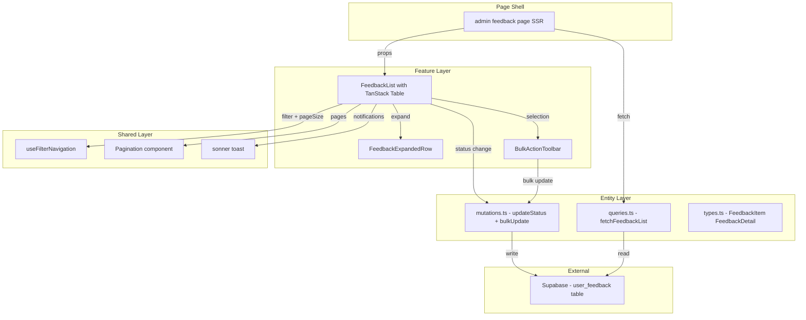

# Design Document — Feedback Page Enhancements

## Overview

**Purpose:** This feature enhances the `/admin/feedback` list page to support inline ticket triage — eliminating the navigate-to-detail-page workflow that slows down bulk feedback processing.

**Users:** Admin users triaging user feedback tickets. Primary workflow: scan list → expand details → change status → repeat (or bulk-select and batch-close).

**Impact:** Replaces the plain shadcn Table in `feedback-list.tsx` with TanStack React Table, adds a new expanded row component, inline status mutations, and bulk operations. The existing detail page (`/admin/feedback/[id]`) remains unchanged.

### Goals
- Enable inline ticket detail viewing without navigation
- Allow single-click status changes directly from the list
- Support bulk status operations for batch triage
- Provide configurable pagination (25/50/100, default 50)

### Non-Goals
- No changes to the feedback submission widget (`features/feedback/`)
- No new database migrations
- No bulk operations beyond status change
- No changes to the standalone detail page

## Architecture

### Existing Architecture Analysis

The current feedback list follows the standard FSD pattern:
- **Page shell** (`app/(app)/admin/feedback/page.tsx`) — Server Component, fetches data via `fetchFeedbackList()`
- **Feature component** (`features/admin-feedback/ui/feedback-list.tsx`) — Client Component, renders plain shadcn Table with filter tabs, search, pagination
- **Entity layer** (`entities/admin/`) — types, server queries (`queries.ts`), client mutations (`mutations.ts`)
- **Detail page** (`app/(app)/admin/feedback/[id]/page.tsx`) — Server Component, separate route with `FeedbackDetailView`

Row click currently triggers `router.push()` to the detail page.

### Architecture Pattern & Boundary Map



**Architecture Integration:**
- Selected pattern: FSD layers preserved — feature components compose entity and shared layers
- Domain boundary: all feedback logic stays in `features/admin-feedback` + `entities/admin`
- New components: `FeedbackExpandedRow` (extracted detail view), `BulkActionToolbar` (inline in FeedbackList)
- Steering compliance: FSD import rules, shadcn component reuse, sonner toast pattern

### Technology Stack

| Layer | Choice / Version | Role in Feature | Notes |
|-------|------------------|-----------------|-------|
| Frontend | `@tanstack/react-table` v8 | Headless table with expand + select models | New dependency |
| Frontend | shadcn/ui `Select`, `Checkbox`, `Table` | Render layer for TanStack columns | Existing |
| Frontend | `sonner` | Toast notifications for status updates | Existing |
| Data | Supabase JS client | Direct mutations + queries on `kvota.user_feedback` | Existing |

## Requirements Traceability

| Requirement | Summary | Components | Interfaces | Flows |
|-------------|---------|------------|------------|-------|
| 1.1 | Click row expands detail panel | FeedbackList, FeedbackExpandedRow | TanStack `getExpandedRowModel` | Row click → expand |
| 1.2 | Click expanded row collapses | FeedbackList | TanStack row toggle | — |
| 1.3 | Expanding new row collapses previous | FeedbackList | Single-expand state logic | — |
| 1.4 | Keyboard toggle (Enter/Space) | FeedbackList | Row `onKeyDown` handler | — |
| 1.5 | Expanded content matches detail view | FeedbackExpandedRow | `FeedbackExpandedRowProps` | — |
| 2.1 | Status dropdown in column | FeedbackList (column def) | `Select` + `StatusCellProps` | — |
| 2.2 | Optimistic status update | FeedbackList | `updateFeedbackStatus` | Optimistic → API → confirm/revert |
| 2.3 | Error revert + toast | FeedbackList | `toast.error()` | — |
| 2.4 | Dropdown stops propagation | FeedbackList (column def) | `stopPropagation` on Select | — |
| 3.1 | Checkbox column | FeedbackList (column def) | TanStack `getRowSelectionModel` | — |
| 3.2 | Header checkbox select-all | FeedbackList | TanStack header select | — |
| 3.3 | Bulk toolbar appears on selection | FeedbackList (inline toolbar) | `BulkToolbarProps` | — |
| 3.4 | Apply disabled without status | FeedbackList (inline toolbar) | Controlled state | — |
| 3.5 | Bulk update API call | Mutations | `bulkUpdateFeedbackStatus` | Select → Apply → API |
| 3.6 | Success: clear + refetch + toast | FeedbackList | `router.refresh()` + `toast.success()` | — |
| 3.7 | Error: keep selection + toast | FeedbackList | `toast.error()` | — |
| 4.1 | Page size selector (25/50/100) | FeedbackList, Pagination area | `Select` component | — |
| 4.2 | Default 50 items | Queries, Page shell | `pageSize` param default | — |
| 4.3 | Page size change resets to page 1 | FeedbackList | `useFilterNavigation` | — |
| 4.4 | Page size in URL | FeedbackList, Page shell | `pageSize` search param | — |
| 4.5 | Page size change clears selection | FeedbackList | Reset row selection state | — |
| 5.1–5.4 | Preserved functionality | All existing components | No interface changes | — |

## Components and Interfaces

| Component | Domain/Layer | Intent | Req Coverage | Key Dependencies | Contracts |
|-----------|-------------|--------|--------------|------------------|-----------|
| FeedbackList | features/admin-feedback | Main list with TanStack table, expand, select, inline status | 1.1–1.4, 2.1–2.4, 3.1–3.4, 3.6–3.7, 4.1–4.5, 5.1–5.3 | TanStack React Table (P0), useFilterNavigation (P1) | State |
| FeedbackExpandedRow | features/admin-feedback | Expanded detail panel for a single feedback row | 1.1, 1.5 | FeedbackDetail type (P1) | — |
| bulkUpdateFeedbackStatus | entities/admin | Batch status mutation via Supabase `.in()` | 3.5 | Supabase client (P0) | Service |
| fetchFeedbackList (modified) | entities/admin | Accept pageSize parameter | 4.2 | Supabase admin client (P0) | Service |
| Page shell (modified) | app/(app)/admin/feedback | Pass pageSize from searchParams | 4.4 | — | — |

### Feature Layer

#### FeedbackList (rewrite)

| Field | Detail |
|-------|--------|
| Intent | Renders the full feedback list with TanStack table supporting row expansion, row selection, inline status change, bulk toolbar, and configurable pagination |
| Requirements | 1.1–1.4, 2.1–2.4, 3.1–3.4, 3.6–3.7, 4.1–4.5, 5.1–5.3 |

**Responsibilities & Constraints**
- Owns the TanStack table instance with expand + selection models
- Manages optimistic status update state per-row
- Renders bulk action toolbar conditionally on selection count > 0
- Delegates URL updates to `useFilterNavigation`

**Dependencies**
- Inbound: Page shell — `FeedbackListProps` (P0)
- Outbound: `updateFeedbackStatus` — single status mutation (P0)
- Outbound: `bulkUpdateFeedbackStatus` — batch mutation (P0)
- Outbound: `useFilterNavigation` — URL param sync (P1)
- External: `@tanstack/react-table` — table engine (P0)

**Contracts**: State [x]

##### State Management

```typescript
interface FeedbackListState {
  // TanStack managed
  expanded: ExpandedState;        // Record<string, boolean> — single row
  rowSelection: RowSelectionState; // Record<string, boolean>
  
  // Local
  optimisticStatuses: Map<string, string>; // shortId → pending status
  bulkTargetStatus: string | null;
  searchValue: string;
}
```

- Persistence: `expanded` and `rowSelection` are ephemeral (reset on page change). `pageSize` persists in URL.
- Concurrency: optimistic updates use per-row Map; bulk update disables inline dropdowns for selected rows during flight.

**Implementation Notes**
- Integration: Reuses existing `useFilterNavigation` for all URL param changes (status, search, page, pageSize)
- Validation: `pageSize` clamped to [25, 50, 100] — invalid values fall back to 50
- Risks: TanStack re-render on 100 rows — mitigate with `useMemo` on column definitions

#### FeedbackExpandedRow

| Field | Detail |
|-------|--------|
| Intent | Renders expanded detail content for a single feedback ticket within the table |
| Requirements | 1.1, 1.5 |

**Responsibilities & Constraints**
- Display-only: full description, page URL link, screenshot with lightbox, collapsible debug context, ClickUp link
- Does NOT include status change UI (handled inline in table column)
- Reuses visual patterns from `FeedbackDetailView` but is a separate component (not importing the detail view)

**Dependencies**
- Inbound: FeedbackList — renders as expanded row content (P0)
- Inbound: `FeedbackDetail` type from entities/admin (P1)

**Implementation Notes**
- Extract visual blocks from `feedback-detail.tsx` design (info grid, description block, screenshot + Dialog lightbox, Collapsible debug context, ClickUp link)
- Renders inside a `<TableCell colSpan={totalColumns}>` wrapper

### Entity Layer

#### bulkUpdateFeedbackStatus (new)

| Field | Detail |
|-------|--------|
| Intent | Update status for multiple feedback tickets in a single Supabase call |
| Requirements | 3.5 |

**Contracts**: Service [x]

##### Service Interface

```typescript
function bulkUpdateFeedbackStatus(
  shortIds: string[],
  status: "new" | "in_progress" | "resolved" | "closed"
): Promise<void>;
```

- Preconditions: `shortIds.length > 0`, `status` is valid enum value
- Postconditions: All matching rows updated with new status and `updated_at` timestamp
- Invariants: Uses Supabase client-side auth — inherits admin RLS permissions

**Implementation Notes**
- Single `.update({status, updated_at}).in('short_id', shortIds)` call
- Error: throws `Error` with Supabase error message

#### fetchFeedbackList (modified)

| Field | Detail |
|-------|--------|
| Intent | Accept dynamic `pageSize` parameter instead of hardcoded constant |
| Requirements | 4.2 |

**Contracts**: Service [x]

##### Service Interface Change

```typescript
// Before
function fetchFeedbackList(
  orgId: string, status?: string, search?: string, page?: number
): Promise<FeedbackListResult>;

// After
function fetchFeedbackList(
  orgId: string, status?: string, search?: string, page?: number, pageSize?: number
): Promise<FeedbackListResult>;
```

- `pageSize` defaults to 50 (was hardcoded 20)
- Existing callers unaffected (optional param with default)

## Data Models

No schema changes. The existing `kvota.user_feedback` table has all required columns:
- `short_id` (PK for client references)
- `status` (text: new, in_progress, resolved, closed)
- `updated_at` (timestamp, set on status change)
- All detail fields: `description`, `page_url`, `screenshot_url`, `debug_context`, `feedback_type`, `user_name`, `user_email`, `clickup_task_id`, `created_at`

## Error Handling

### Error Strategy

All errors surface via sonner toast — consistent with the rest of the application.

| Scenario | Category | Response |
|----------|----------|----------|
| Single status update fails | User Error / Network | Revert optimistic update, `toast.error("Ошибка при обновлении статуса")` |
| Bulk status update fails | User Error / Network | Keep selection, `toast.error("Ошибка при массовом обновлении")` |
| Invalid pageSize in URL | User Error | Clamp to 50 (silent) |
| Data fetch fails | System Error | Next.js error boundary handles (existing behavior) |

## Testing Strategy

### Unit Tests
- TanStack column definitions render correct cell content
- `bulkUpdateFeedbackStatus` constructs correct Supabase query
- `pageSize` URL param parsing with fallback to 50
- Optimistic status state update and revert logic

### Integration Tests
- `fetchFeedbackList` with `pageSize` param returns correct count
- `bulkUpdateFeedbackStatus` updates multiple rows in test DB

### E2E / Browser Tests
- Click row → expanded panel appears with correct content
- Click expanded row → collapses
- Change inline status → persists after page refresh
- Select 3 rows → bulk change to "closed" → all update
- Change page size 25→50→100 → correct item counts
- Keyboard: Enter on focused row toggles expansion
- Filter tab + search still work as before
