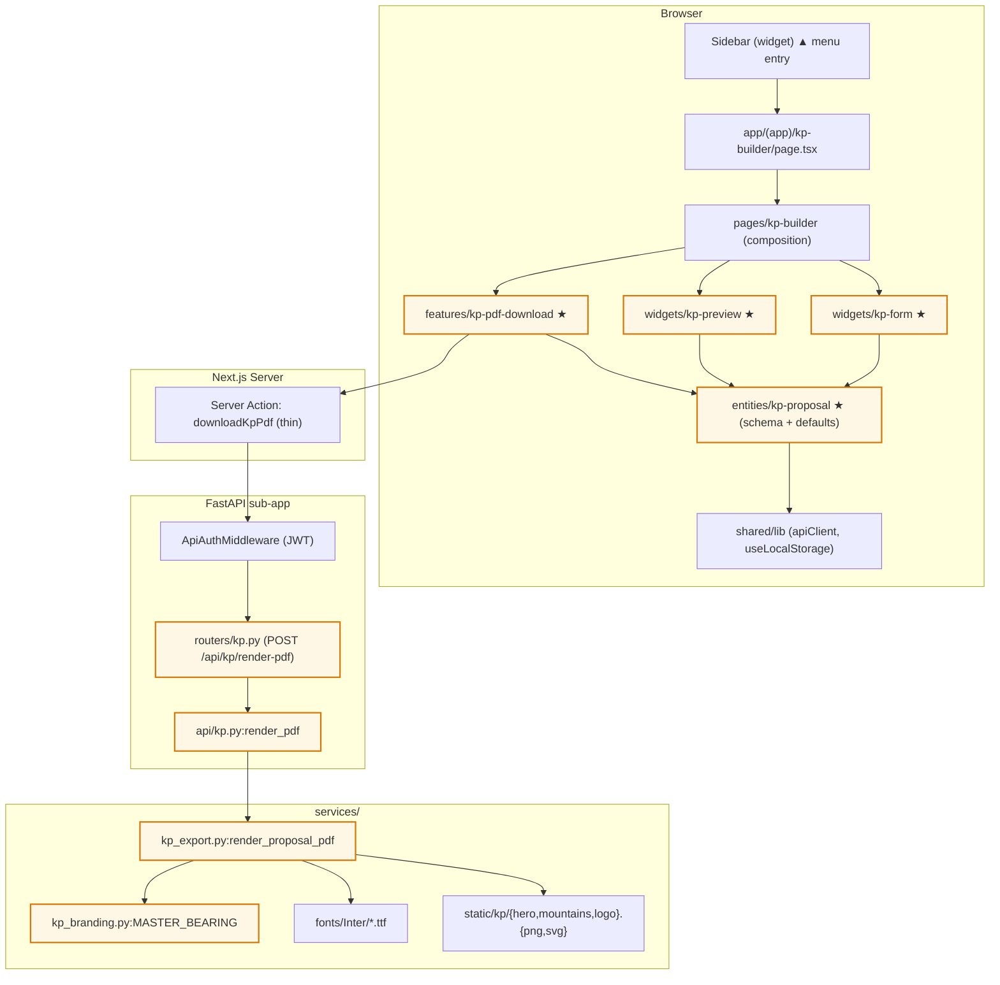

# Technical Design: KP Builder

## Overview

**Purpose:** Add a standalone Next.js page that lets sales staff fill in a heavy-machinery commercial proposal (КП) and download it as a branded PDF rendered server-side via WeasyPrint.

**Users:** Sales managers, head of sales — any authenticated user in iteration 1.

**Impact:** Adds one route, one sidebar entry, four FSD slices, one FastAPI router, one PDF service, one branding config, one font bundle. Zero database changes. Zero changes to existing endpoints.

### Goals

- New standalone page at `/kp-builder` with split-screen form + live preview.
- Server-side PDF rendering through a JWT-protected `/api/kp/render-pdf` endpoint.
- Master Bearing branding hardcoded behind a single isolated config object.
- Inter bundled and embedded in the PDF.
- Visual regression fixture so future renderer changes don't silently break the layout.
- Form state persisted to `localStorage` for cross-reload recovery.

### Non-Goals

- No database persistence, no link to `quotes`/`specifications`/`deals`.
- No multi-tenant branding UI — `branding` is a developer-edited constant.
- No email delivery, no Supabase Storage upload, no versioning.
- No role-based access gating beyond "authenticated".
- No FastHTML route changes; `main.py` is untouched.

## Architecture

### Existing Architecture Analysis

- **Frontend:** Next.js 15 App Router with FSD layers (`app → pages → widgets → features → entities → shared`). Routes under `frontend/src/app/(app)/...` are thin shells delegating to `frontend/src/pages/...` compositions.
- **Backend API:** FastAPI sub-app mounted at `/api` in `api/app.py`. Routers live under `api/routers/`; business logic in `api/<domain>.py`; cross-domain services in `services/`.
- **PDF exports:** Three existing modules (`specification_export.py`, `invoice_export.py`, `contract_spec_export.py`) all use WeasyPrint with f-string HTML and inlined `<style>` CSS. None use a custom font.
- **Auth:** `ApiAuthMiddleware` on the outer FastAPI app validates Supabase JWT into `request.state.api_user`. The KP endpoint inherits this for free.
- **Error envelope:** `api/lib/errors.py:error_response(code, message, status_code)` produces the canonical `{"success": false, "error": {"code": ..., "message": ...}}` shape; the default 422 is mapped to `VALIDATION_ERROR` in `api/app.py`.

### Architecture Pattern & Boundary Map



★ = new slice/file. ▲ = existing, single-line edit. Brand colors mark new vs existing.

### Technology Stack & Alignment

- **Frontend:** Next.js 15 + TypeScript strict, Tailwind v4 + shadcn/ui, React Hook Form + Zod for the form, TanStack Query is **not** needed (no server data fetch beyond the PDF action), `sonner` (already in repo) for toasts.
- **Backend:** Python 3.11+, FastAPI sub-app, `weasyprint==60.x` (already pinned), `pdfminer.six` (new, for visual regression tests).
- **Fonts:** Inter (OFL), bundled at `services/fonts/Inter/` (Regular 400, Medium 500, SemiBold 600, Bold 700).
- **Static assets:** Hero illustrations + Master Bearing logo at `services/static/kp/`. Served only to the Python renderer (read from disk); not exposed via HTTP.
- **Testing:** `pytest` for backend (with `pytest.mark.unit` and `pytest.mark.integration`), `vitest` for frontend unit, Playwright MCP for browser smoke (Phase 5e).

## Requirements Traceability

| REQ | Component | Files |
|-----|-----------|-------|
| 1.1, 1.2, 1.4 | Sidebar entry, route | `widgets/sidebar/sidebar-menu.ts`, `app/(app)/kp-builder/page.tsx` |
| 1.3 | Auth gate | inherited from `app/(app)/layout.tsx` |
| 1.5 | Split-screen layout | `pages/kp-builder/ui/kp-builder-page.tsx` |
| 2.1, 2.4, 2.5 | Default data + reset/example | `entities/kp-proposal/model/default-data.ts`, `widgets/kp-form/ui/form-toolbar.tsx` |
| 2.2, 2.3, 2.6 | localStorage persistence | `entities/kp-proposal/lib/use-kp-state.ts` |
| 3.1–3.5 | Header & meta fields | `widgets/kp-form/ui/section-offer.tsx`, `widgets/kp-preview/ui/kp-page-1.tsx` |
| 4.1–4.7 | Items table + total | `widgets/kp-form/ui/section-items.tsx`, `entities/kp-proposal/lib/calc-total.ts`, `widgets/kp-preview/ui/kp-page-1.tsx` |
| 5.1–5.3 | Page-1 notes | `widgets/kp-form/ui/section-notes.tsx`, `widgets/kp-preview/ui/kp-page-1.tsx` |
| 6.1–6.3 | Tech specs list | `widgets/kp-form/ui/section-specs.tsx`, `widgets/kp-preview/ui/kp-page-2.tsx` |
| 7.1–7.4 | Packaging checklist | `widgets/kp-form/ui/section-packaging.tsx`, `widgets/kp-preview/ui/kp-page-2.tsx` |
| 8.1–8.3 | Conditions list | `widgets/kp-form/ui/section-conditions.tsx`, `widgets/kp-preview/ui/kp-page-2.tsx` |
| 9.1–9.3 | Services checkboxes | `widgets/kp-form/ui/section-services.tsx`, `widgets/kp-preview/ui/kp-page-2.tsx` |
| 10.1–10.4 | Notes-2 + contacts + footer | `widgets/kp-form/ui/section-contacts.tsx`, `widgets/kp-preview/ui/kp-page-2.tsx` |
| 11.1–11.5 | Live preview rendering, CSS isolation | `widgets/kp-preview/ui/*.tsx`, `widgets/kp-preview/ui/kp-preview.module.css` |
| 12.1–12.4 | Zoom controls | `widgets/kp-preview/ui/preview-toolbar.tsx` |
| 13.1–13.5 | PDF download trigger | `features/kp-pdf-download/ui/download-button.tsx`, `features/kp-pdf-download/api/render-pdf-action.ts` |
| 14.1–14.8 | Endpoint contract | `api/routers/kp.py`, `api/kp.py` |
| 15.1–15.6 | PDF specification | `services/kp_export.py`, `services/kp_branding.py`, `services/fonts/Inter/*`, `services/static/kp/*` |
| 16.1–16.4 | Branding isolation | `services/kp_branding.py`, `entities/kp-proposal/model/branding.ts` |
| 17.1–17.4 | Visual fidelity | `tests/services/test_kp_export_visual.py`, baseline at `tests/services/__fixtures__/kp_baseline.json` |
| 18.1–18.4 | Auth + logging | inherited middleware; logging in `api/kp.py` |
| 19.1–19.4 | Error surfaces | `features/kp-pdf-download/api/render-pdf-action.ts`, `api/kp.py` |
| 20.1–20.6 | Out-of-scope guards | enforced by absence; lint check in `tests/test_no_db_writes.py` (regex over `services/kp_export.py`) |

## Components & Interface Contracts

### Backend

#### `services/kp_branding.py` — branding constants (new)

```python
from dataclasses import dataclass
from pathlib import Path
from typing import Tuple

_KP_STATIC = Path(__file__).parent / "static" / "kp"
_KP_FONTS = Path(__file__).parent / "fonts" / "Inter"

@dataclass(frozen=True)
class FooterFeature:
    """One of the four 'features' tiles in the page-1 footer (Reliable supply, etc.)."""
    icon_svg: str  # raw inline SVG markup
    title_line_1: str
    title_line_2: str

@dataclass(frozen=True)
class KpBranding:
    name: str
    primary_blue: str       # hex e.g. "#1d3a8a"
    primary_red: str        # hex e.g. "#d11f2f"
    accent_cream: str       # background
    logo_svg: str           # raw inline SVG markup
    hero_machinery_path: Path
    mountains_path: Path
    default_subtitle: str
    page1_footer_features: Tuple[FooterFeature, FooterFeature, FooterFeature, FooterFeature]
    page2_footer_phone: str
    page2_footer_site: str
    page2_footer_email: str
    font_dir: Path

MASTER_BEARING: KpBranding = KpBranding(
    name="Master Bearing",
    primary_blue="#1d3a8a",
    primary_red="#d11f2f",
    accent_cream="#fbf6ec",
    logo_svg=_KP_STATIC.joinpath("master-bearing-logo.svg").read_text(),
    hero_machinery_path=_KP_STATIC / "hero-machinery.png",
    mountains_path=_KP_STATIC / "mountains.png",
    default_subtitle="на поставку крупной спецтехники",
    page1_footer_features=(
        FooterFeature(icon_svg=_load("shield.svg"), title_line_1="НАДЕЖНЫЕ", title_line_2="ПОСТАВКИ"),
        FooterFeature(icon_svg=_load("shield-check.svg"), title_line_1="КАЧЕСТВЕННАЯ", title_line_2="ПРОДУКЦИЯ"),
        FooterFeature(icon_svg=_load("cog.svg"), title_line_1="ТЕХНИЧЕСКАЯ", title_line_2="ПОДДЕРЖКА"),
        FooterFeature(icon_svg=_load("handshake.svg"), title_line_1="ИНДИВИДУАЛЬНЫЙ", title_line_2="ПОДХОД"),
    ),
    page2_footer_phone="8-800-350-21-34",
    page2_footer_site="www.masterbearing.ru",
    page2_footer_email="order@masterbearing.ru",
    font_dir=_KP_FONTS,
)
```

The `_load(path)` helper reads SVG files from `services/static/kp/icons/`. Branding is a single immutable dataclass — adding a second brand later means adding one more constant and a lookup function; no renderer code changes.

#### `services/kp_export.py` — PDF renderer (new)

```python
from dataclasses import dataclass
from typing import List
from services.kp_branding import KpBranding, MASTER_BEARING

@dataclass(frozen=True)
class KpItem:
    name: str = ""
    model: str = ""
    qty: str = ""    # kept as strings; renderer parses defensively
    price: str = ""

@dataclass(frozen=True)
class KpPackagingItem:
    text: str = ""
    checked: bool = False

@dataclass(frozen=True)
class KpServices:
    delivery: bool = False
    training: bool = False
    supervision: bool = False
    warranty: bool = False
    commissioning: bool = False
    service: bool = False

@dataclass(frozen=True)
class KpProposal:
    """Validated, immutable form snapshot. Built from the JSON body."""
    subtitle: str = ""
    supplier: str = ""
    manager: str = ""
    phone: str = ""
    email: str = ""
    address: str = ""
    basis: str = ""
    payment: str = ""
    date: str = ""
    lead: str = ""
    amount: str = ""
    price_includes: str = ""
    items: tuple[KpItem, ...] = ()
    notes: str = ""
    specs: tuple[str, ...] = ()
    packaging: tuple[KpPackagingItem, ...] = ()
    conditions: tuple[str, ...] = ()
    services: KpServices = KpServices()
    notes2: str = ""
    contact_phone: str = ""
    contact_email: str = ""
    contact_site: str = ""
    contact_address: str = ""
    foot_phone: str = ""
    foot_site: str = ""
    foot_email: str = ""

def render_proposal_html(proposal: KpProposal, branding: KpBranding = MASTER_BEARING) -> str:
    """Build the two-page A4 HTML string ready for WeasyPrint."""

def render_proposal_pdf(proposal: KpProposal, branding: KpBranding = MASTER_BEARING) -> bytes:
    """Render the proposal to PDF bytes. Embeds Inter via @font-face."""
```

Internal structure of `render_proposal_html`:

- `_kp_styles(branding)` — returns inlined CSS string (ports `kp.css` from the design prototype, with brand colors interpolated from `branding`).
- `_page_1(proposal, branding)` — header bars, hero image, info grid, items table with auto-total, notes box, page-1 footer features.
- `_page_2(proposal, branding)` — header strip, two-column specs+packaging cards, conditions, services + notes-2, contacts block with mountains illustration, page-2 footer.
- Number formatting: `_fmt_ru(value)` — strips spaces, replaces comma with dot, parses to Decimal, formats with `groups_separator=' '` (narrow no-break space). Returns the raw input on parse failure.
- Items padding: always emits at least 5 rows even if fewer items are provided.
- All polygon-clipped bars are emitted as `<svg>` shapes inside the colored `<div>`, not via `clip-path` alone, to sidestep any WeasyPrint quirk (see ADR-4).

#### `api/kp.py` — handler module (new)

```python
import logging
import uuid
from datetime import date
from starlette.requests import Request
from starlette.responses import Response
from api.lib.errors import error_response
from api.lib.auth_helpers import require_api_user  # existing helper
from services.kp_export import render_proposal_pdf, KpProposal, KpItem, KpPackagingItem, KpServices

logger = logging.getLogger(__name__)

async def render_pdf(request: Request) -> Response:
    """Render a heavy-machinery commercial proposal as PDF.

    Path: POST /api/kp/render-pdf
    Params:
        body: KpProposalRequest (JSON) — all fields optional, defaults documented in service
    Returns:
        Binary PDF body with Content-Type: application/pdf and Content-Disposition
    Roles: any authenticated user
    """
    user = require_api_user(request)  # raises 401 if missing
    request_id = str(uuid.uuid4())
    try:
        body = await request.json()
    except ValueError:
        return error_response("VALIDATION_ERROR", "Malformed JSON body", status_code=400)

    proposal = _build_proposal(body)  # tolerant: missing fields → defaults
    try:
        pdf_bytes = render_proposal_pdf(proposal)
    except Exception:
        logger.exception("kp.render_pdf failed", extra={"request_id": request_id, "user_id": user.id})
        return error_response("RENDER_ERROR", "PDF rendering failed", status_code=500, extra={"request_id": request_id})

    filename = f"kp-{date.today().isoformat()}.pdf"
    logger.info("kp.render_pdf ok", extra={
        "request_id": request_id, "user_id": user.id, "org_id": user.org_id,
        "bytes": len(pdf_bytes),
    })
    return Response(
        content=pdf_bytes,
        media_type="application/pdf",
        headers={"Content-Disposition": f'attachment; filename="{filename}"'},
    )
```

#### `api/routers/kp.py` — router (new)

```python
from fastapi import APIRouter
from starlette.requests import Request
from starlette.responses import Response
from api.kp import render_pdf as _render_pdf

router = APIRouter(tags=["kp"])

@router.post("/render-pdf", response_model=None)
async def post_render_pdf(request: Request) -> Response:
    return await _render_pdf(request)
```

#### `api/app.py` — one-line addition

```python
from api.routers import (..., kp, ...)
api_sub_app.include_router(kp.router, prefix="/kp")  # → /api/kp/render-pdf
```

### Frontend

#### `entities/kp-proposal` (new) — data shape + schema + defaults

Files:
- `model/types.ts` — TS types matching the Python dataclasses
- `model/schema.ts` — Zod schema mirroring the types, used by RHF resolver
- `model/default-data.ts` — `DEFAULT_PROPOSAL` matching the design's `DEFAULT_DATA`
- `model/empty-data.ts` — `EMPTY_PROPOSAL` for the "Clear" action
- `model/branding.ts` — `BRANDING` constant (colors + footer values) mirroring the Python branding for preview-side rendering
- `lib/calc-total.ts` — `calcGrandTotal(items): number` and `calcRowTotal(item): number | null` helpers (REQ-4)
- `lib/fmt-ru.ts` — Russian-locale number formatter mirroring the Python `_fmt_ru` (REQ-3.3, REQ-4.5)
- `lib/use-kp-state.ts` — `useKpState()` hook: `{ data, setData, clear, loadExample, zoom, setZoom }` backed by `localStorage` with silent quota fallback (REQ-2)
- `index.ts` — public API (`KpProposal`, `kpProposalSchema`, `DEFAULT_PROPOSAL`, `EMPTY_PROPOSAL`, `BRANDING`, `useKpState`, `calcGrandTotal`, `calcRowTotal`, `fmtRu`)

```typescript
// entities/kp-proposal/model/types.ts
export interface KpItem { name: string; model: string; qty: string; price: string; }
export interface KpPackagingItem { text: string; checked: boolean; }
export interface KpServices {
  delivery: boolean; training: boolean; supervision: boolean;
  warranty: boolean; commissioning: boolean; service: boolean;
}
export interface KpProposal {
  subtitle: string; supplier: string; manager: string;
  phone: string; email: string; address: string;
  basis: string; payment: string; date: string;
  lead: string; amount: string; priceIncludes: string;
  items: KpItem[];
  notes: string;
  specs: string[];
  packaging: KpPackagingItem[];
  conditions: string[];
  services: KpServices;
  notes2: string;
  contact_phone: string; contact_email: string;
  contact_site: string; contact_address: string;
  foot_phone: string; foot_site: string; foot_email: string;
}
```

#### `widgets/kp-form` (new) — left pane

Files:
- `ui/kp-form.tsx` — root component, receives `data`, `setData`, `onClear`, `onLoadExample`; composes section sub-components
- `ui/form-header.tsx` — wordmark + crumbs + "Очистить"/"Пример" buttons
- `ui/section-offer.tsx` — section 1: offer info (REQ-3)
- `ui/section-items.tsx` — section 2: items table with add/remove rows (REQ-4)
- `ui/section-notes.tsx` — notes textarea (REQ-5)
- `ui/section-specs.tsx` — dynamic specs list (REQ-6)
- `ui/section-packaging.tsx` — dynamic packaging with checkboxes (REQ-7)
- `ui/section-conditions.tsx` — dynamic conditions (REQ-8)
- `ui/section-services.tsx` — 6 fixed service checkboxes (REQ-9)
- `ui/section-contacts.tsx` — contacts + footer (REQ-10)
- `ui/kp-form.module.css` — kvotaflow form styles (cream bg, Inter, copper accent)
- `lib/use-dynamic-list.ts` — `useDynamicList<T>()` helper for add/remove row patterns
- `index.ts` — exports `KpForm`

The form does **not** use React Hook Form for iteration 1 — controlled inputs driven by `useKpState` are simpler. Zod schema is used only on the submit boundary (before sending to the API) to fail fast on type drift.

UX complexity notes (from common/ux-complexity.md):
- The form has 9 sections — above the "warning" threshold of 6-8 sections. Mitigated by:
  - Each section has a colored section header with an icon (visual scannability).
  - Sections are sticky-collapsed under their header — clicking the header expands/collapses (progressive disclosure, REQ-21 might follow if needed).
- One primary CTA in the preview pane ("Сохранить PDF"), two tertiary CTAs in the form header ("Очистить", "Пример"). Hierarchy preserved.

#### `widgets/kp-preview` (new) — right pane

Files:
- `ui/kp-preview.tsx` — root: stacks two `<KpPage>` components, applies `transform: scale(zoom)` wrapping
- `ui/preview-toolbar.tsx` — "Предпросмотр · A4 · 2 страницы" title + zoom controls + "Сохранить PDF" slot
- `ui/kp-page-1.tsx` — page 1 (header, info grid, items table, notes, footer features)
- `ui/kp-page-2.tsx` — page 2 (specs + packaging cards, conditions, services + notes-2, contacts, footer)
- `ui/kp-field.tsx` — labeled icon + label + value row used in the info grid
- `ui/icons.tsx` — KP-specific SVG icon set (separate from app-level lucide icons; ports `Icons.jsx` from prototype)
- `ui/master-bearing-mark.tsx` — Master Bearing logo SVG (ports `BearingLogo.jsx`)
- `ui/illustrations.tsx` — `HeavyMachineryIllu` + `MountainIllu` referencing `/static/kp/*.png` images from the Next.js `public/` directory (mirror of `services/static/kp/*.png` content)
- `ui/kp-preview.module.css` — KP layout styles scoped under `.kpPage` class; **does not** reference any kvotaflow design tokens
- `index.ts` — exports `KpPreview`

CSS isolation strategy (REQ-11.5, REQ-16.4): All KP styles live in `kp-preview.module.css` using CSS Modules — the `.kpPage` class becomes `_kpPage_h7a8d_1` at build time, so no class can accidentally bleed into the kvotaflow form on the left. Inter is loaded once at the page level via `<link rel="preload">` in `app/(app)/kp-builder/page.tsx` head, with the same TTF files served from `frontend/public/fonts/Inter/`.

#### `features/kp-pdf-download` (new) — PDF download action

Files:
- `ui/download-button.tsx` — button + loading spinner + click handler
- `api/render-pdf-action.ts` — Server Action `downloadKpPdf(proposal: KpProposal): Promise<Blob>` calling `apiServerClient("/kp/render-pdf", ...)`
- `api/parse-error.ts` — maps API error codes (`UNAUTHORIZED` → "session expired", `RENDER_ERROR` → "try again with request id X")
- `index.ts` — exports `DownloadKpPdfButton`

The Server Action receives the validated `KpProposal`, forwards it to the Python API with the user's JWT (handled inside `apiServerClient`), and returns a `Blob`. The button component triggers an `<a>`-tag download via `URL.createObjectURL(blob)` then revokes the URL.

#### `pages/kp-builder` (new) — composition

Files:
- `ui/kp-builder-page.tsx` — split-screen layout: `<KpForm />` on the left, `<KpPreview />` on the right with `<DownloadKpPdfButton />` in the toolbar
- `index.ts` — exports `KpBuilderPage`

The page reads `useKpState()` once and threads `data`/`setData` into both widgets.

#### `app/(app)/kp-builder/page.tsx` (new) — route shell

```tsx
import { KpBuilderPage } from "@/pages/kp-builder";
export default function Page() { return <KpBuilderPage />; }
```

The `(app)` segment already handles auth gating; unauthenticated users redirect to `/login` (REQ-1.4).

#### `widgets/sidebar/sidebar-menu.ts` — single-line edit

Add to `mainItems` (the "Главное" section), placed right after "Новый КП":

```typescript
if (hasRole("sales", "sales_manager", "head_of_sales")) {
  mainItems.push({
    icon: FileText,  // already imported
    label: "КП на технику",
    href: "/kp-builder",
  });
}
```

## Data Models

No database changes. The proposal exists only in `localStorage` and request bodies.

### Frontend → Backend payload (JSON)

```typescript
// What the Server Action sends; matches Python KpProposal dataclass field-for-field.
interface KpProposalPayload {
  subtitle?: string;
  supplier?: string;
  // ... all fields from KpProposal, all optional, all default to "" or [] on the Python side
}
```

### Backend → Frontend response

- **Success:** binary `application/pdf` body with `Content-Disposition: attachment; filename="kp-YYYY-MM-DD.pdf"`.
- **Error:** standard JSON envelope `{"success": false, "error": {"code": "...", "message": "...", "request_id": "..."}}` with status 400/401/500.

### localStorage keys

| Key | Value | REQ |
|-----|-------|-----|
| `kvotaflow.kp.v1` | JSON-serialized `KpProposal` | 2.2 |
| `kvotaflow.kp.v1.zoom` | Number 0.3–1.2 as string | 12.3 |

Versioning suffix `.v1` makes future schema migrations safe: bump to `.v2` and ship a one-time migration in `useKpState`.

## Error Handling

### Error Strategy

- **Server:** all rendering exceptions are caught, logged with `request_id` + `user_id`, and returned as `RENDER_ERROR` with HTTP 500. Validation errors return `VALIDATION_ERROR` with HTTP 400. Auth failures return `UNAUTHORIZED` with HTTP 401 from the middleware.
- **Client:** the Server Action propagates the error envelope; the download button maps codes to user-friendly toasts (REQ-19). Form state is never mutated by errors — the user can retry without re-entering data.

### Error Categories

| Code | HTTP | Source | User-facing message |
|------|------|--------|---------------------|
| `UNAUTHORIZED` | 401 | `ApiAuthMiddleware` | "Сессия истекла, перезагрузите страницу" |
| `VALIDATION_ERROR` | 400 | handler | The `message` field verbatim |
| `RENDER_ERROR` | 500 | handler | "Не удалось сгенерировать PDF, попробуйте ещё раз (ID: {request_id})" |

## Testing Strategy

### Unit Tests (backend, `pytest -m unit`)

- `tests/services/test_kp_export_units.py`:
  - `_fmt_ru`: parses "5 850 000", "5850000", "5850,5", "abc" — last returns raw.
  - `_build_proposal` (in `api/kp.py`): all-fields, no-fields, missing-nested-services.
  - `calc_grand_total`: sums valid rows, ignores rows with non-numeric qty/price.
- `tests/services/test_kp_export_html.py`:
  - Output contains brand colors interpolated from `MASTER_BEARING`.
  - Output references the font files via `file://` URL.
  - Items table emits ≥5 rows even when 1 item is provided (REQ-4.4).
  - Empty packaging row still renders the checkbox div (REQ-7).

### Integration Tests (backend, `pytest -m integration`)

- `tests/services/test_kp_export_render.py`:
  - `render_proposal_pdf(DEFAULT_PROPOSAL_FIXTURE)` returns non-empty bytes starting with `%PDF-`.
  - PDF has exactly 2 pages (assert via `pikepdf.Pdf.open(io.BytesIO(bytes))`).
- `tests/api/test_kp_endpoint.py`:
  - 401 without JWT.
  - 400 on malformed JSON.
  - 200 with `application/pdf` Content-Type on valid body.
  - `Content-Disposition` header carries `kp-{today}.pdf`.

### Visual Regression (backend, `pytest -m integration`)

- `tests/services/test_kp_export_visual.py`:
  - Renders PDF for `DEFAULT_PROPOSAL_FIXTURE`.
  - Extracts text + bounding-box structure via `pdfminer.six` into a normalized JSON.
  - Compares against `tests/services/__fixtures__/kp_baseline.json`.
  - Diff > 0 → test fails with a clear "baseline drift; review and `pytest --update-baseline` if intentional" message.
  - `--update-baseline` is a custom pytest flag that overwrites the JSON in place.

### Frontend Unit Tests (`vitest`)

- `entities/kp-proposal/lib/calc-total.test.ts`: row sum, grand total, mixed valid/invalid rows.
- `entities/kp-proposal/lib/fmt-ru.test.ts`: locale formatter parity with Python.
- `entities/kp-proposal/lib/use-kp-state.test.ts` (dom): default load, persist on change, restore on rehydrate, silent quota fail.
- `widgets/kp-form/ui/section-items.test.tsx` (dom): add row appends, remove row removes, qty/price inputs update state.

### Browser Test (Phase 5e, Playwright MCP)

Manifest entries (auto-generated from REQ in Phase 5e):
- TEST: navigate to `/kp-builder`, page loads without console errors.
- TEST: form on left shows default data; preview on right renders both pages with "КОММЕРЧЕСКОЕ ПРЕДЛОЖЕНИЕ" heading.
- TEST: change `supplier` input → preview updates within one render.
- TEST: click "Сохранить PDF" → network request to `POST /api/kp/render-pdf` → response is `application/pdf`.
- TEST: smoke at 1440px and 375px (the split-screen collapses to single-column on mobile; preview is read-only at narrow widths).
- TEST: console has no errors throughout.

## Architecture Decision Records

### ADR-1 (SUPERSEDED): WeasyPrint over Playwright

**Original decision (2026-05-22):** Use WeasyPrint for PDF rendering.

**Original rationale:** Already in production for 3 exports; no new docker dependency (Playwright adds ~300 MB chromium); CSS feature audit confirmed clip-path / transforms / SVG are supported by WeasyPrint ≥53.

**Reversed by ADR-9 on 2026-05-24** after the rendered PDF was visually unacceptable (ghost headline text, mis-sized hero illustration, off-grid info rows). Kept here for history.

### ADR-9: Playwright over WeasyPrint (post-implementation reversal)

**Decision:** Render the KP PDF via headless Chromium driven by Playwright. WeasyPrint stays in the image for the three table-only exports (specs / invoices / contracts).

**Trigger:** First end-to-end smoke render of the design fixture revealed three classes of WeasyPrint-only visual defects: duplicate "ghost" headline text, hero machinery illustration positioned outside the intended bounding box (overlapping the headline), and SVG icon glyphs rendering at wrong sizes inside info-grid cells. A side-by-side Chrome `--print-to-pdf` of the SAME HTML produced the expected design. The HTML/CSS port is faithful; the engine is the limiting factor.

**Rationale:** Brand-design documents (clip-path bars, SVG icons, precise typography, hero illustrations) need a full CSS layout engine. WeasyPrint is sufficient for table-only documents (the three existing exports) but not for layered design pages. The cost of adding Chromium to the image (~300 MB, +1-2 s per render) is justified by pixel-perfect parity between the live Next.js preview and the downloaded PDF — both are now rendered by Chrome.

**Trade-off:** Image size grows ~300 MB. Per-render latency increases from <500 ms (WeasyPrint) to 1-2 s (browser launch + render). Both acceptable at the human-triggered cadence of KP generation. The visual regression test (`tests/services/test_kp_export_visual.py`, pdfminer-based) is retired — Chromium is deterministic enough that structural compare is no longer required; pikepdf-based page-count and embedded-font-name checks (`test_kp_export_render.py`) cover the regression surface.

**Cost recovered:** `pdfminer.six` dependency removed. `--update-baseline` pytest flag removed from `conftest.py`. The `kp_baseline.json` fixture is deleted. ADR-4 (SVG polygon fallback for clip-path) is retained as belt-and-braces but is no longer load-bearing.

### ADR-7: Silent localStorage quota fallback

### ADR-2: Hardcoded Master Bearing branding in a single isolated file

**Decision:** Ship Master Bearing as the only brand in iteration 1; isolate all brand-specific values in `services/kp_branding.py` + `entities/kp-proposal/model/branding.ts`.

**Rationale:** Per user direction, this iteration ships one customer; future multi-brand changes will be a single-file edit plus a lookup function.

**Trade-off:** Two parallel constants (Python + TypeScript) must stay in sync. Mitigated by an `assert` in the renderer that the embedded primary colors match between the two on visual regression baseline.

### ADR-3: localStorage-only persistence

**Decision:** Form state lives in `localStorage`; no backend persistence.

**Rationale:** Iteration 1 is standalone; adding DB schema for transient form drafts is over-engineering. Future iterations will add DB persistence when the page integrates with `quotes`.

**Trade-off:** Drafts don't survive cross-device. Acceptable for iteration 1; sales staff complete a KP in one session.

### ADR-4: SVG fallbacks for clip-path polygons

**Decision:** Render every angled bar in the layout as both `clip-path` *and* an inline SVG polygon shape positioned absolutely.

**Rationale:** WeasyPrint generally supports `clip-path: polygon(...)`, but quirks can appear with specific angles or border-radius interactions. Belt-and-braces SVG ensures the bar appears even if `clip-path` fails on a particular WeasyPrint build.

**Trade-off:** Slightly more HTML markup. Worth it for visual robustness.

### ADR-5: pdfminer.six structural compare for visual regression

**Decision:** Use `pdfminer.six` to extract text + bounding boxes from rendered PDFs and compare structure as JSON, rather than byte-diff or perceptual-diff.

**Rationale:** Byte diffs are noisy (metadata, font subsetting reorder); perceptual diffs need poppler + tolerance tuning. Structural diff is the cheapest stable signal — catches "section moved", "table missing", "text changed".

**Trade-off:** Doesn't catch pure color or line-weight changes. Acceptable because a typography/color change should be intentional and the baseline is updated explicitly in the same commit.

### ADR-6: PDF filename `kp-{YYYY-MM-DD}.pdf` (no supplier slug)

**Decision:** Server returns `Content-Disposition: attachment; filename="kp-{ISO date}.pdf"`.

**Rationale:** ASCII-safe across all email clients and operating systems. Supplier slug would require sanitization for filesystem-safety and adds little user value when the user typed the supplier name themselves.

**Trade-off:** Multiple KPs on the same day collide on filename. Browsers handle this by appending `(1)`, `(2)`. Iteration 2 can add a deterministic slug when supplier comes from DB.

### ADR-8: Inter instead of Plus Jakarta Sans (Cyrillic coverage)

**Decision:** Use Inter (Regular, Medium, SemiBold, Bold; latin + cyrillic + cyrillic-ext subsets) for both the KP preview and the PDF.

**Rationale:** The original design called for Plus Jakarta Sans, but the Google Fonts release of that family does not include the Cyrillic subset. Chrome on macOS hides the gap during preview by falling back to SF Pro; WeasyPrint in the production Linux Docker image would fall back to DejaVu Sans, breaking the brand typography for every Russian glyph in the proposal. Inter is the closest humanist sans we can ship with full Cyrillic coverage, is already familiar to the kvotaflow form area, and uses the same OFL license terms.

**Trade-off:** The KP preview area visually de-differentiates from the kvotaflow form area (both now run Inter). Brand differentiation comes from the layout, colour, and illustrations rather than the typeface. Acceptable; the alternative (broken Cyrillic in production PDFs) is unshippable.

### ADR-7: Silent localStorage quota fallback

**Decision:** Catch `QuotaExceededError` and continue without surfacing UI feedback.

**Rationale:** Form state is small (~5 KB worst case); quota is unlikely to hit. Toasting on every keystroke when persistence fails is noisy and unactionable. In-memory React state still works; only cross-reload survival degrades.

**Trade-off:** A user in private-mode Safari may lose drafts on reload without warning. Acceptable; Safari private mode is < 1% of internal sales traffic.

## Known WeasyPrint Quirks

Documented here as required by REQ-17.4:

- **Quirk #1 — Font kerning:** WeasyPrint uses Pango; Chromium uses HarfBuzz. Subtle differences in letter spacing for the "КОММЕРЧЕСКОЕ ПРЕДЛОЖЕНИЕ" headline are accepted.
- **Quirk #2 — Color profile:** WeasyPrint emits sRGB without an embedded profile; some PDF viewers may shift the red brand color by 1-2% perceived saturation. Considered acceptable.
- **Quirk #3 — `letter-spacing` on `text-transform: uppercase`:** Slightly different breaking points between Chromium and WeasyPrint. Mitigated by manual line breaks in headlines.
- **Quirk #4 — `font-weight: 800` without a bundled 800 face:** WeasyPrint synthesizes a heavier weight from the nearest bundled face, producing inconsistent stroke widths. The KP renderer pins headline weights to bundled values only (we bundle 400/500/600/700; the H1 "КОММЕРЧЕСКОЕ ПРЕДЛОЖЕНИЕ" uses 700, not 800). Bundle every weight you reference, or down-round to the closest available weight.

This section is the authoritative list — when a new quirk surfaces during implementation, it gets appended here and to `research.md`.

## Migration Strategy

Not applicable — no schema changes, no data migration.

## Deployment Notes

- Docker image must `COPY services/fonts/Inter /usr/src/app/services/fonts/Inter` (no separate volume).
- Docker image must `COPY services/static/kp /usr/src/app/services/static/kp`.
- `requirements.txt` adds `pdfminer.six` (~250 KB).
- `frontend/public/fonts/Inter/*.ttf` must be present for the browser preview to use the same font as the PDF.
- Caddy needs no changes — `/api/kp/render-pdf` is already covered by the existing `/api/*` route to the Python container.
