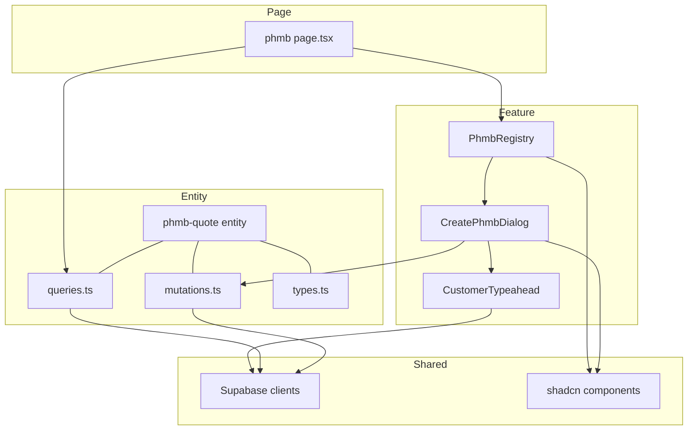

# Design Document: PHMB Registry

## Overview

**Purpose**: Standalone registry page for PHMB quotes at `/phmb` — the entry point for the PHMB price-list quotation flow. Includes quote list with search/filter/pagination and a create dialog with payment terms.

**Users**: Sales managers and admins create and manage PHMB quotes.

**Impact**: New FSD entity (`phmb-quote`), new feature slice (`phmb`), new page route. No database changes. First page of the standalone PHMB flow.

### Goals
- Dedicated registry for PHMB quotes (separate from /quotes)
- Create dialog with pre-configured payment terms from org settings
- Search by client/IDN, filter by computed status
- Sidebar integration

### Non-Goals
- Quote detail workspace (Screen 2: `/phmb/[id]`)
- Procurement queue (Screen 3: `/phmb/procurement`)
- Handsontable integration (Screen 2)
- PDF export (Screen 2)

## Architecture



### Technology Stack

| Layer | Choice | Role | Notes |
|-------|--------|------|-------|
| Frontend | Next.js 15 App Router | Page routing, SSR data fetch | Existing |
| UI | shadcn/ui + Tailwind v4 | Table, Dialog, Input, Button, Badge, Command | Existing |
| Data | Supabase JS (kvota) | Direct queries and mutations | Existing |
| Auth | @supabase/ssr | Session, role check | Existing |

## Requirements Traceability

| Req | Summary | Components |
|-----|---------|------------|
| 1.1-1.6 | Registry table with columns, pagination | PhmbRegistry, queries |
| 2.1-2.4 | Search and status filter | PhmbRegistry |
| 3.1-3.8 | Create dialog with payment terms | CreatePhmbDialog, CustomerTypeahead, mutations |
| 4.1-4.2 | Empty state | PhmbRegistry |
| 5.1-5.5 | Sidebar link, access control | page.tsx, sidebar |
| 6.1-6.3 | Responsive design | All components |

## Components and Interfaces

| Component | Layer | Intent | Reqs | Dependencies |
|-----------|-------|--------|------|-------------|
| page.tsx | Page | SSR: auth + fetch + render | 5.3-5.5 | phmb-quote/queries (P0) |
| PhmbRegistry | Feature/UI | Table + search + filter + empty state | 1.1-1.6, 2.1-2.4, 4.1-4.2, 6.1 | shadcn Table (P0) |
| CreatePhmbDialog | Feature/UI | Dialog with 6 fields + submit | 3.1-3.8, 6.3 | phmb-quote/mutations (P0) |
| CustomerTypeahead | Feature/UI | Debounced customer search with dropdown | 3.4 | Supabase client (P0) |
| phmb-quote/queries | Entity | Server-side list query with computed status | 1.1-1.6, 2.1-2.4 | Supabase server (P0) |
| phmb-quote/mutations | Entity | Create quote mutation | 3.5 | Supabase client (P0) |
| phmb-quote/types | Entity | TypeScript interfaces | All | — |

### Entity: phmb-quote

#### types.ts

```typescript
type PhmbQuoteStatus = "draft" | "waiting_prices" | "ready";

interface PhmbQuoteListItem {
  id: string;
  idn_quote: string;
  customer_name: string;
  items_total: number;
  items_priced: number;
  total_amount_usd: number | null;
  status: PhmbQuoteStatus;
  created_at: string;
}

interface CreatePhmbQuoteInput {
  customer_id: string;
  currency: string;
  seller_company_id: string;
  phmb_advance_pct: number;
  phmb_payment_days: number;
  phmb_markup_pct: number;
}

interface PhmbDefaults {
  default_advance_pct: number;
  default_payment_days: number;
  default_markup_pct: number;
}

interface SellerCompany {
  id: string;
  name: string;
}

interface CustomerSearchResult {
  id: string;
  name: string;
  inn: string | null;
}
```

#### queries.ts

```typescript
function fetchPhmbQuotesList(params: {
  orgId: string;
  search?: string;
  status?: PhmbQuoteStatus;
  page?: number;
}): Promise<{ data: PhmbQuoteListItem[]; total: number }>;

function fetchPhmbDefaults(orgId: string): Promise<PhmbDefaults>;

function fetchSellerCompanies(orgId: string): Promise<SellerCompany[]>;
```

`fetchPhmbQuotesList` computes status via subquery: counts `phmb_quote_items` per quote (total vs priced). Returns `draft` if 0 items, `waiting_prices` if any unpriced, `ready` if all priced.

#### mutations.ts

```typescript
function createPhmbQuote(orgId: string, input: CreatePhmbQuoteInput): Promise<{ id: string }>;

function searchCustomers(query: string, orgId: string): Promise<CustomerSearchResult[]>;
```

### Feature: phmb

#### PhmbRegistry

```typescript
interface PhmbRegistryProps {
  quotes: PhmbQuoteListItem[];
  total: number;
  defaults: PhmbDefaults;
  sellerCompanies: SellerCompany[];
  orgId: string;
  initialSearch?: string;
  initialStatus?: PhmbQuoteStatus;
  initialPage?: number;
}
```

**State**: search query, status filter, current page, dialog open state. URL sync via `router.push` for search/status/page params.

**Table columns**: Дата | IDN | Клиент | Позиции (X/Y) | Сумма | Статус

**Status badges**: draft = gray, waiting_prices = amber, ready = green.

#### CreatePhmbDialog

```typescript
interface CreatePhmbDialogProps {
  defaults: PhmbDefaults;
  sellerCompanies: SellerCompany[];
  orgId: string;
  open: boolean;
  onOpenChange: (open: boolean) => void;
}
```

**Fields**: customer (CustomerTypeahead), currency (Select), seller company (Select), advance % (Input number), deferral days (Input number), markup % (Input number).

**On submit**: call createPhmbQuote → redirect to `/phmb/${id}`.

#### CustomerTypeahead

```typescript
interface CustomerTypeaheadProps {
  onSelect: (customer: CustomerSearchResult) => void;
  orgId: string;
}
```

**Behavior**: Input with 300ms debounce, min 2 chars, dropdown with results. Uses `searchCustomers` mutation (client-side query). Renders name + INN in dropdown items.

### Page: /phmb

```typescript
interface PageProps {
  searchParams: Promise<{ search?: string; status?: string; page?: string }>;
}
```

**Flow**: auth check → role check (sales/admin) → fetch quotes list + defaults + seller companies → render PhmbRegistry.

## Error Handling

- **Fetch failure**: Page error boundary with retry
- **Create failure**: Toast error in dialog, form stays open
- **Search failure**: Silent fallback to empty results
- **Auth**: Middleware redirect to /login

## Testing Strategy

### E2E (Playwright)
- Login → navigate to /phmb → verify table renders
- Search by client name → verify filtering
- Open create dialog → fill fields → submit → verify redirect to /phmb/[id]
- Empty state → click CTA → dialog opens
- Non-sales user → verify redirect to dashboard
