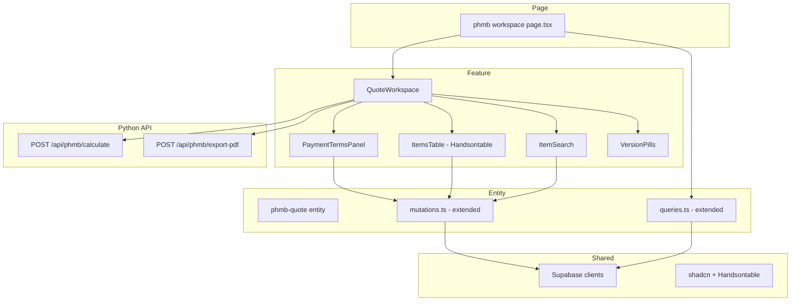

# Design Document: PHMB Quote Workspace

## Overview

**Purpose**: Full-featured quote workspace for PHMB flow at `/phmb/[id]`. The main screen where sales managers build quotations using a Handsontable spreadsheet, with auto-calculation, versioning, and PDF export.

**Users**: Sales managers build and manage PHMB quotes. Admin users can also access.

**Impact**: New page route, new feature components, Handsontable integration, Python API endpoints for calculation and PDF. Most complex screen in the PHMB flow.

### Goals
- Handsontable with Excel-like UX (copy-paste, cell nav, add/delete rows)
- Auto-calculation using phmb_calculator.py via Python API
- Payment terms panel with real-time recalculation
- Version management (create, switch, independent terms)
- PDF export for commercial offers

### Non-Goals
- Procurement queue UI (Screen 3)
- Price list management/upload
- Specification/deal conversion from PHMB quotes

## Architecture



### Technology Stack

| Layer | Choice | Role | Notes |
|-------|--------|------|-------|
| Frontend | Next.js 15 | Page + SSR | Existing |
| Spreadsheet | Handsontable React | Items table | NEW — npm install |
| UI | shadcn/ui + Tailwind | Dialog, Button, Badge, Collapsible | Existing |
| Data | Supabase JS (kvota) | Items CRUD, versions | Existing |
| Calc API | Python FastHTML | POST /api/phmb/calculate | NEW endpoint |
| PDF API | Python FastHTML | POST /api/phmb/export-pdf | NEW endpoint |

## Components

| Component | Layer | Intent | Key Reqs |
|-----------|-------|--------|----------|
| page.tsx | Page | SSR: auth + fetch quote + items + versions | 1.5 |
| QuoteWorkspace | Feature | Orchestrates all sub-components | 1.1-1.4 |
| ItemSearch | Feature | Search price list + add to quote | 2.1-2.5 |
| ItemsTable | Feature | Handsontable wrapper with columns config | 3.1-3.7 |
| PaymentTermsPanel | Feature | Collapsible terms editor | 5.1-5.4 |
| VersionPills | Feature | Version switcher + create | 6.1-6.4 |
| phmb-quote/queries | Entity | Fetch quote detail + items + versions | 1.1 |
| phmb-quote/mutations | Entity | Add/update/delete items, save terms, create version | 2.2, 3.2, 5.3, 6.2 |

### Entity Extensions (phmb-quote)

#### New types (add to existing types.ts)

```typescript
interface PhmbQuoteDetail {
  id: string;
  idn_quote: string;
  customer_name: string;
  currency: string;
  phmb_advance_pct: number;
  phmb_payment_days: number;
  phmb_markup_pct: number;
  total_amount_usd: number | null;
  created_at: string;
}

interface PhmbQuoteItem {
  id: string;
  quote_id: string;
  catalog_number: string;
  product_name: string;
  brand: string | null;
  quantity: number;
  unit: string;
  list_price_rmb: number | null;
  discount_pct: number;
  purchase_price: number | null;
  purchase_currency: string | null;
  delivery_days: number | null;
  hs_code: string | null;
  duty_pct: number | null;
  // Calculated fields (from API)
  exw_price_usd: number | null;
  cogs_usd: number | null;
  financial_cost_usd: number | null;
  total_price_usd: number | null;
  total_price_with_vat_usd: number | null;
  // Status
  status: "priced" | "waiting";
}

interface PhmbVersion {
  id: string;
  quote_id: string;
  version_number: number;
  label: string;
  phmb_advance_pct: number;
  phmb_payment_days: number;
  phmb_markup_pct: number;
  created_at: string;
}

interface PriceListSearchResult {
  id: string;
  catalog_number: string;
  product_name: string;
  brand: string | null;
  unit: string;
  list_price_rmb: number | null;
  discount_pct: number;
}

interface CalcResult {
  items: Array<{
    id: string;
    exw_price_usd: number;
    cogs_usd: number;
    financial_cost_usd: number;
    total_price_usd: number;
    total_price_with_vat_usd: number;
  }>;
  totals: {
    subtotal_usd: number;
    total_usd: number;
    total_with_vat_usd: number;
  };
}
```

#### New queries (add to queries.ts)

```typescript
function fetchPhmbQuoteDetail(quoteId: string): Promise<PhmbQuoteDetail | null>;
function fetchPhmbQuoteItems(quoteId: string): Promise<PhmbQuoteItem[]>;
function fetchPhmbVersions(quoteId: string): Promise<PhmbVersion[]>;
```

#### New mutations (add to mutations.ts)

```typescript
function addItemToQuote(quoteId: string, priceListItemId: string, quantity: number): Promise<PhmbQuoteItem>;
function updateItemQuantity(itemId: string, quantity: number): Promise<void>;
function updateItemPrice(itemId: string, price: number, currency: string): Promise<void>;
function deleteItem(itemId: string): Promise<void>;
function savePaymentTerms(quoteId: string, terms: { phmb_advance_pct: number; phmb_payment_days: number; phmb_markup_pct: number }): Promise<void>;
function createVersion(quoteId: string, label: string): Promise<PhmbVersion>;
function searchPriceList(query: string, orgId: string): Promise<PriceListSearchResult[]>;
function calculateQuote(quoteId: string): Promise<CalcResult>;
function exportPdf(quoteId: string, versionId?: string): Promise<Blob>;
```

### Feature Components

#### QuoteWorkspace
Main orchestrator. Holds state for current items, active version, terms. Coordinates between sub-components.

```typescript
interface QuoteWorkspaceProps {
  quote: PhmbQuoteDetail;
  items: PhmbQuoteItem[];
  versions: PhmbVersion[];
  orgId: string;
}
```

#### ItemSearch
Debounced search input (300ms, min 2 chars) → dropdown with price list results → click to add row.

```typescript
interface ItemSearchProps {
  onAddItem: (item: PriceListSearchResult) => void;
  orgId: string;
}
```

#### ItemsTable (Handsontable)
Wraps `@handsontable/react` with column config, read-only calculated columns, orange rows for waiting items.

```typescript
interface ItemsTableProps {
  items: PhmbQuoteItem[];
  onUpdateItem: (id: string, field: string, value: number | string) => void;
  onDeleteItem: (id: string) => void;
  onItemsChange: (items: PhmbQuoteItem[]) => void;
}
```

#### PaymentTermsPanel
Collapsible panel with 3 fields. On save → triggers recalculation.

```typescript
interface PaymentTermsPanelProps {
  terms: { phmb_advance_pct: number; phmb_payment_days: number; phmb_markup_pct: number };
  onSave: (terms: { phmb_advance_pct: number; phmb_payment_days: number; phmb_markup_pct: number }) => void;
  isSaving: boolean;
}
```

#### VersionPills
Horizontal pills showing versions. Active version highlighted. "+" button to create new.

```typescript
interface VersionPillsProps {
  versions: PhmbVersion[];
  activeVersionId: string | null;
  onSwitch: (versionId: string) => void;
  onCreate: () => void;
}
```

## Python API Endpoints

### POST /api/phmb/calculate
- **Input**: `{ quote_id: string }`
- **Process**: Fetch items + settings → call phmb_calculator.py → update items with calculated values → return results
- **Output**: `CalcResult`
- **Auth**: JWT from Supabase Auth

### POST /api/phmb/export-pdf
- **Input**: `{ quote_id: string, version_id?: string }`
- **Process**: Fetch quote + items + calculated values → generate PDF
- **Output**: PDF binary (application/pdf)
- **Auth**: JWT from Supabase Auth

## Error Handling

- **Calc failure**: Toast error, items keep previous values
- **Search failure**: Empty dropdown, no crash
- **Save failure**: Toast error, form stays editable
- **PDF failure**: Toast error with retry suggestion
- **Item add when price missing**: Silent queue entry, visual indicator on row

## Testing Strategy

### E2E (Playwright)
- Navigate to /phmb/[id] → verify header, search, table render
- Search for item → add to table → verify row appears
- Change quantity → verify auto-recalculation
- Change payment terms → verify all prices update
- Create version → verify pills update
- PDF export → verify download starts
