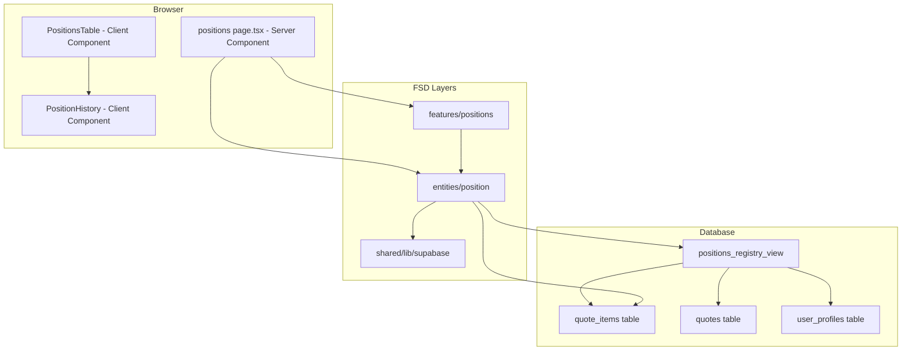
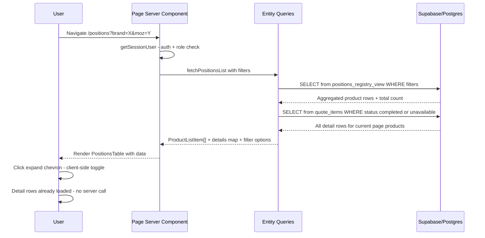
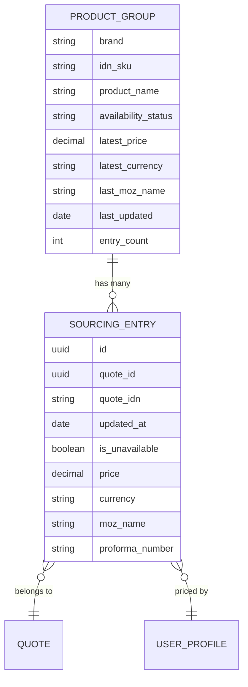

# Technical Design — Positions Registry

## Overview

**Purpose:** The Positions Registry delivers a centralized product sourcing directory to procurement managers and administrators, enabling quick price lookups and availability checks across all historically processed quote items.

**Users:** Procurement managers use this to reference past pricing, compare sourcing options across quotes, and identify unavailable products. Administrators use it for oversight.

**Impact:** Adds a new page (`/positions`) to the Next.js frontend, a new sidebar link, a database view for aggregation, and a new FSD feature module. No changes to existing pages or business logic.

### Goals
- Provide a deduplicated product view (brand + SKU) with latest pricing and availability
- Enable drill-down into full sourcing history per product
- Follow established FSD and server-component patterns

### Non-Goals
- No CRUD operations — read-only registry
- No "Покупай" status — tracked as separate feature on quotes list
- No real-time updates — standard page reload on filter change
- No product search by name (filters only) — can be added later

## Architecture

### Architecture Pattern & Boundary Map



**Selected pattern:** FSD layered architecture with server-side data fetching — identical to suppliers, customers, and other registry pages.

**Domain boundaries:**
- `entities/position/` — types and Supabase query functions (data access)
- `features/positions/` — UI components (table, filters, expandable rows)
- `app/(app)/positions/` — routing shell (auth, params, render)

**Existing patterns preserved:** Server component → fetchData → client component props pattern, URL-based filter state, `createAdminClient()` for queries, `getSessionUser()` for auth.

### Technology Stack

| Layer | Choice | Role in Feature | Notes |
|-------|--------|-----------------|-------|
| Frontend | Next.js 15, App Router | Server component page + client table | Existing stack |
| UI | shadcn/ui (Table, Select, Input, Badge, Button) | Filter bar, product table, status badges | Existing components |
| Data Access | Supabase JS (`@supabase/supabase-js`) | Query view + table via `createAdminClient()` | Existing client |
| Database | PostgreSQL view (`positions_registry_view`) | Aggregate quote_items by brand+SKU | New migration |
| Sidebar | `sidebar-menu.ts` | Add "Позиции" link | Existing widget |

## System Flows

### Filter and Load Flow



**Key decision:** Detail rows are fetched alongside master rows in a single server request. This avoids expand-on-click latency at the cost of slightly larger initial payload. Given typical page sizes (50 products, ~3-5 entries each), the payload remains small (~250 rows max).

## Requirements Traceability

| Requirement | Summary | Components | Interfaces |
|-------------|---------|------------|------------|
| 1.1 | Sidebar link "Позиции" after "Поставщики" | SidebarMenu | buildMenuSections |
| 1.2 | Role-gated access (procurement, admin) | PositionsPage | getSessionUser |
| 1.3-1.4 | Redirect unauthorized/unauthenticated | PositionsPage | redirect() |
| 2.1-2.9 | Deduplicated product table with latest data | PositionsTable, fetchPositionsList | ProductListItem |
| 3.1-3.6 | Expandable sourcing history per product | PositionHistory | SourcingEntry |
| 4.1-4.9 | Filter bar with URL persistence | PositionsTable (filter form) | URL searchParams |
| 5.1-5.4 | Pagination (50/page) | PositionsTable | range + count |
| 6.1-6.2 | Empty and error states | PositionsTable | — |
| 7.1-7.4 | Design system tokens and badges | All UI components | design-system.md |
| 8.1-8.4 | FSD layer compliance | All modules | import boundaries |

## Components and Interfaces

| Component | Domain/Layer | Intent | Req Coverage | Key Dependencies | Contracts |
|-----------|-------------|--------|--------------|------------------|-----------|
| PositionsPage | app/(app)/positions | Route shell: auth, params, fetch, render | 1.2-1.4, 8.3 | getSessionUser (P0), fetchPositionsList (P0) | — |
| PositionsTable | features/positions/ui | Master table with filters, pagination, expand | 2.1-2.9, 4.1-4.9, 5.1-5.4, 6.1-6.2 | ProductListItem (P0) | State |
| PositionHistory | features/positions/ui | Expandable detail rows per product | 3.1-3.6 | SourcingEntry (P0) | — |
| fetchPositionsList | entities/position/queries | Server-side data fetch from view + items | 2.1-2.9, 4.1-4.9 | createAdminClient (P0) | Service |
| fetchFilterOptions | entities/position/queries | Fetch distinct brands + МОЗ for dropdowns | 4.5-4.7 | createAdminClient (P0) | Service |
| SidebarMenu update | widgets/sidebar | Add "Позиции" menu item | 1.1 | buildMenuSections (P0) | — |
| positions_registry_view | database migration | SQL view aggregating products | 2.1-2.9 | quote_items, quotes, user_profiles | — |

### Data Access Layer

#### fetchPositionsList

| Field | Detail |
|-------|--------|
| Intent | Fetch paginated, filtered list of unique products with their sourcing details |
| Requirements | 2.1-2.9, 3.1-3.6, 4.1-4.9, 5.1-5.4 |

**Responsibilities & Constraints**
- Queries `positions_registry_view` for master-level product rows (paginated)
- Queries `quote_items` for detail-level sourcing entries (for products on current page)
- Applies filters: availability, brand, МОЗ, date range
- Returns both master rows and grouped detail entries in a single call

**Dependencies**
- Inbound: PositionsPage — server component calls this function (P0)
- External: Supabase `createAdminClient()` — database access (P0)

**Contracts**: Service [x]

##### Service Interface

```typescript
interface PositionFilters {
  availability?: "available" | "unavailable"; // omit = all
  brand?: string;
  mozId?: string; // user_profiles.user_id of procurement manager
  dateFrom?: string; // ISO date
  dateTo?: string; // ISO date
  page?: number;
}

interface PositionsListResult {
  products: ProductListItem[];
  details: Record<string, SourcingEntry[]>; // keyed by "brand::idn_sku"
  total: number;
  filterOptions: {
    brands: string[];
    managers: { id: string; name: string }[];
  };
}

function fetchPositionsList(
  orgId: string,
  filters: PositionFilters
): Promise<PositionsListResult>;
```

- Preconditions: `orgId` is a valid organization UUID
- Postconditions: Returns paginated products sorted by `last_updated DESC`, with matching detail entries grouped by product key
- Invariants: Only items where `procurement_status = 'completed'` OR `is_unavailable = true` are included

**Implementation Notes**
- Master query: `SELECT * FROM positions_registry_view WHERE org filters ORDER BY last_updated DESC RANGE(from, to)`
- Detail query: `SELECT * FROM quote_items WHERE (brand, idn_sku) IN (current page products) AND (completed OR unavailable) ORDER BY updated_at DESC`
- Filter options: fetched in parallel with main queries using `Promise.all()`
- The detail query fetches all entries for products on the current page, not just the expanded ones — eliminates client-server round trips on expand

### UI Layer

#### PositionsTable

| Field | Detail |
|-------|--------|
| Intent | Render the master product table with filter bar, pagination, and expandable rows |
| Requirements | 2.1-2.9, 4.1-4.9, 5.1-5.4, 6.1-6.2, 7.1-7.4 |

**Contracts**: State [x]

##### State Management

```typescript
interface PositionsTableProps {
  products: ProductListItem[];
  details: Record<string, SourcingEntry[]>;
  total: number;
  filterOptions: {
    brands: string[];
    managers: { id: string; name: string }[];
  };
  // Current filter state from URL
  initialBrand: string;
  initialMozId: string;
  initialAvailability: string;
  initialDateFrom: string;
  initialDateTo: string;
  initialPage: number;
}
```

- State model: `expandedProducts: Set<string>` — tracks which product keys are expanded (client-only)
- Persistence: Filter state persisted in URL search params via `<form method="GET">`
- Concurrency: None — read-only UI, no optimistic updates

**Implementation Notes**
- Filter bar uses native HTML form submission (matches suppliers pattern)
- Expand/collapse is pure client state — no server round-trip
- Product key format: `${brand}::${idn_sku}` (same as details map key)
- Pagination links use `buildQueryString()` helper (same pattern as SuppliersTable)

#### PositionHistory

| Field | Detail |
|-------|--------|
| Intent | Render sourcing history entries for an expanded product |
| Requirements | 3.1-3.6, 7.3 |

Summary-only component — presentational, no new boundaries.

**Implementation Notes**
- Receives `SourcingEntry[]` from parent via props (already loaded)
- Unavailable entries rendered with muted opacity and "Недоступен" text
- Quote link: `<Link href={/quotes/${entry.quoteId}}>` using quote IDN as label

## Data Models

### Domain Model



**Aggregates:** `PRODUCT_GROUP` is a read-only aggregate derived from `quote_items`. No transactional boundary — this is a reporting view.

**Business rules:**
- Product uniqueness: `brand + COALESCE(idn_sku, '')` — null SKU treated as empty string
- Availability derivation: has_available AND has_unavailable → "mixed"; only available → "available"; only unavailable → "unavailable"
- Latest price: most recent entry where `is_unavailable = false`; if all unavailable → null

### Physical Data Model

#### Database View: `kvota.positions_registry_view`

New migration creates this view. No new tables — reads from existing `quote_items`, `quotes`, `user_profiles`.

```sql
CREATE OR REPLACE VIEW kvota.positions_registry_view AS
WITH base AS (
  SELECT
    qi.brand,
    COALESCE(qi.idn_sku, '') AS idn_sku,
    qi.product_name,
    qi.purchase_price_original,
    qi.purchase_currency,
    qi.is_unavailable,
    qi.updated_at,
    qi.assigned_procurement_user,
    qi.proforma_number,
    qi.quote_id,
    q.organization_id,
    q.idn AS quote_idn,
    up.full_name AS moz_name,
    ROW_NUMBER() OVER (
      PARTITION BY qi.brand, COALESCE(qi.idn_sku, '')
      ORDER BY qi.updated_at DESC
    ) AS rn,
    bool_or(NOT COALESCE(qi.is_unavailable, false)
            AND qi.purchase_price_original IS NOT NULL)
      OVER (PARTITION BY qi.brand, COALESCE(qi.idn_sku, '')) AS has_available,
    bool_or(COALESCE(qi.is_unavailable, false))
      OVER (PARTITION BY qi.brand, COALESCE(qi.idn_sku, '')) AS has_unavailable,
    COUNT(*) OVER (PARTITION BY qi.brand, COALESCE(qi.idn_sku, '')) AS entry_count
  FROM kvota.quote_items qi
  JOIN kvota.quotes q ON q.id = qi.quote_id
  LEFT JOIN kvota.user_profiles up ON up.user_id = qi.assigned_procurement_user
  WHERE qi.procurement_status = 'completed'
     OR COALESCE(qi.is_unavailable, false) = true
)
SELECT
  brand,
  idn_sku,
  product_name,
  purchase_price_original AS latest_price,
  purchase_currency AS latest_currency,
  moz_name AS last_moz_name,
  assigned_procurement_user AS last_moz_id,
  updated_at AS last_updated,
  entry_count,
  organization_id,
  CASE
    WHEN has_available AND has_unavailable THEN 'mixed'
    WHEN has_available THEN 'available'
    ELSE 'unavailable'
  END AS availability_status
FROM base
WHERE rn = 1;
```

**Index recommendation** (add in same migration):
```sql
CREATE INDEX IF NOT EXISTS idx_quote_items_brand_sku_updated
  ON kvota.quote_items (brand, COALESCE(idn_sku, ''), updated_at DESC)
  WHERE procurement_status = 'completed' OR is_unavailable = true;
```

### Data Contracts

#### TypeScript Types (`entities/position/types.ts`)

```typescript
export type AvailabilityStatus = "available" | "unavailable" | "mixed";

export interface ProductListItem {
  brand: string;
  idnSku: string;
  productName: string;
  latestPrice: number | null;
  latestCurrency: string | null;
  lastMozName: string | null;
  lastMozId: string | null;
  lastUpdated: string;
  entryCount: number;
  availabilityStatus: AvailabilityStatus;
}

export interface SourcingEntry {
  id: string;
  quoteId: string;
  quoteIdn: string;
  updatedAt: string;
  isUnavailable: boolean;
  price: number | null;
  currency: string | null;
  mozName: string | null;
  proformaNumber: string | null;
}
```

## Error Handling

### Error Categories and Responses

**User Errors (4xx):**
- Unauthorized (no session) → redirect to `/login` (handled by server component)
- Forbidden (wrong role) → redirect to `/` (handled by server component)

**System Errors (5xx):**
- Database query failure → display error state in table area ("Ошибка загрузки данных")
- View not found (migration not applied) → same error state

No complex error flows — read-only page with server-side rendering.

## Testing Strategy

### Unit Tests
1. Availability status derivation logic (available/unavailable/mixed)
2. Product key generation (`brand::idn_sku` with null handling)
3. Filter query string building with all parameter combinations
4. Price display formatting (with currency, null handling)

### Integration Tests
1. `fetchPositionsList` returns correctly grouped and paginated data
2. Filter combinations (brand + МОЗ + date range) return expected results
3. Detail entries match their parent product groups

### E2E/UI Tests
1. Page loads with product data for procurement user
2. Non-procurement user gets redirected
3. Expanding a product row shows sourcing history
4. Applying filters updates the table and URL
5. Pagination navigates between pages preserving filters
