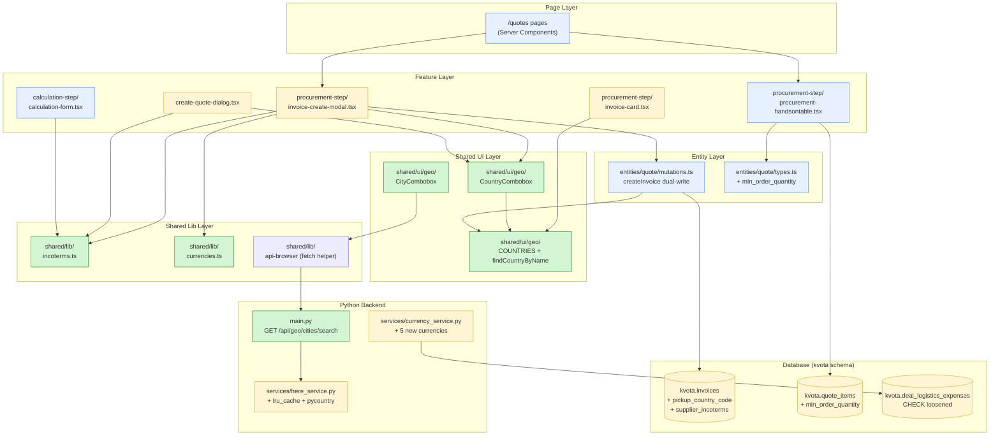
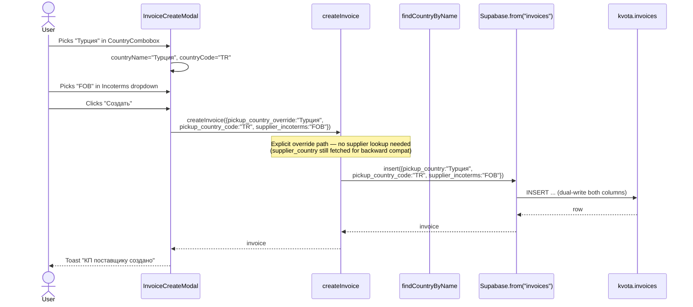
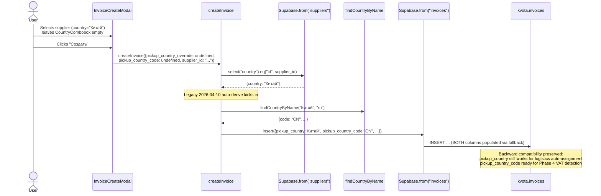
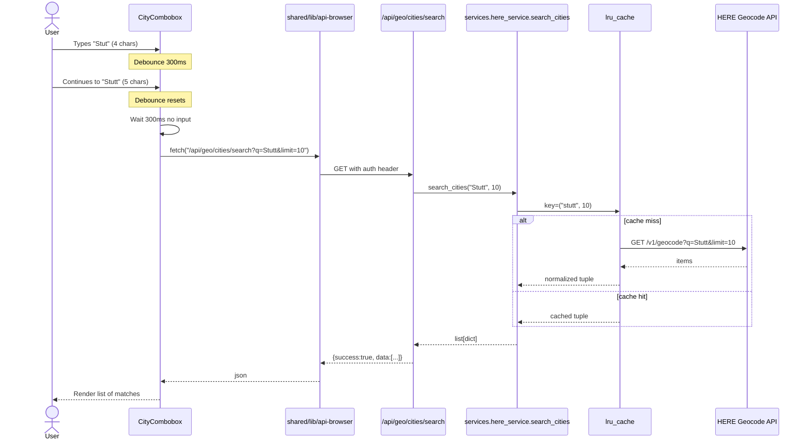

# Technical Design — Procurement Phase 3

## Overview

Procurement Phase 3 ships five related procurement team improvements on top of shared geo and Incoterms primitives. The centerpiece is a pair of reusable form components (`CountryCombobox`, `CityCombobox`) in `frontend/src/shared/ui/geo/`, backed by platform-standard `Intl` APIs for country data and the existing HERE Geocode API for city search. These components unblock a per-supplier-invoice shipping country field that Phase 4 VAT auto-detection will consume.

The remaining features are concrete data-model and UI changes: a new `invoices.pickup_country_code` column that dual-writes alongside the legacy `pickup_country` text field (preserving the 2026-04-10 customs/logistics fix), a new `invoices.supplier_incoterms` column with a dropdown fed by a newly extracted `INCOTERMS_2020` shared constant, a `quote_items.min_order_quantity` column with a soft warning UX in the procurement handsontable, and five additional supported currencies (AED, KZT, JPY, GBP, CHF) with a loosened check constraint on `deal_logistics_expenses` and a consolidated frontend currency module.

### Goals

- Build reusable, bilingual (Russian primary + English secondary) country and city pickers in `shared/ui/geo/` that any form in OneStack can consume in under 20 minutes of wiring.
- Ship per-supplier-invoice shipping country (ISO-2) and supplier Incoterms fields into `kvota.invoices` additively, without touching `pickup_country` text values or breaking logistics auto-assignment.
- Add MOQ awareness to the procurement workflow as a soft warning — visible, searchable, and non-blocking — without any change to the calculation engine.
- Extend CBR-backed currency support by five entries and consolidate the three drifted frontend currency lists.
- Preserve every behavior added by today's earlier customs/logistics fix (commits `08a56ae`, `cc29010`) as explicit regression-tested non-goals.

### Non-Goals

- **Phase 4 features** — VAT auto-detection from shipping country, PEO rates table, kanban procurement sub-statuses, English UI translation beyond the bilingual country labels.
- **Migrating the legacy `/api/cities/search` HTMX endpoint** off HERE — it stays as-is for unmigrated FastHTML pages.
- **Swapping HERE for an alternative geocoder** — only the two known HERE service flaws are fixed (hardcoded 28-country alpha3/alpha2 dict; no caching). Provider migration (Photon) remains Phase 4+ contingency if rate limits bite.
- **Backfilling `invoices.pickup_country_code` from existing `pickup_country` text values** — a future script. Phase 3 only ensures new writes populate both fields.
- **Adding a `suppliers.country_code` column** — avoided via the `findCountryByName` helper, which resolves names to codes client-side when needed.
- **Migrating city inputs across the quotes flow** — only the supplier invoice modal gets a CityCombobox in Phase 3. `delivery_city` on quotes stays as plain text for now.
- **Deprecating or dropping `invoices.pickup_country` text column** — stays indefinitely; Phase 3 is strictly additive.
- **Role-based column visibility enforcement for MOQ** — MOQ is visible to all roles that can see quote items.

## Architecture

### Existing Architecture Analysis

OneStack's frontend follows Feature-Sliced Design (FSD) with layers `app → pages → widgets → features → entities → shared`. Relevant constraints for Phase 3:

- **Shared layer placement.** Any component or constant that could be consumed by more than one feature must live in `shared/ui/` or `shared/lib/`. The DataTable precedent (`shared/ui/data-table/`) is the reference pattern.
- **Base UI primitives.** All popovers/dialogs in the Next.js frontend use `@base-ui/react` wrappers at `components/ui/`. The Phase 3 `CountryCombobox` reuses `components/ui/popover.tsx` exactly as `shared/ui/data-table/column-filter.tsx` does.
- **Api-first rule.** Every business operation must be reachable through a documented API endpoint that both humans (Next.js) and AI agents can call. The new `GET /api/geo/cities/search` returns JSON, is auth-gated, and follows the docstring convention in `api-first.md` steering.
- **Dual invoice tables.** `kvota.invoices` is the procurement КП table; `kvota.supplier_invoices` is a separate finance-only payment tracking table. Phase 3 touches `invoices` only.
- **Protected calculation engine.** `calculation_engine.py`, `calculation_mapper.py`, `calculation_models.py` are not modified. MOQ is a display-layer warning, not a calculation input.
- **Migration numbering.** Sequential; next free numbers are 266, 267, 268. Migrations are applied via `scripts/apply-migrations.sh` over SSH to beget-kvota.
- **Carry-forward from 2026-04-10.** `createInvoice` at `frontend/src/entities/quote/mutations.ts:373-387` auto-derives `invoices.pickup_country` (Russian text) from `suppliers.country`. Phase 3 extends this code path — it does not replace or bypass it.

### Architecture Pattern & Boundary Map



FSD boundary rules enforced by the map:

- `shared/ui/geo` has no imports from `entities/`, `features/`, or `widgets/`.
- `shared/lib/incoterms.ts` and `shared/lib/currencies.ts` are pure data modules — no imports from higher layers.
- `entities/quote/mutations.ts` imports `findCountryByName` from `@/shared/ui/geo` (shared → entity is a downward import, which is not allowed in strict FSD; the workaround is that `findCountryByName` is a pure data lookup in the shared layer, and `entities/` imports it — this mirrors the project precedent of `entities/quote/mutations.ts` importing `cn`, `createClient`, and other shared utilities).
- Feature components import from `shared/ui/geo`, `shared/lib/incoterms`, `shared/lib/currencies`, and `entities/quote/mutations` — all downward, all allowed.

### Technology Stack & Alignment

| Layer | Technology | Status |
|-------|-----------|--------|
| Frontend framework | Next.js 15 + React 19 | Existing |
| UI primitives | `@base-ui/react` + Tailwind v4 + shadcn wrappers at `components/ui/` | Existing |
| Country data | `Intl.supportedValuesOf("region")` + `Intl.DisplayNames` (RU + EN) | **New usage** — no new dependency |
| City search | HERE Geocode API via existing `services/here_service.py` | Existing; flaws fixed |
| HERE client resilience | `functools.lru_cache(maxsize=256)` | **New** |
| ISO alpha-3 → alpha-2 mapping | `pycountry` (new Python dep) with fallback to existing hardcoded dict | **New dependency** |
| Backend framework | FastHTML via existing `main.py` `@rt` decorator | Existing |
| Database | Supabase PostgreSQL, `kvota` schema | Existing |
| Migrations | Numbered SQL files in `migrations/`, applied via `scripts/apply-migrations.sh` | Existing |
| Tests — Python | pytest | Existing |
| Tests — Frontend | vitest + fake Supabase pattern (see `entities/quote/__tests__/mutations.test.ts`) | Existing; Phase 3 triples the frontend test file count |

No new frontend dependencies. One new backend dependency (`pycountry`).

## Components & Interface Contracts

### 1. Shared Geo Module — `frontend/src/shared/ui/geo/`

**Files:**
- `countries.ts` — static data + lookup helpers.
- `country-combobox.tsx` — single-select bilingual country picker.
- `city-combobox.tsx` — typeahead HERE-backed city picker.
- `index.ts` — barrel export.

**Module public API (TypeScript):**

```typescript
// countries.ts
export interface Country {
  readonly code: string;          // ISO 3166-1 alpha-2, uppercase
  readonly nameRu: string;
  readonly nameEn: string;
}

export const COUNTRIES: readonly Country[];

export function findCountryByCode(
  code: string | null | undefined
): Country | undefined;

export function findCountryByName(
  name: string | null | undefined,
  locale?: "ru" | "en"
): Country | undefined;

// country-combobox.tsx
export interface CountryComboboxProps {
  value: string | null;                   // ISO-2 code
  onChange: (code: string | null) => void;
  placeholder?: string;
  clearable?: boolean;                    // default true
  disabled?: boolean;
  ariaLabel?: string;
  className?: string;
  listMaxHeight?: number;                 // default 256
  displayLocale?: "ru" | "en";            // default "ru" (primary label)
}

export function CountryCombobox(props: CountryComboboxProps): JSX.Element;

// city-combobox.tsx
export interface CityComboboxValue {
  city: string;
  country_code: string;
  country_name_ru: string;
  country_name_en: string;
  display: string;
}

export interface CityComboboxProps {
  value: CityComboboxValue | null;
  onChange: (next: CityComboboxValue | null) => void;
  onCountryChange?: (countryCode: string | null) => void;
  placeholder?: string;
  disabled?: boolean;
  debounceMs?: number;                    // default 300
  minQueryLength?: number;                // default 2
  className?: string;
}

export function CityCombobox(props: CityComboboxProps): JSX.Element;
```

**Behavioral contract:**

- `COUNTRIES` built at module load from `Intl.supportedValuesOf("region")` filtered to `/^[A-Z]{2}$/`, with `Intl.DisplayNames` for both locales. Sorted by `nameRu.localeCompare(..., "ru")`. If runtime lacks `Intl.supportedValuesOf`, returns empty array (graceful degradation — REQ 1.11).
- `findCountryByCode` is O(n) linear scan; acceptable for 250 entries.
- `findCountryByName` iterates `COUNTRIES` matching against `nameRu` or `nameEn` based on the `locale` argument. Match is case-insensitive with whitespace trimmed. Returns `undefined` if no match — graceful degradation per REQ 1.12 and design decision D5.
- `CountryCombobox` uses `@base-ui/react` Popover + Input + keyboard navigation (ArrowUp/ArrowDown/Enter/Escape). Virtual focus tracked via `focusedIndex` state, synced to scroll via `scrollIntoView({ block: "nearest" })`. Reference pattern: `shared/ui/data-table/column-filter.tsx`.
- `CityCombobox` debounces input (default 300ms), requires ≥2 non-whitespace characters, calls `GET /api/geo/cities/search?q={q}&limit={n}` via the shared `api-browser` helper, and handles loading/empty/error states inline in the popover (REQ 2.4–2.9).

### 2. Shared Incoterms Module — `frontend/src/shared/lib/incoterms.ts`

**Public API:**

```typescript
export interface Incoterm {
  readonly code: string;              // EXW, FCA, ..., CIF
  readonly label: string;              // human-readable short description, e.g. "Ex Works"
}

export const INCOTERMS_2020: readonly Incoterm[];  // 11 entries

export function isValidIncoterm(code: string | null | undefined): boolean;
```

**Consumers:**

- `frontend/src/features/quotes/ui/procurement-step/invoice-create-modal.tsx` — new supplier Incoterms dropdown (REQ 5.8).
- `frontend/src/features/quotes/ui/create-quote-dialog.tsx:52` — existing 5-value dropdown rewritten to consume `INCOTERMS_2020` (REQ 10.4).
- `frontend/src/features/quotes/ui/calculation-step/calculation-form.tsx:20` — existing 5-value dropdown rewritten to consume `INCOTERMS_2020` (REQ 10.5).

**Expansion safety:** Existing stored values are all within the 5-value subset (`DDP/DAP/CIF/FOB/EXW`). Expanding to 11 is strictly additive — no stored value becomes invalid (REQ 10.6).

### 3. Shared Currencies Module — `frontend/src/shared/lib/currencies.ts`

**Public API:**

```typescript
export const SUPPORTED_CURRENCIES: readonly string[];  // 10 entries, mirrors backend
export const CURRENCY_LABELS: Readonly<Record<string, string>>;  // "USD" → "USD ($)", etc.

export function isSupportedCurrency(code: string | null | undefined): boolean;
```

**Rationale (D9):** Eliminates the three drifted hardcoded arrays:

- `invoice-create-modal.tsx:25` → replaced by import (touched by T2, not T4).
- `additional-expenses.tsx:15` → replaced by import (T4).
- `route-segments.tsx:9` → replaced by import (T4).

**Backend alignment:** The module's `SUPPORTED_CURRENCIES` array mirrors `services/currency_service.py:20` exactly. A manual sync (not code-generated) — if Phase 4 adds another currency, both must be updated. The frontend array is the source of truth for UI display; the backend array is the source of truth for validation.

### 4. Cities Search API Endpoint — `main.py`

**Contract:**

```
Path: GET /api/geo/cities/search
Query params:
  q      : string (required, min length 2 after trim)
  limit  : integer (optional, default 10, clamped to [1, 25])
Headers:
  Authorization: Bearer <supabase-jwt>  OR  Cookie: session=<legacy-fasthtml>
Returns (HTTP 200):
  {
    "success": true,
    "data": [
      {
        "city": "Берлин",
        "country_code": "DE",
        "country_name_ru": "Германия",
        "country_name_en": "Germany",
        "display": "Берлин, Германия"
      }
    ]
  }
Returns (HTTP 200, empty or degraded):
  { "success": true, "data": [] }
Returns (HTTP 400):
  { "success": false, "error": { "code": "INVALID_QUERY", "message": "q must be at least 2 characters" } }
Returns (HTTP 401):
  { "success": false, "error": { "code": "UNAUTHENTICATED", "message": "..." } }

Side effects: none
Caching:     lru_cache on services.here_service.search_cities (process-local, 256 entries)
Roles:       any authenticated user
```

**Auth:** Reuses the existing dual-auth pattern (`request.state.api_user` JWT or legacy session) per `feedback_dual_auth_api.md`. Must check JWT first.

**Error handling:** HERE API failures return `{"success": true, "data": []}` (graceful degradation) AND log the error server-side. Only missing/invalid `q` returns 400 (user error) or missing auth returns 401 (REQ 3.2, 3.5, 3.6, 3.7).

**Legacy endpoint preservation:** The existing `/api/cities/search` (FastHTML Option output) stays untouched (REQ 3.9).

**Handler docstring format** (per `api-first.md` steering):

```python
@rt("/api/geo/cities/search")
def get(session, request, q: str = "", limit: int = 10):
    """Structured city search backed by HERE Geocode API.

    Path:   GET /api/geo/cities/search
    Params:
        q:     str (required, min 2 chars after trim)
        limit: int (optional, default 10, clamped 1..25)
    Returns:
        { "success": True, "data": [ {city, country_code, country_name_ru, country_name_en, display}, ... ] }
    Side Effects: none (read-only HERE API call, LRU-cached)
    Roles: any authenticated user
    """
```

### 5. HERE Service Fixes — `services/here_service.py`

**Changes:**

1. **LRU cache on `search_cities`** (REQ 4.1, 4.2):

```python
from functools import lru_cache

@lru_cache(maxsize=256)
def _search_cities_cached(query_normalized: str, count: int) -> tuple[dict, ...]:
    """Inner cached lookup. Returns tuple (hashable) of frozen dicts."""
    ...
```

The public `search_cities` wraps `_search_cities_cached` after normalizing the query (strip + lower). Returns `list[dict]` for backward compatibility with the existing FastHTML endpoint. Tuples are hashable so `lru_cache` can key on them; dicts would not be.

2. **pycountry-backed alpha-3 → alpha-2** (REQ 4.3, 4.4, 4.5):

```python
try:
    import pycountry
    def _alpha3_to_alpha2(code: str) -> str:
        if not code:
            return ""
        try:
            country = pycountry.countries.get(alpha_3=code.upper())
            return country.alpha_2 if country else ""
        except (KeyError, AttributeError):
            return ""
except ImportError:
    # Fallback to existing hardcoded dict
    def _alpha3_to_alpha2(code: str) -> str:
        _HARDCODED = {"BEL": "BE", ...}  # existing 28 entries
        return _HARDCODED.get(code.upper(), "")
```

This replaces the inline slicing at `here_service.py:86` (`country_code[:2]`) which was silently producing wrong results.

3. **`requirements.txt`** adds `pycountry>=24.6.1`.

### 6. Migration 266 — `invoices.pickup_country_code` + `supplier_incoterms`

**File:** `migrations/266_add_shipping_country_and_incoterms_to_invoices.sql`

```sql
-- Phase 3: Shipping country code (ISO-2) and supplier Incoterms on procurement invoices.
-- Additive only. Coexists with the existing pickup_country text column.

ALTER TABLE kvota.invoices
    ADD COLUMN IF NOT EXISTS pickup_country_code CHAR(2),
    ADD COLUMN IF NOT EXISTS supplier_incoterms TEXT;

COMMENT ON COLUMN kvota.invoices.pickup_country_code IS
    'ISO 3166-1 alpha-2 code of the supplier pickup country. Populated alongside the legacy pickup_country text field by the Phase 3 dual-write logic. Used by Phase 4 VAT auto-detection.';

COMMENT ON COLUMN kvota.invoices.supplier_incoterms IS
    'Incoterms 2020 code (EXW/FCA/CPT/CIP/DAP/DPU/DDP/FAS/FOB/CFR/CIF) agreed with the supplier for this invoice. Informational only — not a calculation engine input.';

ALTER TABLE kvota.invoices
    ADD CONSTRAINT invoices_pickup_country_code_format
    CHECK (pickup_country_code IS NULL OR pickup_country_code ~ '^[A-Z]{2}$');

INSERT INTO kvota.schema_migrations (version, filename, applied_at)
VALUES (266, '266_add_shipping_country_and_incoterms_to_invoices.sql', now())
ON CONFLICT (version) DO NOTHING;
```

No default, no backfill — both columns are nullable. Existing rows remain valid per REQ 9.7.

### 7. Migration 267 — `quote_items.min_order_quantity`

**File:** `migrations/267_add_min_order_quantity_to_quote_items.sql`

```sql
ALTER TABLE kvota.quote_items
    ADD COLUMN IF NOT EXISTS min_order_quantity NUMERIC;

COMMENT ON COLUMN kvota.quote_items.min_order_quantity IS
    'Supplier minimum order quantity. Informational only — triggers a soft UX warning when quantity < min_order_quantity, but does not block save, calculation, or approval.';

INSERT INTO kvota.schema_migrations (version, filename, applied_at)
VALUES (267, '267_add_min_order_quantity_to_quote_items.sql', now())
ON CONFLICT (version) DO NOTHING;
```

Nullable, no default. Existing rows remain valid per REQ 9.7.

### 8. Migration 268 — Loosen `deal_logistics_expenses` currency CHECK

**File:** `migrations/268_loosen_deal_logistics_expenses_currency_check.sql`

```sql
-- Phase 3: Replace the hardcoded currency allowlist with a format-only regex check.
-- This aligns deal_logistics_expenses with all other currency-bearing tables in the schema.

ALTER TABLE kvota.deal_logistics_expenses
    DROP CONSTRAINT IF EXISTS deal_logistics_expenses_currency_check;

ALTER TABLE kvota.deal_logistics_expenses
    ADD CONSTRAINT deal_logistics_expenses_currency_check
    CHECK (currency ~ '^[A-Z]{3}$');

INSERT INTO kvota.schema_migrations (version, filename, applied_at)
VALUES (268, '268_loosen_deal_logistics_expenses_currency_check.sql', now())
ON CONFLICT (version) DO NOTHING;
```

The constraint name stays the same so that existing operational docs still match (REQ 9.6: existing migrations not modified; new migration drops + adds cleanly).

**Does not touch historical migration 190.** All current rows satisfy the new constraint because they already satisfy the stricter `IN (...)` list.

### 9. `createInvoice` Dual-Write Logic — `frontend/src/entities/quote/mutations.ts`

**Current state (lines 373–387, 2026-04-10 customs fix):**

```typescript
let pickupCountry: string | null = null;
if (data.supplier_id) {
  const { data: supplier, error: supplierError } = await supabase
    .from("suppliers").select("country").eq("id", data.supplier_id).maybeSingle();
  if (supplierError) throw supplierError;
  pickupCountry = supplier?.country ?? null;
}
```

**Phase 3 extension:**

```typescript
import { findCountryByName } from "@/shared/ui/geo";

// Input contract (new optional fields):
//   data.pickup_country_code?: string | null  // ISO-2 from CountryCombobox
//   data.supplier_incoterms?: string | null
//   data.pickup_country_override?: string | null  // Russian name override if user picked

// Derivation:
let pickupCountryText: string | null = data.pickup_country_override ?? null;
let pickupCountryCode: string | null = data.pickup_country_code ?? null;

if (!pickupCountryText && data.supplier_id) {
  const supplier = await fetchSupplierCountry(data.supplier_id);
  pickupCountryText = supplier?.country ?? null;
}

// If user didn't supply a code, try to resolve from the text name.
if (!pickupCountryCode && pickupCountryText) {
  const match = findCountryByName(pickupCountryText, "ru");
  pickupCountryCode = match?.code ?? null;
}

// Insert writes both columns.
const insertRow = {
  ...base,
  pickup_city: data.pickup_city ?? null,
  pickup_country: pickupCountryText,
  pickup_country_code: pickupCountryCode,
  supplier_incoterms: data.supplier_incoterms ?? null,
};
```

**Precedence rule (REQ 5.10):** If the user explicitly passes a country through the CountryCombobox, their choice wins for both fields. If not, supplier derivation fills the text and `findCountryByName` populates the code best-effort.

**Type safety:** The `Insert` type generated from `database.types.ts` after migration 266 will include `pickup_country_code?: string | null` and `supplier_incoterms?: string | null` — the mutation picks them up automatically after type regeneration.

### 10. Invoice Create Modal — `invoice-create-modal.tsx`

**Current form fields:** supplier, buyer_company, city (plain text), currency (hardcoded 4-value dropdown), cargo boxes.

**Phase 3 additions:**

1. **`CountryCombobox` for "Страна отгрузки"** — placed above the city input so country is picked before city. On change, stores the ISO-2 code in `countryCode` state AND the corresponding Russian display name in `countryName` state (read from the selected `Country` object).
2. **Incoterms dropdown for "Условия поставки"** — consumes `INCOTERMS_2020`, positioned after city. Includes a leading "— не указано —" option mapped to `null`.
3. **Currency dropdown** — now imports from `@/shared/lib/currencies` instead of the local `CURRENCIES` constant at line 25. Covers the drift fix (missing TRY + adds the 5 new currencies) as a side effect of the import.

**Submit payload to `createInvoice`:**

```typescript
await createInvoice({
  ...existing fields,
  pickup_city: city || undefined,
  pickup_country_override: countryName || undefined,  // "Турция" etc.
  pickup_country_code: countryCode || undefined,       // "TR" etc.
  supplier_incoterms: incoterms || undefined,          // "FOB" etc.
});
```

### 11. Invoice Card — `invoice-card.tsx`

**Changes:** Display `pickup_country_code` and `supplier_incoterms` when populated. The card currently shows `pickup_city` and `supplier.name` — Phase 3 adds a line "Страна: {nameRu} ({country_code}) · Условия: {incoterms}" when either field is set.

### 12. Create Quote Dialog — `create-quote-dialog.tsx`

**Changes (REQ 11):**

1. Replace plain-text `deliveryCountry` input (line 443-452) with `CountryCombobox`. Stores the Russian display name in the existing `delivery_country` text column — no schema change for quotes.
2. Rewrite the existing Incoterms `<select>` at line 52 to consume `INCOTERMS_2020`.
3. On opening the dialog for edit (if the code path exists), seed the CountryCombobox via `findCountryByName(historical, "ru")`. If no match, show placeholder — user sees legacy-data mismatch immediately.

### 13. Calculation Form — `calculation-form.tsx`

**Changes:** Rewrite the existing Incoterms `<select>` at line 20 to consume `INCOTERMS_2020`. No other changes.

### 14. Procurement Handsontable — `procurement-handsontable.tsx`

**Column order change (REQ 6.3):**

Before: `brand | product_code | supplier_sku | manufacturer_product_name | product_name | quantity | purchase_price_original | production_time_days | weight_in_kg | dimensions | is_unavailable | supplier_sku_note | [unassign]` (13 columns)

After: `brand | product_code | supplier_sku | manufacturer_product_name | product_name | quantity | min_order_quantity | purchase_price_original | production_time_days | weight_in_kg | dimensions | is_unavailable | supplier_sku_note | [unassign]` (14 columns)

**Implementation touchpoints:**

- `COLUMN_KEYS` at line 31 — insert `"min_order_quantity"` after `"quantity"`.
- `RowData` interface at line 46 — add `min_order_quantity: number | null`.
- `itemToRow` mapper at line 90 — map the new field.
- Headers array at line 311 — insert `"МИН. ЗАКАЗ"` after `"Кол"`.
- Columns config at line 326 — insert column descriptor with `type: "numeric"` and a custom cell renderer that draws a warning icon when `row.min_order_quantity > row.quantity`.
- `handleAfterChange` numeric-parse branch at line 245 — include `"min_order_quantity"` alongside `purchase_price_original`, `weight_in_kg`, `production_time_days`.
- `lockedColIndices` at line 277 — do NOT add the new index (MOQ is editable).
- Every other hardcoded column index in the file shifts by +1 for columns after `quantity` — requires a careful pass during T3 implementation.

**Warning renderer (pseudo-interface, not implementation code):**

```typescript
function renderMoqCell(params: HotRendererParams): void {
  const value = params.value as number | null;
  const row = params.instance.getSourceDataAtRow(params.row) as RowData;
  const hasWarning = value != null && row.quantity != null && row.quantity < value;
  // render value + optional warning-icon span + title tooltip
}
```

**Totals area badge (REQ 6.6):** A new `useMemo` in the procurement step parent component that counts rows where `quantity < min_order_quantity`. Renders "⚠ MOQ: {N}" when N > 0. Placement: alongside the existing "Всего позиций / Сумма" totals row.

### 15. Currency Service Extension — `services/currency_service.py`

**Line 20 before:** `SUPPORTED_CURRENCIES = ['USD', 'EUR', 'RUB', 'CNY', 'TRY']`
**Line 20 after:** `SUPPORTED_CURRENCIES = ['USD', 'EUR', 'RUB', 'CNY', 'TRY', 'AED', 'KZT', 'JPY', 'GBP', 'CHF']`

**CBR mappings** (lines 23–36) extended with:

```python
CBR_CURRENCY_CODES = {
    ...existing,
    'AED': 'R01230',   # UAE Dirham
    'KZT': 'R01335',   # Kazakhstan Tenge
    'JPY': 'R01820',   # Japanese Yen (per 100)
    'GBP': 'R01035',   # British Pound
    'CHF': 'R01775',   # Swiss Franc
}
CBR_CHAR_CODES = {
    ...existing,
    'AED': 'AED', 'KZT': 'KZT', 'JPY': 'JPY', 'GBP': 'GBP', 'CHF': 'CHF',
}
```

Note: CBR publishes JPY per 100 units (the `Nominal` field in the XML). The existing parser at `fetch_cbr_rates` already handles `Nominal` — need to verify JPY arithmetic works through `convert_to_usd`. Test case: `convert_to_usd(1000, 'JPY')` must produce a plausible USD range (~6–10 USD assuming 100–200 JPY/USD).

**Other services** (`logistics_expense_service.py:34`, `supplier_invoice_payment_service.py:67`, `supplier_invoice_service.py:72`) switch from local literals to `from services.currency_service import SUPPORTED_CURRENCIES`.

## Data Flow

### Dual-write on invoice creation



### Fallback path when user doesn't pick a country



### City search request flow



## Error Handling

| Error scenario | Detection | Response | Visible to user |
|---------------|-----------|----------|-----------------|
| `Intl.supportedValuesOf` missing | `typeof check` at module load | Return empty `COUNTRIES` array | "Страна не найдена" in popover (REQ 1.11) |
| `pycountry` import fails | `ImportError` at module load | Fall back to hardcoded 28-country dict | Logged warning; alpha-2 resolution continues for the 28 known entries (REQ 4.4) |
| HERE Geocode API network error | Existing `try/except` in `search_cities` | Return `[]` | Empty city list in CityCombobox (REQ 2.8, 3.6) |
| HERE Geocode returns zero results | `items = []` after filter | Return `[]` | "Ничего не найдено" message (REQ 2.7, 3.5) |
| Cities endpoint gets invalid `q` | Length check | HTTP 400 with structured error | Logged client-side; CityCombobox does not issue request (REQ 3.2) |
| Cities endpoint unauthenticated | Dual-auth check fails | HTTP 401 | User redirected to login (existing middleware) |
| Invoice insert fails due to bad country code | CHECK constraint | PostgreSQL error surfaced as Supabase error | Existing error toast "Не удалось создать КП поставщику" |
| `findCountryByName` returns `undefined` | Null check | `pickup_country_code` stays null | Legacy `pickup_country` text still populated; graceful degradation (REQ 9.2, D5) |
| MOQ parse fails on non-numeric input | `parseFloat` NaN | Value stays as previous | Handsontable rejects the edit (existing behavior) |
| CBR rate missing for new currency on weekends | Existing `fetch_cbr_rates` fallback | Use previous day's rate | Warning logged; conversion proceeds |

## Testing Strategy

### Unit Tests — Frontend (vitest)

| Test file | Covers | New or extended |
|-----------|--------|-----------------|
| `frontend/src/shared/ui/geo/__tests__/countries.test.ts` | `COUNTRIES` built correctly, `findCountryByCode`, `findCountryByName` (RU + EN lookups, case-insensitive, unknown returns undefined) | New |
| `frontend/src/shared/ui/geo/__tests__/country-combobox.test.tsx` | Trigger renders, search filters, keyboard navigation (Arrow/Enter/Escape), clear, displayLocale override | New |
| `frontend/src/shared/ui/geo/__tests__/city-combobox.test.tsx` | Debounce, min query length, fetch success, fetch error, empty result, loading state | New |
| `frontend/src/shared/lib/__tests__/incoterms.test.ts` | `INCOTERMS_2020.length === 11`, `isValidIncoterm` truthy/falsy | New |
| `frontend/src/entities/quote/__tests__/mutations.test.ts` | Extended with 3 new cases: (a) user picks explicit country → both fields written with explicit values, (b) user leaves empty + supplier has country → derived via `findCountryByName`, (c) user leaves empty + supplier has unknown-to-ICU country → text written, code stays null | Extended |

### Unit/Integration Tests — Python (pytest)

| Test file | Covers | New or extended |
|-----------|--------|-----------------|
| `tests/test_here_service.py` | (a) LRU cache: calling `search_cities` twice with same args → HERE API called once (mock); (b) alpha-3 → alpha-2 mapping for 5+ countries not in the hardcoded dict (BR, EG, NG, PK, AR); (c) graceful fallback when `pycountry` is missing | New |
| `tests/test_api_geo_cities_search.py` | (a) 200 on valid query; (b) 400 on short query; (c) 401 unauthenticated; (d) empty array on HERE failure; (e) docstring present with Path/Params/Returns/Roles | New |
| `tests/test_currency_service.py` | (a) `SUPPORTED_CURRENCIES` length is 10; (b) `convert_to_usd(1000, 'AED')` in plausible range; (c) JPY handling via `Nominal=100`; (d) CBR codes dict has matching entries | New |
| `tests/test_migration_268_currency_constraint.py` | (a) insert into `deal_logistics_expenses` with `AED`, `KZT`, `JPY`, `GBP`, `CHF` succeeds; (b) insert with `xx`, `usd` lowercase, `X3` fails | New |
| `tests/test_logistics_expense_service.py` line 366 | Update `assert len(SUPPORTED_CURRENCIES) == 5` → `== 10` | Extended (mechanical) |

### Browser Tests — Localhost:3000 (T5)

Manifest covers: new quote dialog (delivery country picker + Incoterms dropdown showing all 11), supplier invoice create modal (country picker saves both fields, Incoterms dropdown saves supplier terms, currency dropdown shows all 10), procurement handsontable (MOQ column present, warning icon fires when qty < MOQ, totals badge shows count), login via admin@test.kvota.ru, no console errors. Manifest generated from requirements.md REQ IDs per lean-tdd Phase 5e.

## Rollout Plan

1. **T1 (shared infra)** — Single commit. Adds `pycountry` to `requirements.txt`, new shared modules, HERE fixes, new endpoint. No schema changes. Local test: `pytest tests/test_here_service.py tests/test_api_geo_cities_search.py`. Commit + hold before deploy.
2. **Migrations 266, 267, 268** — Applied together via `scripts/apply-migrations.sh 266 267 268` over SSH once T2/T3/T4 implementation is ready locally. Regenerate `database.types.ts` after.
3. **T2 + T3 + T4 commits** — Separate commits, squashable into one PR. Each commit runs the frontend tests for its affected area.
4. **T5 browser test** — Localhost:3000 with prod Supabase via `frontend/.env.local` (per `reference_localhost_browser_test.md`). Verifies all 5 features end-to-end with admin login.
5. **Deploy** — `git push` → GitHub Actions deploys to beget-kvota Docker. Post-deploy smoke test via Phase 7b (unique URLs from Phase 5e manifest).
6. **ClickUp close** — `86afua0qb` closed with link to prod URL of the invoice create modal.
7. **Changelog** — v0.5.0 entry noting Phase 3 improvements.

**Rollback strategy:** Each migration has a direct inverse (drop column / restore old constraint). Rollback order: T5 (no action) → T2/T3/T4 git revert → apply inverse migrations 268/267/266 → T1 git revert. Because every schema change is additive-only, rollback does not destroy data.

## Requirements Traceability

| REQ | Title | Component(s) |
|-----|-------|--------------|
| 1.1–1.11 | CountryCombobox static bilingual picker | §1 Shared Geo Module |
| 1.12 | `findCountryByName` helper | §1 countries.ts, §9 createInvoice dual-write |
| 2.1–2.10 | CityCombobox HERE-backed typeahead | §1 Shared Geo Module |
| 3.1–3.9 | Cities search API endpoint | §4 main.py endpoint, §5 HERE service |
| 4.1–4.2 | LRU cache on search_cities | §5 HERE service |
| 4.3–4.5 | pycountry alpha-3/2 mapping | §5 HERE service |
| 4.6–4.7 | HERE service regression tests | Testing — `tests/test_here_service.py` |
| 5.1–5.5 | Migration 266 schema changes | §6 Migration 266 |
| 5.6–5.10 | Dual-write pickup_country + pickup_country_code | §9 createInvoice, §10 InvoiceCreateModal |
| 5.11 | Display on invoice card | §11 invoice-card |
| 6.1–6.2 | Migration 267 + type regeneration | §7 Migration 267 |
| 6.3–6.9 | Handsontable MOQ column + warning UX | §14 Procurement Handsontable |
| 7.1–7.3 | SUPPORTED_CURRENCIES extension | §15 Currency Service |
| 7.4–7.5 | Migration 268 constraint loosening | §8 Migration 268 |
| 7.6 | Frontend currency list consolidation | §3 Currencies Module, §10 Modal |
| 7.7–7.8 | Currency regression tests | Testing — `tests/test_currency_service.py`, `tests/test_migration_268_currency_constraint.py` |
| 8.1–8.5 | Bilingual labels throughout | §1 Shared Geo Module, §4 API response shape |
| 9.1–9.8 | Backward compatibility guarantees | Data Flow §§, Testing Strategy, Rollout Plan |
| 10.1–10.7 | Incoterms 2020 shared constant | §2 Shared Incoterms Module, §10/§12/§13 consumers |
| 11.1–11.5 | Delivery country on create-quote-dialog | §12 Create Quote Dialog |
