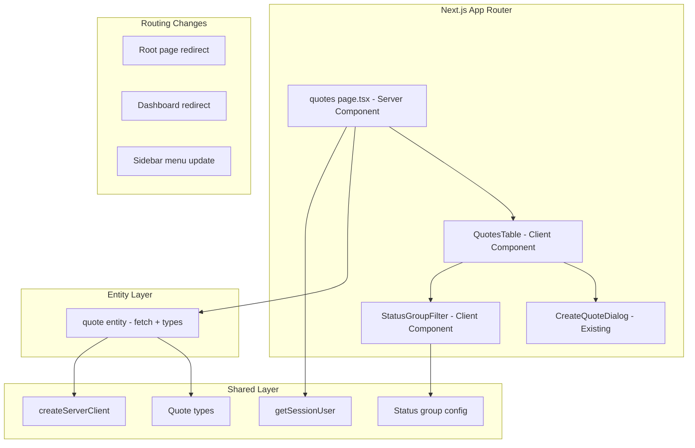
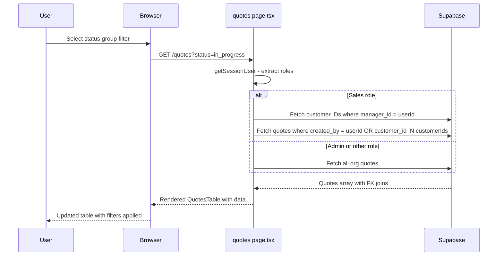

# Technical Design: Quotes Registry Migration

## Overview

**Purpose**: Migrate the /quotes registry from FastHTML to Next.js and establish it as the primary landing page, replacing the current /dashboard placeholder.

**Users**: All authenticated users — sales managers (primary: create and track their quotes), procurement/logistics/customs (find quotes for their workflow), admins/top_managers (oversight of all quotes with manager filtering).

**Impact**: Replaces the FastHTML /quotes route with a Next.js page. Changes post-login redirect from /dashboard to /quotes. Removes dashboard page.

### Goals
- Clean, minimal registry table with smart grouped status filters
- Role-based visibility (sales sees only relevant quotes)
- URL-persisted filter state for shareable views
- Reuse existing CreateQuoteDialog component

### Non-Goals
- Summary/aggregation cards or charts (explicitly excluded by user)
- Quote detail page migration (separate future task)
- Real-time updates via Supabase Realtime (not needed for registry)
- Search by quote content (text search within items)

## Architecture

### Existing Architecture Analysis

The Next.js frontend follows an SSR-first pattern:
- Server components fetch data from Supabase with searchParams-based filters
- Client components render tables with form-based filter controls (method="GET")
- Role checking via `getSessionUser()` → `{roles: string[]}` + `hasRole()` helper
- Sidebar configured in `buildMenuSections()` with role-based item visibility
- Current auth redirect: `/` → `/dashboard` → needs changing to `/quotes`

### Architecture Pattern & Boundary Map



**Architecture Integration**:
- Selected pattern: SSR-first with form-based filters (matches customers/suppliers pages)
- FSD boundaries: `entities/quote` (data + types), `features/quotes/ui` (table + filters), `app/(app)/quotes` (page shell)
- Existing patterns preserved: server component data fetch, form method="GET", shadcn Table, role-based rendering
- New components: QuotesTable, StatusGroupFilter, quote fetch function
- Steering compliance: FSD layer imports (shared → entities → features → pages), kvota schema, design system tokens

### Technology Stack

| Layer | Choice | Role in Feature | Notes |
|-------|--------|-----------------|-------|
| Frontend | Next.js 15 App Router | Page routing, SSR data fetch | Existing |
| UI | shadcn/ui Table + Badge + Button | Registry table, status badges, filter pills | Existing |
| Data | Supabase JS `@supabase/ssr` | Direct query to kvota.quotes | Existing, schema: kvota |
| Auth | getSessionUser() | Role extraction for visibility | Existing |
| Styling | Tailwind CSS v4 | Layout, responsive | Existing |

No new dependencies required.

## System Flows

### Filter + Data Fetch Flow



## Requirements Traceability

| Requirement | Summary | Components | Interfaces | Flows |
|-------------|---------|------------|------------|-------|
| 1.1-1.6 | Registry table with columns, pagination, navigation | QuotesTable, QuotesPage | QuoteListItem type | Filter + Fetch |
| 2.1-2.5 | Grouped status filtering | StatusGroupFilter, STATUS_GROUPS config | StatusGroup type | Filter + Fetch |
| 3.1-3.6 | Customer and manager filters | QuotesTable filter form | Filter params type | Filter + Fetch |
| 4.1-4.3 | Role-based visibility | QuotesPage (fetchQuotes), getSessionUser | - | Filter + Fetch |
| 5.1-5.4 | Create quote button + dialog | QuotesTable, CreateQuoteDialog (existing) | CreateQuoteDialogProps | - |
| 6.1-6.4 | Landing page redirect | Root page, dashboard page, sidebar config | - | - |
| 7.1-7.3 | URL state persistence | QuotesTable form, QuotesPage searchParams | QuotesFilterParams | Filter + Fetch |

## Components and Interfaces

| Component | Domain/Layer | Intent | Req Coverage | Key Dependencies | Contracts |
|-----------|-------------|--------|--------------|------------------|-----------|
| QuotesPage | app/(app)/quotes | Server component: fetch + render | 1, 4, 6, 7 | getSessionUser (P0), fetchQuotesList (P0) | - |
| QuotesTable | features/quotes/ui | Client table with filters and actions | 1, 2, 3, 5, 7 | StatusGroupFilter (P1), CreateQuoteDialog (P1) | State |
| StatusGroupFilter | features/quotes/ui | Pill buttons for status groups | 2 | STATUS_GROUPS config (P0) | State |
| fetchQuotesList | entities/quote | Supabase query with role-based filter | 1, 4 | Supabase client (P0), getSessionUser (P0) | Service |
| STATUS_GROUPS | entities/quote/config | Status-to-group mapping constant | 2 | - | - |
| Routing changes | app/ | Redirects: /, /dashboard → /quotes | 6 | - | - |

### Entity Layer

#### fetchQuotesList

| Field | Detail |
|-------|--------|
| Intent | Fetch paginated quotes list with role-based visibility and filters |
| Requirements | 1.1, 1.6, 4.1, 4.2, 4.3 |

**Responsibilities & Constraints**
- Builds Supabase query with FK joins to customers and profiles
- Applies role-based WHERE clause (sales: own + assigned customers)
- Applies filter params (status group, customer, manager)
- Returns paginated results with total count

**Dependencies**
- Outbound: Supabase JS client — data query (P0)
- Inbound: QuotesPage server component — caller (P0)

**Contracts**: Service [x]

##### Service Interface
```typescript
interface QuotesFilterParams {
  status?: string        // status group key or individual status
  customer?: string      // customer UUID
  manager?: string       // manager user UUID
  page?: number          // 1-based page number
  pageSize?: number      // default 20
}

interface QuoteListItem {
  id: string
  idn_quote: string
  created_at: string
  workflow_status: string
  total_amount_quote: number | null
  total_profit_usd: number | null
  currency: string | null
  customer: { id: string; name: string } | null
  manager: { id: string; full_name: string } | null
  version_count: number
  current_version: number
}

interface QuotesListResult {
  data: QuoteListItem[]
  total: number
  page: number
  pageSize: number
}

function fetchQuotesList(
  params: QuotesFilterParams,
  user: { id: string; roles: string[]; org_id: string }
): Promise<QuotesListResult>
```
- Preconditions: User is authenticated, org_id is set
- Postconditions: Returns quotes visible to user, filtered and paginated
- Invariants: Sales users never see quotes outside their scope

#### STATUS_GROUPS

| Field | Detail |
|-------|--------|
| Intent | Map 14 workflow statuses to 5 display groups |
| Requirements | 2.1 |

```typescript
interface StatusGroup {
  key: string            // 'draft' | 'in_progress' | 'approval' | 'deal' | 'closed'
  label: string          // Display label (Russian)
  statuses: string[]     // workflow_status values in this group
  color: string          // Tailwind color class for pills/badges
}

const STATUS_GROUPS: StatusGroup[] = [
  { key: 'draft', label: 'Черновик', statuses: ['draft'], color: 'bg-slate-100 text-slate-700' },
  { key: 'in_progress', label: 'В работе', statuses: ['pending_procurement', 'logistics', 'pending_customs'], color: 'bg-blue-100 text-blue-700' },
  { key: 'approval', label: 'Согласование', statuses: ['pending_quote_control', 'pending_spec_control', 'pending_sales_review', 'pending_approval'], color: 'bg-amber-100 text-amber-700' },
  { key: 'deal', label: 'Сделка', statuses: ['approved', 'sent_to_client', 'deal'], color: 'bg-green-100 text-green-700' },
  { key: 'closed', label: 'Закрыт', statuses: ['rejected', 'cancelled'], color: 'bg-red-100 text-red-700' },
]
```

### Feature Layer

#### QuotesTable

| Field | Detail |
|-------|--------|
| Intent | Client component rendering the quotes table with filter controls and create button |
| Requirements | 1.1-1.5, 2.2-2.5, 3.1-3.6, 5.1-5.4, 7.1 |

**Responsibilities & Constraints**
- Renders filter bar: StatusGroupFilter pills + customer dropdown + manager dropdown (role-conditional)
- Renders shadcn Table with 8 columns
- Handles row click navigation to `/quotes/{id}`
- Handles cell-level click navigation (customer → `/customers/{id}`)
- Renders "Новый КП" button (role-conditional) that opens CreateQuoteDialog
- Filter form uses method="GET" to persist state in URL

**Dependencies**
- Inbound: QuotesPage — provides data, user, filter options (P0)
- Outbound: StatusGroupFilter — status filter UI (P1)
- Outbound: CreateQuoteDialog — existing component (P1)

**Contracts**: State [x]

##### State Management
```typescript
interface QuotesTableProps {
  quotes: QuoteListItem[]
  total: number
  page: number
  pageSize: number
  filters: QuotesFilterParams
  customers: { id: string; name: string }[]
  managers: { id: string; full_name: string }[]
  userRoles: string[]
  userId: string
  orgId: string
}
```
- State: createDialogOpen (boolean) — local state for dialog toggle
- Persistence: All filter state via URL query params (form method="GET")
- Concurrency: None — server renders fresh data on each form submit

**Implementation Notes**
- Row click: `router.push(/quotes/${id})` with event delegation
- Customer cell: `event.stopPropagation()` + `router.push(/customers/${customerId})`
- Version indicator: plain text `v{N}` for single version, styled pill `v{N} ({total})` for multiple
- Status badge: reuse Badge component with color from STATUS_GROUPS config
- Money formatting: `Intl.NumberFormat` with currency from quote
- Profit coloring: green for positive, red for negative, muted for zero

#### StatusGroupFilter

| Field | Detail |
|-------|--------|
| Intent | Render clickable pill buttons for 5 status groups with optional detail expansion |
| Requirements | 2.1-2.5 |

**Responsibilities & Constraints**
- Renders 5 pill buttons from STATUS_GROUPS config
- Active state on selected group
- Click toggles filter (same group click = deselect = show all)
- Optional expansion: clicking "▾" on active pill shows individual statuses as sub-pills

**Dependencies**
- Inbound: QuotesTable — provides active filter value (P0)
- External: STATUS_GROUPS config (P0)

```typescript
interface StatusGroupFilterProps {
  activeGroup: string | null
  activeStatus: string | null  // individual status within group, if expanded
}
```

**Implementation Notes**
- Each pill is a button inside the form that sets a hidden input value
- "Reset" clears both group and individual status selections
- Expansion is client-side state only — selecting individual status adds `&detail_status=value` to URL

### Routing Changes

#### Root and Dashboard Redirects

| Field | Detail |
|-------|--------|
| Intent | Redirect /, /dashboard to /quotes for authenticated users |
| Requirements | 6.1, 6.2, 6.3 |

**Files to modify**:
- `frontend/src/app/page.tsx`: Change `redirect("/dashboard")` → `redirect("/quotes")`
- `frontend/src/app/(app)/dashboard/page.tsx`: Replace content with `redirect("/quotes")`
- `frontend/src/app/(auth)/login/page.tsx` or auth callback: Verify post-login redirects to `/quotes`

#### Sidebar Menu Update

| Field | Detail |
|-------|--------|
| Intent | Highlight КП as active, ensure correct href |
| Requirements | 6.4 |

**File**: `frontend/src/widgets/sidebar/sidebar-menu.ts`
- Verify "Коммерческие предложения" item exists with `href: "/quotes"`
- It should already be in REGISTRIES section — confirm active state detection works with new landing

## Data Models

### Domain Model
No new tables or columns. The quotes registry reads from existing `kvota.quotes` table with FK joins to `kvota.customers` and `kvota.profiles`.

**Query columns**: `id, idn_quote, created_at, workflow_status, total_amount_quote, total_profit_usd, currency, customer_id, created_by, customers!customer_id(id, name), profiles!created_by(id, full_name)`

**Version count**: Requires subquery or separate count from `kvota.quote_versions` grouped by quote_id.

### Supabase Query Pattern

```typescript
// Base query
supabase
  .from('quotes')
  .select(`
    id, idn_quote, created_at, workflow_status,
    total_amount_quote, total_profit_usd, currency,
    customers!customer_id(id, name),
    profiles!created_by(id, full_name),
    quote_versions(count)
  `, { count: 'exact' })
  .eq('organization_id', orgId)
  .order('created_at', { ascending: false })
  .range(offset, offset + pageSize - 1)

// Role-based filter (sales)
.or(`created_by.eq.${userId},customer_id.in.(${assignedCustomerIds})`)

// Status group filter
.in('workflow_status', statusGroup.statuses)

// Customer filter
.eq('customer_id', customerId)

// Manager filter
.eq('created_by', managerId)
```

## Error Handling

### Error Categories
- **Empty state** (no quotes match filters): Display friendly "Нет КП" message with suggestion to reset filters or create new
- **Supabase query failure**: Show toast error, log to console. Page renders with empty table.
- **Auth failure** (no session): Middleware redirects to /login (existing behavior)
- **Role fetch failure**: Fall back to showing all quotes (permissive default — better than blocking)

## Testing Strategy

### Unit Tests
- `STATUS_GROUPS` config: all 14 statuses mapped, no duplicates, no gaps
- `fetchQuotesList`: role-based filter logic (sales vs admin query construction)
- Money formatting: edge cases (null, zero, negative)

### Integration Tests
- Supabase query returns expected shape with FK joins
- Role-based visibility: sales user sees filtered set, admin sees all

### E2E Tests (Browser — Phase 6d)
- Login → lands on /quotes (not /dashboard)
- `/dashboard` URL → redirects to /quotes
- Status group filter toggles correctly
- Row click navigates to quote detail
- "Новый КП" button appears for sales, hidden for procurement
- Create dialog opens and creates quote

## Migration Strategy

1. Create Next.js `/quotes` page with all components
2. Update redirects (/, /dashboard → /quotes)
3. Update sidebar if needed
4. Update Caddy routing to send `/quotes` to Next.js instead of FastHTML
5. Verify in browser
6. Delete FastHTML `/quotes` route from main.py (after Caddy switchover confirmed)
