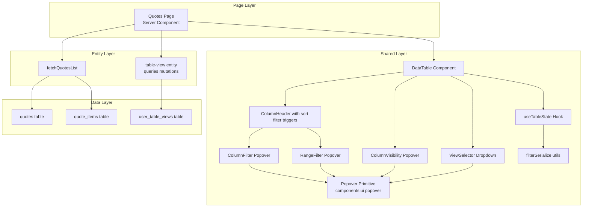

# Technical Design — Reusable Data Table

## Overview

This feature delivers a reusable `DataTable` component to the OneStack Next.js frontend, replacing the ad-hoc `quotes-table.tsx` implementation and providing a shared foundation for all registry pages (customers, positions, suppliers, currency invoices). Users gain Excel-style column filters with searchable checkbox lists, numeric range filters, saveable named views, and column visibility controls. Sales managers, procurement managers, and administrators will use it for every registry that exposes tabular data.

The feature replaces the status-pill filter row and global dropdown filters on `/quotes` with column-header filter popovers, consolidates sort/filter state into URL query parameters, and introduces a new `kvota.user_table_views` table storing named filter presets per user.

### Goals

- Deliver a framework-agnostic (within Next.js + Supabase) reusable `DataTable` component in `shared/ui/data-table/` usable for any registry in under an hour of integration work.
- Support multi-select value filters with in-popover search, numeric range filters, and tri-state column sorting.
- Provide persistent personal saved views (name + filters + sort + visible columns) via `kvota.user_table_views` with forward-compatible schema for organization-shared views.
- Preserve all existing quotes registry functionality (access control, pagination, action row grouping, row click navigation).

### Non-Goals

- Cell editing — registries are read-only; editing lives on detail pages.
- Client-side sorting, pagination, or filtering — all operations are server-side.
- Shared-views UI — schema supports it, but UI is deferred.
- Role-based column visibility enforcement — `allowedRoles` metadata is stored in column config but not enforced at render time.
- Migrating registries other than quotes in this release — the component is built for reuse, but only `/quotes` is migrated to consume it.

## Architecture

### Existing Architecture Analysis

The OneStack Next.js frontend follows Feature-Sliced Design (FSD) with five layers: `shared → entities → features → widgets → pages`. The current quotes registry lives in `features/quotes/ui/quotes-table.tsx` and is tightly coupled to the `QuoteListItem` type, using local state for filter labels and a custom `useFilterNavigation` hook for URL sync.

Constraints to preserve:

- **FSD layer rules**: The new DataTable is cross-feature, so it must live in `shared/ui/` and must not import from `features/` or `entities/`.
- **URL as filter state**: `useFilterNavigation` already exists in `shared/lib/` and will be superseded by the new `useTableState` hook.
- **Base UI primitives**: All dialogs use `@base-ui/react`. The new popover primitive must follow the same wrapper pattern as `components/ui/dialog.tsx`.
- **Server-side pagination**: Consumer queries (like `fetchQuotesList`) already implement role-based access control and cursor pagination. The DataTable must not take over data fetching.
- **Supabase RLS**: The new `user_table_views` table must enforce row-level security consistent with other user-scoped tables.

### Architecture Pattern & Boundary Map



**Architecture Integration**:

- **Selected pattern**: Controlled component with external data source. DataTable is a thin UI shell that displays rows and emits state changes via URL navigation. The consuming page owns the data fetch and access control.
- **Domain boundaries**: DataTable has zero knowledge of specific registries — it operates on generic row type `T` and column config. The `table-view` entity handles saved-views persistence generically via `table_key` string.
- **Existing patterns preserved**: shadcn-style `components/ui/` wrapper pattern, FSD layer imports, Base UI primitive family, Supabase RLS policies.
- **New components rationale**:
  - `DataTable` — the shell component everything hangs off.
  - `ColumnFilter` / `RangeFilter` — two filter popover variants, separate because their internal state shapes differ.
  - `ColumnVisibility` / `ViewSelector` — discrete responsibilities that need independent popovers.
  - `ColumnHeader` — encapsulates sort + filter trigger UI per column so `DataTable` stays simple.
  - `Popover` primitive (new in `components/ui/`) — shared across all popover consumers.
  - `useTableState` + `filterSerialize` — hook and utilities to unify URL ↔ state translation across consumers.
- **Steering compliance**: Follows `.kiro/steering/structure.md` FSD rules; follows `.kiro/steering/access-control.md` by keeping access logic in query layer; follows `.kiro/steering/tech.md` on Base UI / shadcn wrapper conventions.

### Technology Stack

| Layer | Choice / Version | Role in Feature | Notes |
|-------|------------------|-----------------|-------|
| Frontend primitives | `@base-ui/react@^1.3.0` | Popover, Dialog base components | Already installed — add new `popover.tsx` wrapper following `dialog.tsx` pattern |
| Frontend framework | Next.js 15 (App Router) | Page composition, server components for data fetch | Existing stack |
| Styling | Tailwind CSS v4 + shadcn tokens | Consistent visuals | Existing stack |
| State | URL query params (primary) + localStorage (column visibility fallback) | Shareable filter state | New `useTableState` hook |
| Data access | Supabase JS client (`@supabase/supabase-js`) | Views CRUD | Existing pattern; new entity `table-view` wraps queries |
| Database | PostgreSQL via Supabase, schema `kvota` | Views persistence | New migration 261 |
| Type safety | TypeScript (strict mode) | Generic `DataTable<T>`, column config types | No `any` — generics + discriminated unions for filter types |

## Requirements Traceability

| Requirement | Summary | Components | Interfaces | Flows |
|-------------|---------|------------|------------|-------|
| 1.1–1.7 | Declarative column configuration with filters, sort, row click | DataTable, ColumnHeader | `DataTableProps<T>`, `DataTableColumn<T>` | Loading flow |
| 2.1–2.9 | Multi-select filters with search, checkbox list, active state, IN predicates | ColumnFilter, useTableState, filterSerialize | `ColumnFilterProps`, `FilterState` | Filter flow |
| 3.1–3.5 | Numeric range filter popover, `__min`/`__max` URL format, gte/lte predicates | RangeFilter, useTableState | `RangeFilterProps` | Filter flow |
| 4.1–4.7 | Tri-state column sort with icons and sortKey mapping | ColumnHeader, useTableState | `DataTableColumn<T>.sortKey` | Filter flow |
| 5.1–5.6 | Column visibility popover with localStorage fallback | ColumnVisibility, useTableState | `ColumnVisibilityState` | — |
| 6.1–6.9 | Saved views CRUD | ViewSelector, SaveViewDialog, ManageViewsDialog, table-view entity | `TableView` | Save view flow |
| 7.1–7.7 | Schema support for future shared views | Migration 261, table-view entity | SQL schema, RLS policies | — |
| 8.1–8.8 | URL as source of truth, conventions | useTableState, filterSerialize | Serialize/parse helpers | Loading flow |
| 9.1–9.6 | Search input with debounce, row grouping | DataTable top bar | `DataTableProps<T>.search`, `rowGrouping` | Loading flow |
| 10.1–10.5 | filterOptions prop, consumer-fetched | DataTable, ColumnFilter | `DataTableProps<T>.filterOptions` | — |
| 11.1–11.6 | Remove status pills and group-key | Quotes Page, fetchQuotesList | Modified `QuotesFilterParams` | — |
| 12.1–12.8 | Wire DataTable to quotes with access control | Quotes Page, fetchQuotesList, DataTable | Extended `QuotesFilterParams` | Loading flow |
| 13.1–13.6 | FSD placement in shared/ui, shared/lib, entities/table-view | Directory structure | `index.ts` barrels | — |

## Components and Interfaces

### Summary Table

| Component | Domain/Layer | Intent | Req Coverage | Key Dependencies | Contracts |
|-----------|--------------|--------|--------------|------------------|-----------|
| DataTable | shared/ui | Generic table shell with filters, sort, views, column visibility | 1.1–1.7, 2.1–2.9, 3.1–3.5, 4.1–4.7, 5.1–5.6, 9.1–9.6, 10.1–10.5 | useTableState (P0), ColumnHeader (P0), filter popovers (P0), ViewSelector (P0) | State |
| ColumnHeader | shared/ui | Per-column header with label, sort toggle, filter trigger | 1.3, 1.4, 4.1–4.7 | ColumnFilter (P1), RangeFilter (P1) | State |
| ColumnFilter | shared/ui | Multi-select filter popover with search and checkboxes | 2.1–2.9 | Popover (P0), useTableState (P0) | State |
| RangeFilter | shared/ui | Numeric min/max filter popover | 3.1–3.5 | Popover (P0), useTableState (P0) | State |
| ColumnVisibility | shared/ui | Popover for show/hide columns | 5.1–5.6 | Popover (P0), localStorage (P1), useTableState (P0) | State |
| ViewSelector | shared/ui | Dropdown of saved views with CRUD actions | 6.1–6.9 | Popover (P0), table-view entity (P0), useTableState (P0) | State |
| Popover primitive | components/ui | Base UI Popover wrapper | Enables all popover consumers | @base-ui/react (P0) | — |
| useTableState | shared/lib | URL ↔ filter/sort/view state hook | 8.1–8.8 | Next router (P0), filterSerialize (P0) | Service |
| filterSerialize | shared/lib | Parse and serialize filter state to URL params | 8.4, 8.5, 8.6 | — | Service |
| table-view entity | entities/table-view | CRUD for `user_table_views` rows | 6.1–6.9, 7.1–7.7 | Supabase client (P0), Auth (P0) | Service |
| Migration 261 | data layer | Create `kvota.user_table_views` with RLS | 7.1–7.7 | PostgreSQL, Supabase RLS | — |

### Key Interface Definitions

#### DataTableColumn (the declarative column config)

```typescript
export type ColumnFilterType =
  | { kind: "multi-select" }
  | { kind: "range"; unit?: string };

export interface DataTableColumn<T> {
  key: string;                               // unique identifier and URL param key
  label: string;
  accessor: (row: T) => React.ReactNode;
  sortable?: boolean;
  sortKey?: string;                          // database column for ORDER BY if different from key
  filter?: ColumnFilterType;
  width?: string;
  align?: "left" | "center" | "right";
  allowedRoles?: readonly string[];          // reserved for future role-based visibility
  defaultVisible?: boolean;
  alwaysVisible?: boolean;                   // cannot be hidden via column visibility UI
}
```

#### DataTable props

```typescript
export interface DataTableProps<T> {
  tableKey: string;                          // e.g., 'quotes' — used for views scope and localStorage key
  rows: readonly T[];
  total: number;
  page: number;
  pageSize: number;
  rowKey: (row: T) => string;
  columns: readonly DataTableColumn<T>[];
  filterOptions?: FilterOptions;             // keyed by column.key
  onRowClick?: (row: T) => void;
  search?: { placeholder?: string; value: string };
  rowGrouping?: { label: string; predicate: (row: T) => boolean };
  topBarActions?: React.ReactNode;
  emptyState?: React.ReactNode;
  viewsEnabled?: boolean;
  currentUserId?: string;
  organizationId?: string;
}
```

#### useTableState hook

```typescript
interface UseTableStateResult {
  filters: Record<string, FilterValue>;
  sort: SortState | null;
  page: number;
  search: string;
  viewId: string | null;
  visibleColumns: readonly string[];
  setFilter: (key: string, value: FilterValue | null) => void;
  setSort: (key: string) => void;
  setPage: (page: number) => void;
  setSearch: (term: string) => void;
  setView: (viewId: string | null) => void;
  setVisibleColumns: (keys: readonly string[]) => void;
  clearAllFilters: () => void;
  serializeCurrent: () => SerializedTableState;
  isModifiedFromView: (viewState: SerializedTableState) => boolean;
}
```

#### TableView (saved views entity)

```typescript
export interface TableView {
  id: string;
  userId: string;
  tableKey: string;
  name: string;
  filters: Record<string, FilterValue>;
  sort: string | null;                         // URL format e.g. "-amount"
  visibleColumns: readonly string[];
  isShared: boolean;                           // always false in this release
  organizationId: string | null;
  isDefault: boolean;
  createdAt: string;
  updatedAt: string;
}

interface TableViewService {
  listViews(tableKey: string, userId: string): Promise<TableView[]>;
  createView(input: CreateViewInput): Promise<TableView>;
  updateView(id: string, input: UpdateViewInput): Promise<TableView>;
  deleteView(id: string): Promise<void>;
  setDefaultView(id: string, tableKey: string, userId: string): Promise<void>;
}
```

## Data Models

### Physical Data Model — Migration 261

```sql
-- migrations/261_create_user_table_views.sql
CREATE TABLE IF NOT EXISTS kvota.user_table_views (
    id UUID PRIMARY KEY DEFAULT gen_random_uuid(),
    user_id UUID NOT NULL REFERENCES auth.users(id) ON DELETE CASCADE,
    table_key VARCHAR(50) NOT NULL,
    name TEXT NOT NULL,
    filters JSONB NOT NULL DEFAULT '{}'::jsonb,
    sort VARCHAR(50),
    visible_columns TEXT[] NOT NULL DEFAULT '{}',
    is_shared BOOLEAN NOT NULL DEFAULT false,
    organization_id UUID REFERENCES organizations(id) ON DELETE CASCADE,
    is_default BOOLEAN NOT NULL DEFAULT false,
    created_at TIMESTAMPTZ NOT NULL DEFAULT now(),
    updated_at TIMESTAMPTZ NOT NULL DEFAULT now(),
    CONSTRAINT chk_shared_has_org CHECK ((is_shared = false) OR (organization_id IS NOT NULL)),
    CONSTRAINT chk_personal_no_org CHECK ((is_shared = true) OR (organization_id IS NULL))
);

-- Partial unique indexes: scope name uniqueness by personal vs shared
CREATE UNIQUE INDEX uq_table_views_personal
    ON kvota.user_table_views (user_id, table_key, name)
    WHERE is_shared = false;

CREATE UNIQUE INDEX uq_table_views_shared
    ON kvota.user_table_views (organization_id, table_key, name)
    WHERE is_shared = true;

-- RLS
ALTER TABLE kvota.user_table_views ENABLE ROW LEVEL SECURITY;

-- Personal views: owner-only
CREATE POLICY personal_views_owner_all
    ON kvota.user_table_views FOR ALL
    USING (is_shared = false AND user_id = auth.uid())
    WITH CHECK (is_shared = false AND user_id = auth.uid());

-- Shared views (prepared for future): org members can SELECT, owner can UPDATE/DELETE
CREATE POLICY shared_views_org_read
    ON kvota.user_table_views FOR SELECT
    USING (is_shared = true AND organization_id IN (
        SELECT organization_id FROM organization_members WHERE user_id = auth.uid()
    ));
-- Plus separate policies for INSERT, UPDATE, DELETE on shared views restricted to owner

-- Trigger: enforce single default view per (user, table_key)
-- Trigger: auto-update updated_at timestamp
```

## URL State Conventions

- **Multi-select**: `?<column>=v1,v2,v3` (comma-separated)
- **Range**: `?<column>__min=100&<column>__max=5000` (double-underscore suffixes)
- **Sort**: `?sort=-<column>` (desc) or `?sort=<column>` (asc)
- **Page**: `?page=<N>` (1-based, omitted when N=1)
- **Search**: `?search=<term>`
- **View**: `?view=<uuid>` (populates other params on first load; subsequent changes are independent)

## Error Handling

- **URL parse errors**: Unknown params silently dropped (R8.8); malformed numeric values in range filters default to undefined.
- **Views CRUD errors**: Surfaced via `toast.error()` with actionable messages.
- **Supabase RLS rejection**: Caught in entity layer; surfaced to UI as generic "Нет доступа" error.
- **localStorage failures**: Catch and fall back to config defaults.

## Testing Strategy

### Unit Tests

- `filterSerialize.parseFilterParams` — round-trip URL ↔ state
- `filterSerialize.canonicalizeState` — order-independence
- `useTableState.setFilter` — page resets to 1 on filter change
- `useTableState.isModifiedFromView` — correctly detects divergence

### Integration Tests

- `table-view` entity: CRUD round-trip against test Supabase
- `fetchQuotesList` with multi-value filters: IN predicates produce expected row sets
- Default view loading on first page mount
- Column visibility localStorage fallback

### E2E / UI Tests (Playwright)

- Apply status filter → URL updates → rows filter correctly
- Apply range filter on amount → URL has `__min`/`__max` → rows filter correctly
- Click column header sort → URL updates → rows re-order
- Save view → view appears → reload view populates URL
- Hide column → persists across reload
- Remove status pills (regression test)
- Search input debounce + multi-field search

## Migration Strategy

- **Phase 1**: Build shared UI primitives (Group 1 foundations — DONE)
- **Phase 2**: Build filter popovers + column header (Group 2)
- **Phase 3**: Build table-view entity + ViewSelector (Group 3)
- **Phase 4**: Build DataTable shell + wire to quotes (Group 4)
- **Phase 5**: Browser tests (Group 5)

**Rollback**: Any regression in quotes registry → revert frontend changes; migration is additive and can remain.
