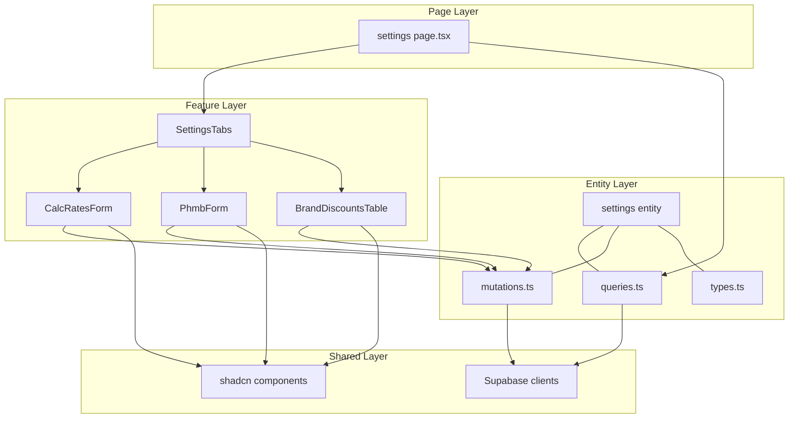

# Design Document: Settings Page Migration

## Overview

**Purpose**: This feature delivers a unified, redesigned organization settings page to admin users, replacing two separate FastHTML pages (`/settings` and `/settings/phmb`) with a single tabbed Next.js page.

**Users**: Admin users manage calculation parameters, PHMB overhead costs, and brand discount rules.

**Impact**: Eliminates two FastHTML routes. Introduces new FSD entity (`settings`), new feature slice (`settings`), and new page route. No database changes required.

### Goals
- Consolidate `/settings` + `/settings/phmb` into one tabbed page
- Add live percentage preview for PHMB overhead costs
- Enable inline editing for brand discount table
- Mobile-responsive layout following design system

### Non-Goals
- Telegram settings migration (separate page, per-user scope)
- Organization name editing (admin-only via direct DB)
- PHMB calculator logic changes (frontend display only)
- New database tables or migrations

## Architecture

### Architecture Pattern & Boundary Map



**Architecture Integration**:
- Selected pattern: Feature-Sliced Design (consistent with existing pages)
- Domain boundary: `settings` entity owns all org-level configuration data
- Existing patterns preserved: server-side queries, client-side mutations, thin page shells
- New components: 4 feature UI components + 1 entity slice
- Steering compliance: FSD layer imports, kvota schema, design system tokens

### Technology Stack

| Layer | Choice / Version | Role in Feature | Notes |
|-------|------------------|-----------------|-------|
| Frontend | Next.js 15 App Router | Page routing, server component data fetch | Existing |
| UI | shadcn/ui + Tailwind CSS v4 | Tabs, Input, Button, Table, Toast | Existing |
| Data | Supabase JS client (kvota schema) | Direct queries and mutations | Existing |
| Auth | @supabase/ssr | Session verification, role check | Existing |

No new dependencies required.

## Requirements Traceability

| Requirement | Summary | Components | Interfaces |
|-------------|---------|------------|------------|
| 1.1 | Tabbed interface with 3 tabs | SettingsTabs | TabConfig |
| 1.2 | Tab switch without page reload | SettingsTabs | Client component state |
| 1.3 | Read-only org name in header | SettingsTabs | OrganizationInfo type |
| 1.4 | URL tab persistence | SettingsTabs + page.tsx | searchParams |
| 1.5 | Non-admin redirect | page.tsx | getSessionUser + role check |
| 2.1-2.5 | Calc rates CRUD with feedback | CalcRatesForm | CalcSettings type, upsertCalcSettings |
| 3.1-3.8 | PHMB overhead with live preview | PhmbForm | PhmbSettings type, upsertPhmbSettings |
| 4.1-4.7 | Brand discounts with inline edit | BrandDiscountsTable | BrandDiscount type, mutations |
| 5.1-5.4 | Responsive design | All UI components | Tailwind responsive classes |
| 6.1-6.4 | Auth and authorization | page.tsx | getSessionUser, role check |

## Components and Interfaces

| Component | Domain/Layer | Intent | Req Coverage | Key Dependencies | Contracts |
|-----------|-------------|--------|--------------|-----------------|-----------|
| page.tsx | Page | Server component: auth + data fetch + render shell | 1.4, 1.5, 6.1-6.4 | settings/queries (P0) | — |
| SettingsTabs | Feature/UI | Client component: tab navigation with URL sync | 1.1-1.3, 5.1 | shadcn Tabs (P0) | State |
| CalcRatesForm | Feature/UI | Form for 3 calculation rate fields with save | 2.1-2.5, 5.2-5.3 | settings/mutations (P0) | State |
| PhmbForm | Feature/UI | PHMB overhead form with live % preview | 3.1-3.8, 5.2-5.3 | settings/mutations (P0) | State |
| BrandDiscountsTable | Feature/UI | Searchable table with inline editing | 4.1-4.7, 5.2 | settings/mutations (P0) | State |
| settings/queries | Entity | Server-side Supabase queries | 1.3, 2.1, 3.1, 4.1 | Supabase server (P0) | Service |
| settings/mutations | Entity | Client-side Supabase mutations | 2.2, 3.6, 4.3-4.5 | Supabase client (P0) | Service |
| settings/types | Entity | TypeScript interfaces for all settings data | All | — | — |

### Entity Layer: settings

#### settings/types.ts

```typescript
interface OrganizationInfo {
  id: string;
  name: string;
}

interface CalcSettings {
  id: string;
  org_id: string;
  rate_forex_risk: number;
  rate_fin_commission: number;
  rate_loan_interest_daily: number;
}

interface PhmbSettings {
  id: string;
  org_id: string;
  base_price_per_pallet: number;
  logistics_price_per_pallet: number;
  customs_handling_cost: number;
  svh_cost: number;
  bank_expenses: number;
  insurance_pct: number;
  other_expenses: number;
  default_markup_pct: number;
  default_advance_pct: number;
  default_payment_days: number;
  default_delivery_days: number;
}

interface BrandDiscount {
  id: string;
  org_id: string;
  brand: string;
  classification: string;
  discount_pct: number;
}

interface BrandGroup {
  id: string;
  name: string;
  brand_count: number;
}

interface SettingsPageData {
  organization: OrganizationInfo;
  calcSettings: CalcSettings | null;
  phmbSettings: PhmbSettings | null;
  brandDiscounts: BrandDiscount[];
  brandGroups: BrandGroup[];
}
```

#### settings/queries.ts

```typescript
// Server-side queries (uses createClient from @/shared/lib/supabase/server)
function fetchSettingsPageData(orgId: string): Promise<SettingsPageData>;
```

**Responsibilities**: Single function fetches all settings data in parallel (4 queries). Returns composite object for page component. Follows existing pattern from `fetchCustomerDetail`.

#### settings/mutations.ts

```typescript
// Client-side mutations (uses createClient from @/shared/lib/supabase/client)
function upsertCalcSettings(orgId: string, data: Omit<CalcSettings, 'id' | 'org_id'>): Promise<void>;
function upsertPhmbSettings(orgId: string, data: Omit<PhmbSettings, 'id' | 'org_id'>): Promise<void>;
function updateBrandDiscount(id: string, discountPct: number): Promise<void>;
function deleteBrandDiscount(id: string): Promise<void>;
function createBrandGroup(orgId: string, name: string): Promise<BrandGroup>;
function deleteBrandGroup(id: string): Promise<void>;
```

### Feature Layer: settings

#### SettingsTabs

| Field | Detail |
|-------|--------|
| Intent | Manages tab navigation with URL sync and renders tab content |
| Requirements | 1.1, 1.2, 1.3, 1.4, 5.1 |

```typescript
interface SettingsTabsProps {
  data: SettingsPageData;
  defaultTab: string; // from URL searchParams
}
```

**State Management**: Uses shadcn `Tabs` component. On tab change, updates URL via `router.push(/settings?tab=${value}, { scroll: false })`. Default tab from server-side `searchParams.tab ?? "calc"`.

#### CalcRatesForm

| Field | Detail |
|-------|--------|
| Intent | Editable form for 3 calculation rate fields with save/loading/toast |
| Requirements | 2.1, 2.2, 2.3, 2.4, 2.5, 5.2, 5.3 |

```typescript
interface CalcRatesFormProps {
  settings: CalcSettings | null;
  orgId: string;
}
```

**State Management**: Local form state via `useState`. On save: disable button → call `upsertCalcSettings` → toast success/error → re-enable. Fields: `rate_forex_risk`, `rate_fin_commission`, `rate_loan_interest_daily` (all `number` inputs with step="0.01").

#### PhmbForm

| Field | Detail |
|-------|--------|
| Intent | PHMB overhead form with live % calculation and markup↔margin converter |
| Requirements | 3.1, 3.2, 3.3, 3.4, 3.5, 3.6, 3.7, 3.8, 5.2, 5.3 |

```typescript
interface PhmbFormProps {
  settings: PhmbSettings | null;
  orgId: string;
}
```

**State Management**: Local form state. Derived percentage values computed on every render: `overheadPct = costValue / basePricePerPallet * 100`. Bidirectional markup↔margin: `margin = markup / (100 + markup) * 100` and `markup = margin / (100 - margin) * 100`. Two-column layout on desktop (md:grid-cols-2), single column on mobile.

#### BrandDiscountsTable

| Field | Detail |
|-------|--------|
| Intent | Searchable table with inline editing, delete confirmation, brand group management |
| Requirements | 4.1, 4.2, 4.3, 4.4, 4.5, 4.6, 4.7, 5.2 |

```typescript
interface BrandDiscountsTableProps {
  discounts: BrandDiscount[];
  brandGroups: BrandGroup[];
  orgId: string;
}
```

**State Management**:
- `searchQuery`: filters rows client-side by brand name
- `editingRowId`: tracks which row is in inline-edit mode (null = none)
- `editValue`: temporary value for the editing field
- On edit icon click → set `editingRowId` and `editValue`
- On blur/Enter → call `updateBrandDiscount`, update local state optimistically, clear `editingRowId`
- On Escape → clear `editingRowId` without saving
- On delete → show confirmation dialog → call `deleteBrandDiscount` → remove from local state
- Brand groups section: list with delete buttons + "Добавить группу" opens inline form

### Page Layer

#### page.tsx (settings)

```typescript
// Server component — thin shell
// Location: frontend/src/app/(app)/settings/page.tsx

interface PageProps {
  searchParams: Promise<{ tab?: string }>;
}
```

**Flow**:
1. `getSessionUser()` → redirect to `/login` if null
2. Check user role === "admin" → redirect to `/dashboard` if not
3. Get `orgId` from user profile
4. `fetchSettingsPageData(orgId)` → get all settings data
5. Render `<SettingsTabs data={data} defaultTab={searchParams.tab ?? "calc"} />`

## Data Models

### Domain Model

No new tables. Existing tables used:

| Table | Usage | Schema |
|-------|-------|--------|
| `organizations` | Read org name | `kvota.organizations` |
| `calculation_settings` | CRUD calc rates | `kvota.calculation_settings` |
| `phmb_settings` | CRUD overhead costs | `kvota.phmb_settings` |
| `phmb_brand_type_discounts` | CRUD brand discounts | `kvota.phmb_brand_type_discounts` |

All scoped by `org_id` (from authenticated user's profile).

## Error Handling

### Error Strategy
- **Save failures**: Toast notification with error message, form remains editable
- **Auth expiry**: Middleware redirects to `/login` (handled by Supabase SSR)
- **Data fetch failure**: Page shows error state with retry option
- **Inline edit failure**: Revert optimistic update, show toast with error

### Error Categories
- **User Errors (4xx)**: Invalid numeric input → client-side validation before submit
- **Auth Errors (401/403)**: Redirect to login/dashboard
- **System Errors (5xx)**: Toast with "Ошибка сохранения. Попробуйте позже."

## Testing Strategy

### Unit Tests
- Percentage calculation: `cost / basePricePerPallet * 100` for various inputs
- Markup ↔ margin conversion: bidirectional formula correctness
- Search filter: brand name filtering logic

### Integration Tests
- Settings page loads with correct data for authenticated admin
- Non-admin gets redirected
- Upsert calc settings persists to database
- Upsert PHMB settings persists to database

### E2E Tests (Playwright)
- Full flow: login → navigate to /settings → switch tabs → edit values → save → verify toast
- Inline edit: click edit → change value → press Enter → verify update
- Mobile responsive: tabs scroll, forms stack, save button full-width
